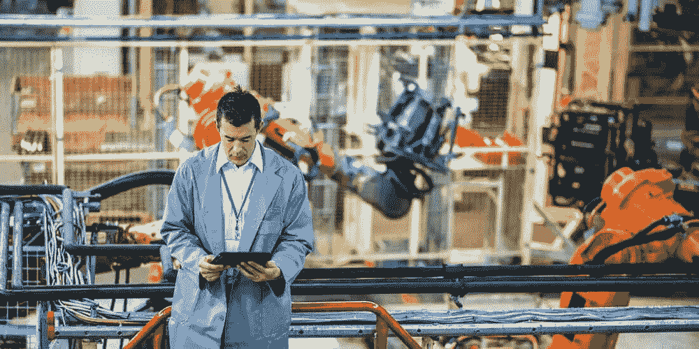

# 人工智能的未来

> 原文：<https://medium.datadriveninvestor.com/the-future-of-artificial-intelligence-11b9d43ea452?source=collection_archive---------39----------------------->

技术进步如此之快，以至于我们有时会忘记当今世界有多先进！客观地说——今天，一部智能手机的处理能力比阿波罗任务中使用的电脑还要多。

特别是人工智能(AI)已经在每个行业产生了变革性的影响，从帮助运输公司的员工预测到达时间到[预测食物颗粒中的毒素](https://news.microsoft.com/transform/new-buhler-machine-uses-the-cloud-to-find-the-needle-in-the-haystack/)。人工智能正在帮助科学家们学习如何更有效地治疗 T4 癌症，农民们正在研究如何使用更少的自然资源种植更多的粮食。

我们已经看到人工智能发生了许多强大而积极的事情，我们只能想象人工智能在未来会如何影响我们。

*人工智能的未来能否解决世界饥饿或带来普遍和平？*

# 高级运输

我们已经通过**自动驾驶汽车**看到了人工智能的开端，尽管为了安全起见，这些汽车目前需要有一名司机在场驾驶。尽管有这一令人兴奋的发展，自动驾驶汽车的技术还不完善，还需要一段时间才能让公众接受自动驾驶汽车的广泛使用。我们可以看到人工智能的进步在不久的将来会导致更多的自动驾驶车辆，如公共汽车，火车，可能还有飞机。

# 减少危险工作

一些人担心人工智能会接管工作，这可能会发生——以一种好的方式。人工智能对于那些冒着生命危险从事危险工作的人来说非常有用。有了 AI，**危险的工作将成为过去**。不要误解我，未来仍然会有危险的工作，但人工智能将会接管其中的许多工作。人工智能不理解痛苦或创伤，如果被摧毁，可以很容易地被取代。这开启了许多可能性，包括诸如拆除炸弹的场景。它们在化学工厂或条件恶劣的工作中同样有用。AI 目前的阶段需要更多的升级才能看到这一点，但这绝对是未来的一种可能。

# 医学领域的进步

AI 在医疗领域可以有很大的帮助，但是医生，不用说，永远是必需品。诊断疾病、进行手术和开药不仅是复杂的、威胁生命的任务，还需要大量的同理心。迄今为止，计算机未能满足这一关键要求。然而，人工智能可能用于外科手术、治疗罕见疾病、寻找癌症的治愈方法、预测疾病以及捕捉人类错误，如输入错误的数据或开错药。

# 为发展中国家提供援助

人工智能(AI)已经渗透到发达国家人们的日常生活中。从虚拟助手到推荐引擎，人工智能出现在新闻、我们的家庭和办公室中。在人工智能的使用方面有很多尚未开发的潜力，特别是在人道主义领域。人工智能可以使资源有限的发展中国家的年经济增长率翻一番。通过利用人工智能的力量，企业、非政府组织(NGO)和政府可以解决威胁生命的问题，并改善发展中国家当地社区的生活。

# 救灾和救援帮助

使用人工智能的预测模型可以在帮助重建工作的同时提供救灾，并及时分发物资。一个类似的例子是 2015 年尼泊尔发生大地震，超过 800 万人受到影响。在善后工作中，[无人机](https://www.reuters.com/article/us-humanitarian-summit-nepal-drones/armed-with-drones-aid-workers-seek-faster-response-to-earthquakes-floods-idUSKCN0Y7003)被用来测绘和评估破坏情况，并加快救援任务。人工智能改善的未来可以在更大程度上帮助应对这些灾难。

# 为残疾人提供无障碍工具

在微软的 Build 开发者大会上，微软宣布了一个新的 2500 万美元、为期五年的[人工智能无障碍项目](https://www.microsoft.com/en-us/ai-for-accessibility)。这些人工智能工具被放在开发人员的手中，以加速可访问的智能人工智能解决方案的开发，使全球 10 亿多残疾人受益。我们已经见证了这一点，因为残疾人扩大了他们对计算机的使用，以令人印象深刻的准确性来听、看和推理。在世界范围内，只有十分之一的残疾人能够使用自信的技术和产品。通过使人工智能解决方案更广泛地可用，我们相信人工智能的未来可以对这个社区产生更大的影响。

虽然我们不知道确切的未来，但很明显，与人工智能的交互将很快成为一种更常见的交互。

除了我们讨论的六种影响，人工智能技术还可以在更多方面影响我们的未来。人工智能在商店中的可能性使我们和许多其他跨多个行业的专业人士对我们人工智能世界的未来感到非常兴奋！

*最初发布于:*[*https://www . dynamiccountsgroup . com/blog/the-future-of-ai/*](https://www.dynamicconsultantsgroup.com/blog/the-future-of-ai/)