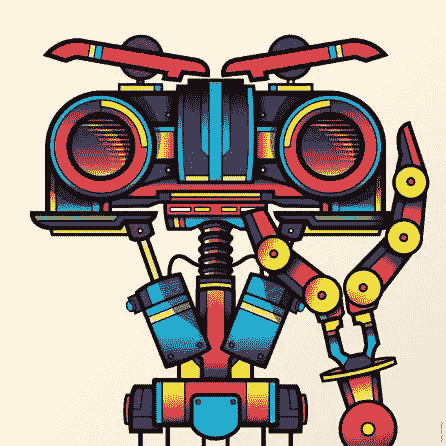

# 人工智能的未来完全依赖于移情

> 原文：<https://medium.datadriveninvestor.com/the-future-of-artificial-intelligence-relies-solely-on-empathy-4a7682247044?source=collection_archive---------13----------------------->

人工智能绝不是人工的。包括它的子集，机器学习，深度学习——AI 是非常真实的，因为它只能通过人类的智能变成有形的东西。但正是这种人类智能也是人工智能真正变得多么强大的致命弱点，以及它在以更深入、更有意义的方式推进我们的社会方面可能产生的持久影响。

Illustration of Johnny 5 of the film Short Circuit. **Art** by **Burlelulkyger**

围绕着人工智能在市场营销、各种商业行业和相关劳动力方面的转变，有着各种各样的宣传；那些在研发实验室之外推动这种转变的人，基本上没有改变他们的思维方式。

我不是在谈论思考和产生更好的算法或推进人工神经网络的方法的能力，而是在设计和开发过程中推进同理心的能力。

*为什么共情？*

人工智能的未来完全依赖于同理心，因为通过同理心，隐性偏见得到了缓解。

由于近年来人工智能的民主化，我们开始看到其应用做好事的所有潜力，但我们必须意识到在发展过程中偏见的危险。

在 [2016 年，ProPublica 披露了他们在 Northpointe 的工具 COMPAS 上所做的研究](https://www.propublica.org/article/how-we-analyzed-the-compas-recidivism-algorithm)，该工具错误地将黑人被告标记为高风险被告的频率高于白人被告。此外，白人被告被标记为低风险。

2015 年，谷歌因其人工智能标签算法将黑人与大猩猩联系在一起而备受指责，当与该群体联系在一起时，它具有种族主义内涵。如果你用谷歌搜索“恐怖分子”这个词并查看图片，你会找到一个极端伊斯兰恐怖分子的页面，但没有一张三 k 党、新纳粹或类似相关团体的图片——所有这些都被归类为美国国内恐怖分子。

像 [COCO](http://cocodataset.org/#home) 和 [ImSitu](http://imsitu.org/) 这样的图像数据集，拥有超过 10 万张延续性别偏见的照片。他们的数据集是关于性别刻板印象的训练系统，比如“男人玩运动”和“女人做饭”。但是，当数据集建立在人类创造的图像上时，我们应该责怪它们吗？这是数据 *GIGO* (好进好出)的经典案例。

想象一下，一个训练有素的基于人工智能的机器人被开发来帮助美国执法部门识别恐怖主义威胁。就我之前提到的观点而言，许多棕色皮肤的中东人将自动成为威胁或高风险的目标，而那些犯下大多数国内恐怖行为的人，右翼极端组织，将被视为低风险。

正如开发人员应该知道不同的人工智能框架和 API 一样，应该有同等的，我认为更多的培训致力于识别数据集内的偏见，主要是自我内部的偏见。

同理心要求我们抛开我们的文化、个人信仰、观点、知识和整体世界观，以理解他人的经历为目标。这并不意味着你必须过度同情、道歉，或者改变你的信念来虚假地安抚别人，而是要努力深入地理解对方的信念。

同理心是我们都有的东西，但有时我们的个人偏见会限制我们同理心的对象或对象。因此，为了变得更有同理心，我们必须建立这种技能。

# 这里有三种方法可以让你变得更有同情心:

1.  **忘记你所知道的**——我们所有人都根据自己的世界观生活。这受到我们的家庭、朋友、我们生活的社区、我们上的学校以及我们接触的媒体的影响。随着时间的推移，所有这些外部力量都变得内在化，并影响我们对世界的看法。虽然你的生活经历对你作为一个个体是至关重要的——如果你对自己的隐性偏见视而不见，你的观点会对他人产生负面影响。因此，暂时忘记你所知道的，努力学习他人的世界观是很重要的。
2.  **成为一名人类学家**——好吧，我不是说你必须寻求人类学的学位，但你可以独立练习该领域的基本技能。去其他国家旅行，或者学习那些你已经习惯的文化、语言和行为，会对你的生活产生有意义的影响。你越能真正地沉浸在其他文化中，你就会开始认识到细微的和不那么细微的差异。你也会开始看到人们之间的共性。这会让你对自己以外的世界有更好的了解。
3.  找一个黑人朋友，或者 LGBTQ 朋友，白人朋友，残疾人朋友，穆斯林朋友，老年朋友，异性朋友等等。与你直接影响范围之外的人交朋友对你同理心的发展有着巨大的意义。你可以直接询问他们对情况的看法和感受。这里的关键是要认识到并理解你的新朋友并不代表他们整个群体；然而，如果他们自己知道并选择这样做，他们也许能够提供一些见解。其次，你应该努力建立关系，这样你才是一个真正的朋友，而不是说“嘿…我有一个(填写描述符)朋友”的人在培养真正的友谊时，自然地，你会更好地对朋友、他们的经历和分享他们经历的人产生共鸣。

以这种方式进行开发，尤其是对于人工智能应用，是形成对用户更深理解的关键。

科技公司已经开始严重依赖人工智能技术作为其产品供应的一部分，然而，科技行业仍然是我们最有偏见的行业之一。尽管机器学习程序非常复杂，但它们只能应用习得的行为。我们必须尽最大努力减少隐性偏见，这样我们才能教好他们。

看到在利用基于人工智能的技术来帮助我们的日常任务方面出现了巨大的转变——在我们能够充分享受人工智能所能提供的所有潜力之前，首先需要人类发生巨大的转变。

我相信，在更深层次的移情思维中，可以找到所需的巨大转变。

**你怎么看？技术的发展应该优先考虑同理心吗？大家讨论一下。下面留言评论！**