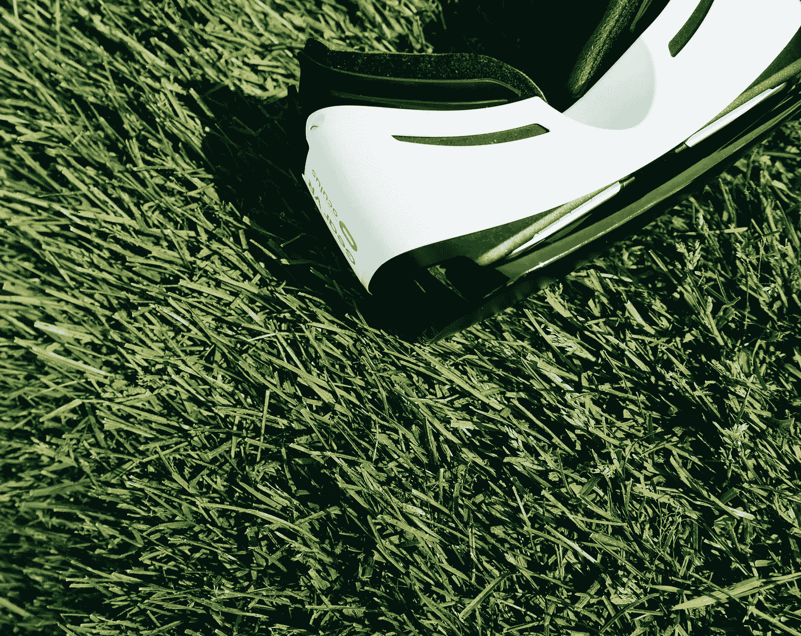

# 增强现实平台的未来

> 原文：<https://medium.datadriveninvestor.com/the-future-of-augmented-reality-platforms-65a90ed1e9ed?source=collection_archive---------7----------------------->

## 与 Atheer 创始人苏莱曼·伊塔尼的访谈

# **简要概述**

[Atheer](https://www.atheerair.com/) 成立于 2011 年，总部位于加州圣塔克拉拉，是一个开创性的增强现实管理平台。他们的主要目标是通过提供满足客户需求的各种解决方案和应用程序，为领先企业提供竞争优势。他们的目标是通过在几个方面将业务提升到一个新的水平，包括“生产力、效率、准确性和劳动力的安全性。”

我采访了 Atheer 的创始人和现任董事会成员 [Soulaiman Itani](https://twitter.com/soulaimanitani?lang=en) ，讲述了他们从一家新兴初创公司到 AR 领域领先科技公司的历程。他是这么说的:

 [## 人工智能和虚拟现实的融合-你能期待什么|数据驱动的投资者

### 在技术领域，融合是合乎逻辑的一步。就在几十年前，你可能需要一个专门的…

www.datadriveninvestor.com](https://www.datadriveninvestor.com/2018/08/30/the-convergence-of-ai-rv-what-you-can-expect/) 

**1。告诉我们更多关于你自己的事情，以及你是如何决定开始创业的。**

我来自黎巴嫩的贝鲁特。我在那里完成了计算机和通信工程的本科学业，然后去了麻省理工学院，获得了电子工程和计算机科学的硕士和博士学位，从事无人机和无人驾驶飞行器(UAV)的研究。之后，我搬到了湾区，在加州大学伯克利分校做癌症研究博士后。我创造了癌症和健康细胞行为的模型，以及如何杀死癌细胞同时最小化对健康细胞的毒性。

我在做博士后的时候就开始研究这个了。我想创造一部可以投影屏幕和键盘的手机，这样就可以用作笔记本电脑或平板电脑。在研究了这个问题之后，我意识到投影仪太耗电了，所以我想到在靠近眼睛的地方使用更小的显示器。那是我开始研究增强现实的时候。

**2。你能给我们解释一下选择公司名称的含义和原因吗？**

这个名字的想法是，数字世界目前被困在屏幕后面，我们正在把它释放出来，并把它放在我们周围的以太中。Atheer 在阿拉伯语中是 Ether。

**3。在跟踪了阿瑟的发展阶段后，我注意到你从 B2C 商业模式转向了 B2B 商业模式。是什么让你选择更 B2b 的方式？**

我们在 2013 年底/2014 年初做了一项大型市场研究，发现消费市场需要很长时间，需要大量营销和时间才能成熟。我们确定了企业中的迫切需求和投资回报，以及更直接的收入途径。

**4。你认为增强现实能以何种方式帮助企业改善他们的现状。**

我们的客户现在几乎在工作的每个方面都使用增强现实。如果你以保时捷为例，他们培训他们的技术人员 4.5 年，以获得金牌资格。尽管如此，使用我们的系统，他们能够减少 40%的修车时间。这是因为在用户的视野中，在正确的时间给出正确的信息，可以显著提高他们的效率。

此外，汽车公司允许他们的客户看到机械师做的检查，并知道可能的解决方案。这样，客户对修复更加放心。

**5。在您看来，AR 在未来几年将面临哪些挑战？**

市场还在成熟，硬件还在早期。AR 已经开始在企业中得到真正的安装，并将在明年开始扩展，后年将会更多。大约在 2020-2021 年，不使用 AR 会让你落后于市场。

第二个挑战是意识以及解决方案的简单性和集成性。这也在显著改善，并将很快有一些大的转变。

**6。你认为，在日益加速的科技世界中，随着对人工智能、物联网和大数据的日益关注，AR 扮演了什么角色？**

AR 是人工智能、物联网和大数据的接口，就像触摸屏体验一样，是移动的接口。AI 和 IoT 依赖于从你的环境中学习，并实时给你信息和反馈。AR 是一个平台，既可以学习你周围的事情，又可以在正确的时间给你正确的信息。为了充分利用物联网、大数据和人工智能，AR 将成为人们用于决策循环的界面。

**7。你有没有采取任何措施，或先发制人的措施，以解决一些更重要的 AR 相关的法律和道德问题，以避免另一个剑桥分析类似的挫折？**

我们不会访问或使用客户的任何信息。它完全属于拥有它的企业。