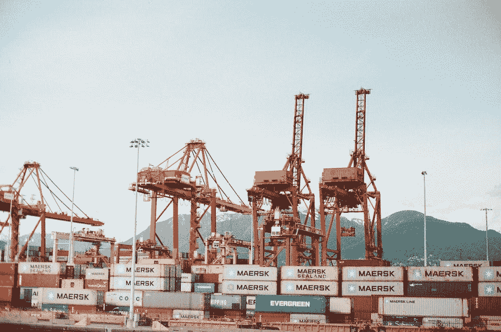

# 澳大利亚和拉丁美洲贸易的未来

> 原文：<https://medium.datadriveninvestor.com/the-future-of-australian-and-latin-american-trade-d0a20bfd3f75?source=collection_archive---------8----------------------->

乍一看，你可能认为澳大利亚和拉丁美洲之间的贸易是不存在的，因为这两个地区相距数千英里。然而，随着世界变得更加全球化，企业寻找新的机会进入市场并扩大利润，澳大利亚事实上已经与拉丁美洲国家建立了贸易关系，这两个地区正在建立新的合作伙伴关系，相互进口和出口对方的商品和服务。

更重要的是，[澳大利亚政府正在努力促进与拉丁美洲的贸易](https://theconversation.com/australia-finally-discovers-latin-america-time-now-to-forge-relationships-9481)，并启动了新的双边协议，对其政策进行了修改，以允许关系的形成和加强。2018 年才通过的新自由贸易协定允许秘鲁和澳大利亚之间的贸易，而智利协定和太平洋联盟则允许澳大利亚和拉丁美洲从彼此的经济中受益。

**澳大利亚/拉丁美洲贸易的挑战**

虽然澳大利亚和拉丁美洲之间的贸易交易和投资有了显著增长，但为了使这些交易富有成效和长期发展，企业和政府必须克服一些挑战。当一些澳大利亚人试图在拉丁美洲拓展业务或向拉丁美洲消费者提供产品或服务时，最常见的问题之一就是语言障碍。当然，你可以支付翻译服务费用，将你的营销材料翻译成另一种语言，但很难与和你说不同语言的客户和企业高管建立并保持有意义的关系，这就是为什么聘请当地的业务发展专家在拉丁美洲国家生活和工作通常是品牌最明智的选择。

除了语言障碍，[还有文化差异](https://www.linkedin.com/pulse/fun-perplexing-cultural-differences-between-latin-lopez-larraquy/)，既包括消费者及其品味和态度，也包括商业文化和最佳实践。澳大利亚人以其宽松和非正式的商业方式而闻名，而拉丁美洲人更保守，重视定期的商业交往，建立和维护新的交易和伙伴关系，也许对员工的要求比澳大利亚企业家更严格。

还必须考虑法律和财务差异；事实上，不同拉美国家的法律法规差异很大，因此，即使你成功拓展到墨西哥，在秘鲁这样的国家工作也可能需要从头开始。由于缺乏对当地市场的可靠了解，在交易或扩张时也很容易出错；腐败盛行，个人往往只顾自己。

虽然墨西哥和阿根廷等国家仍在从保护主义政策中恢复，并因贩毒而闻名，但拉丁美洲在过去十年中已经取得了一些巨大的进步——腐败减少，犯罪减少，经济增长，态度改变。

**与拉丁美洲合作的好处**

过去几年，拉丁美洲的受欢迎程度激增，投资者和品牌总监看到了该地区繁荣的经济、不断壮大的中产阶级以及对西方品牌和产品态度的改变所带来的好处。拉美由 33 个国家和属地组成，是超过 6.2 亿人的[家园](http://worldpopulationreview.com/continents/latin-america-population/)，所有这些人都是潜在客户。精明的澳大利亚人希望将其业务扩展到新的领域，他们无疑会看到，该市场不像英国、美国、加拿大等西方市场那样饱和，甚至不像中国等不断增长的市场那样饱和，并且存在巨大的增长和收入机会。

除了人口，拉丁美洲还受益于其丰富的自然资源，澳大利亚企业可以利用这些资源在国内销售产品。事实上，哥伦比亚和巴西是世界上两个主要的咖啡生产国，星巴克等品牌从这些国家采购供应。廉价的劳动力成本也可以被认为是澳大利亚企业的一大优势，萨尔瓦多的[平均工资仅为每月 400 美元](https://www.numbeo.com/cost-of-living/country_result.jsp?country=El+Salvador)。无论你是想在这个国家树立自己的新形象，还是只想制造产品在其他市场销售，香港都提供廉价劳动力和相对实惠的启动和运营成本，这降低了进入门槛，让企业在没有太多风险或资金需求的情况下在这个国家投资。

**与澳大利亚合作的好处**

澳大利亚经济正在上升，最新的国内生产总值增长率[达到 3.1%，高于预期](https://www.abc.net.au/news/2018-06-06/gdp-economic-growth-data-abs/9840308)。该国也正在迅速成为国际投资的目的地，世界各地的企业都选择在该国设立商店并进入市场。对于拉丁美洲的企业来说，澳大利亚的高人均 GDP(2017 年澳大利亚人均 GDP 为 55925.93 美元，是世界上最高的国家之一)意味着对优质商品和服务的需求很高。2016 年至 2017 年，从拉丁美洲进口了价值超过 63.49 亿澳元的商品，其中 15.74 亿美元用于农业，27.32 亿美元用于 ETM(精心改造的制造业，也称为高科技电子产品)。能够利用这个市场是有意义的，因此为了竞争，与其他企业竞争以最低的价格提供最高质量的产品是至关重要的。

**为什么拉美和澳大利亚的贸易是好事**

作为一名在澳大利亚生活和工作了几十年的澳大利亚人，我现在经营着自己的公司 Biz Latin Hub，该公司提供包括公司组建在内的服务，以帮助那些想要拓展新市场的企业家，我亲身体会到澳大利亚和拉丁美洲之间关系的改善只会是一件好事。它不仅释放了两个地区之间的潜力，使它们能够获得彼此的矿产、服务和其他商品，而且有助于使市场多样化，减少拉丁美洲对美国的依赖，提高该地区的购买力和销售力，帮助澳大利亚企业释放新的收入来源，并在当今的全球市场中竞争，在当今的市场中，任何企业都是不安全的。

*在拉丁美洲或澳大利亚提供服务利润丰厚，但重要的是你要从第一天起就了解你的竞争对手并确保牢固的合作关系。无论你是创业还是寻求扩张，我祝你好运！*