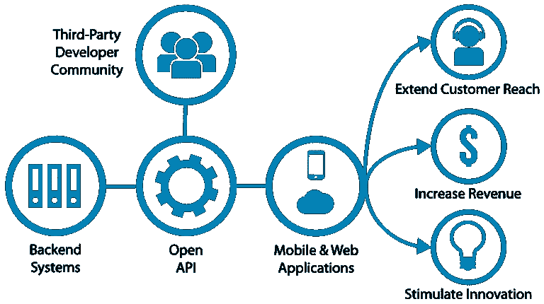

# 银行业的未来——什么是开放式银行？

> 原文：<https://medium.datadriveninvestor.com/the-future-of-banking-what-is-open-ban-b1ad510b37ab?source=collection_archive---------2----------------------->

在这个时代，我们生活的方方面面都在转变为数字化体验。从需要几天才能到达目的地的邮件转变为几秒钟内到达收件人的电子邮件，到从商店购买商品转变为在网上商店点击几个按钮，现在我们正处于汽车自动驾驶的阶段。

所以一切都变得更容易，更快，更好。自从经济开始转变为数字数据驱动的时代以来，轻松快速地访问、编辑和共享数据的能力已经成为任何个人的主要要求。每个人都在尽最大努力满足他们的所有需求，比如购物、支付水电费、通过移动应用程序或网站轻松转账。但是在网上进行金融交易时，如果我们没有像 Paypal、Skrill 或支付宝这样的虚拟钱包，我们就必须面对很多麻烦。这是因为大多数银行都建立在遗留系统之上，他们甚至没有考虑支持在线交易。

 [## 分散金融的出现|数据驱动的投资者

### 当前的全球金融体系为拥有资源、知识和财富的人创造了巨大的财富

www.datadriveninvestor.com](https://www.datadriveninvestor.com/2019/03/14/the-emergence-of-decentralized-finance/) 

信用卡和借记卡的出现，如 VISA、Mastercard、American Express，以及银行建立自己的在线交易系统，在一定程度上弥补了这一差距，但仍然有很多事情可以做，以简化我们所做的金融交易过程。这就是开放银行业发挥作用的地方。

什么是开放式银行？

开放银行业务是将银行提供的内部服务以开放、标准和安全的 API 的形式开放给外部世界，以供第三方开发者使用，从而基于现有的金融机构向大众提供服务和应用。换一种更微妙的方式来说，这意味着公开一个 API，该 API 可以用所有银行通用的标准从银行向外部提供银行服务。授权的第三方可以开发应用程序来使用这些 API，并为普通大众提供更好的设施，重要的是这一点。第三方不必为每家银行构建单独的应用程序(就像我们现在所做的那样)，因为公开的 API 对所有银行都是通用的，第三方可以开发一个应用程序来支持所有遵循开放银行业务的银行。因此，您所有的银行账户都被整合到一个数字钱包中，就像这样！

**它如何帮助顾客？**

大多数银行都专注于以现有的方式处理交易，他们没有兴趣建立一个新的解决方案来帮助客户。另一方面，银行不是 IT 公司，所以他们没有能力以现有的方式处理所有的客户交易，同时开发精通技术的应用程序来帮助客户。当银行正在努力为客户开发新的设施时，有第三方开发人员拥有出色的应用程序来帮助客户，但他们没有客户群。开放银行弥合这一差距如下。银行为他们的服务公开了一个 API，并照常运行。第三方开发人员(有时是金融技术人员)可以通过使用银行提供的开放 API 向普通大众部署他们的解决方案。因此，银行不必担心开发新的应用程序来方便客户，第三方开发商也不必担心寻找客户群，因为他们可以向银行的现有客户提供解决方案。因此，在开放式银行的帮助下，我们可以将金融交易转变为在手机或电脑上点击几下，更快、更安全地进行交易。

**开放银行业能带来什么？**

开放银行定义了一个标准，所有银行在将其服务作为 API 对外公开时都应该遵循这个标准。由于所有银行都有一个标准的 API，第三方开发人员可以轻松地将所有客户的银行账户聚合到一个数字账户中，并通过该账户完成用户的所有交易和支付。只有经过验证和授权的第三方才可以使用银行公开的 API。因此，这使得用户的金融账户更加安全，因为他们不必为每个银行维护在线账户，这更容易受到攻击。开放银行促使第三方为用户提供新的服务和更好的解决方案，这反过来又通过引入新的支付和接受支付方式来方便客户。开放式银行为数据提供了更好的透明度。用户可以很容易地看到自己的财务状况，而不必分别检查每个银行账户，并逐一分析报表。它还通过允许第三方应用程序检查用户在所有银行账户上的交易并识别潜在的欺诈行为来减少欺诈(当应用程序可以访问用户的所有银行账户时，它可以轻松识别单个银行账户上是否有任何异常活动)。

**开放银行的弊端**

尽管开放银行业看起来很棒，但它也有自己的缺点。开放式银行将所有用户数据集中到一个地方。一方面，这更安全，因为您只需保护一个地方，但另一方面，如果这个地方受到攻击，您的所有数据都会暴露。此外，开放银行业务涉及大量数据共享，你的数据会落入他人手中，而不是你信任的银行。

开放银行标准通过对谁访问你的数据、你的数据的哪些部分对第三方可见、如何验证第三方等实施严格的规则来最小化这种情况。但类似地，对于任何其他系统，当你转向数字化时，没有什么是 100%安全和容易的，你必须在开放银行的利弊之间做出权衡，决定是否要使用第三方应用程序。

下次见，再见！

参考资料:

[https://www.investopedia.com/terms/o/open-banking.asp](https://www.investopedia.com/terms/o/open-banking.asp)

[h](https://en.wikipedia.org/wiki/Open_banking)ttps://en . Wikipedia . org/wiki/Open _ banking