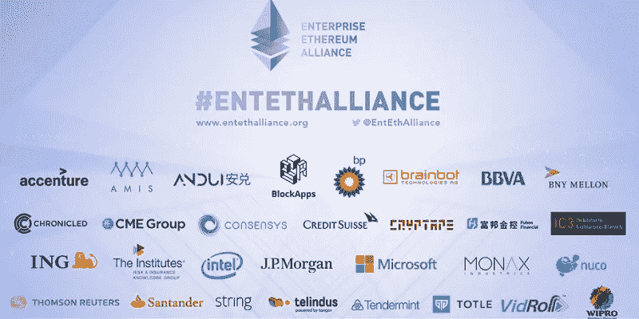
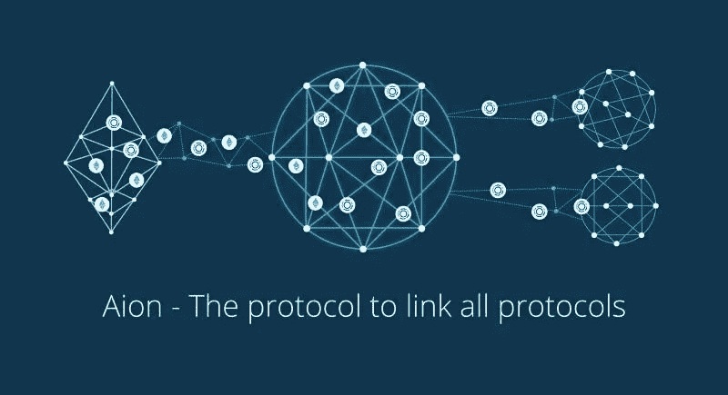
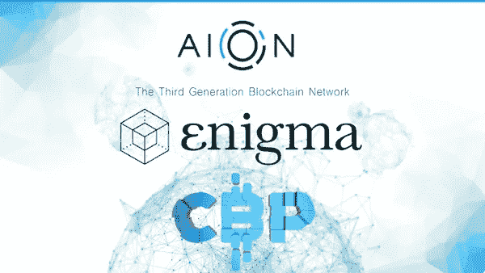
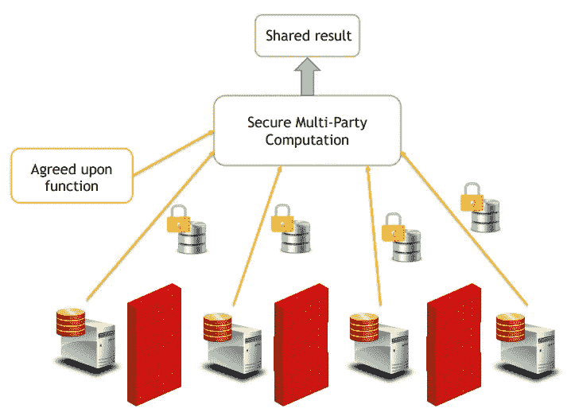
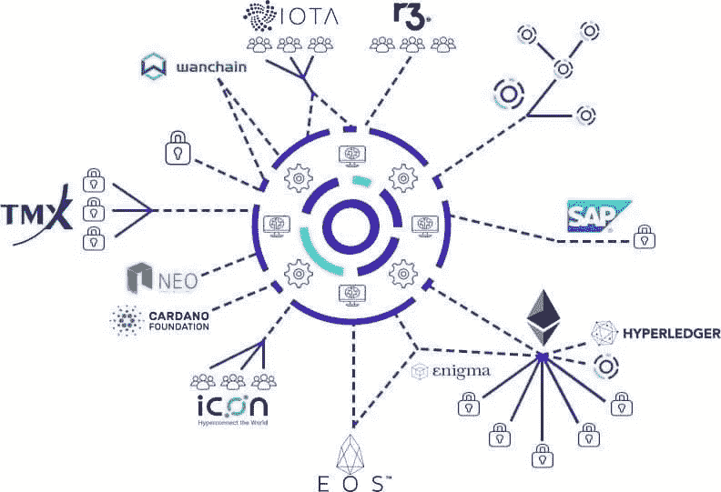

# 区块链的未来是私有的

> 原文：<https://medium.datadriveninvestor.com/the-future-of-blockchain-is-private-878cc57fa3c2?source=collection_archive---------9----------------------->

**区块链的问题**

那些在区块链竞技场的人已经听到了区块链不被大众接受的原因。区块链没有规模化，不安全，不能持有私有数据，也没有和民营企业的融合。即使是最热情的区块链爱好者也能理解这些缺点。幸运的是，市场的波动和技术领域的创新热情激励了开发者，推动了指数级的技术进步。当然，以太坊、Stellar 和 NEO 等空间中的发电站项目以 IBM 和微软等高调的外部合作伙伴的形式展示了它们的潜力，但它们解决了困扰区块链的问题吗？像互操作性和私有数据这样的问题必须在有意义的采用之前解决。

**没有互操作性的新互联网是什么？**

**我们如何打击广告驱动的互联网和轻率窃取私人数据的行为？**

在过去的 20 年里，答案是集中化。相信谷歌，相信脸书，让他们盈利吧。让 Equifax 保留您的数据并拒绝集成。要真正受益并做出改变，你需要密码社区能够一起工作并保证它的安全。安全是指您可以实际传输敏感数据，而不必担心下一次数据泄露。同样重要的是，您必须保持通信和数据路径畅通，以便最大限度地利用数据和区块链。经济学家、作家兼记者肯尼斯·库基尔(Kenneth Cukier)认为“不使用数据在道德上等同于焚书”。同时，库基尔提醒人们对此类数据的负责任的处理。库基尔只需要看看区块链和加密空间。

> “不使用数据在道德上等同于焚书。”—肯尼斯·库基尔

**永恒之塔**

如果你是以太坊及其企业以太坊联盟的粉丝，那么你可能听说过 Nuco Inc，它是企业以太坊联盟的创始成员和主管。2017 年秋天，Nuco 创建了 Aion 网络，其任务是建立一个专注于互操作性的多层区块链，连接公共和私人区块链。2017 年 12 月，加密领域两只潜在黑马之间的合作关系成为区块链唱反调者的强大对手。永恒之塔和谜宣布他们的合作伙伴关系，把“秘密智能合同”带到每一个区块链。目标是 Aion 提供区块链和 Enigma 之间的互操作性，提供在 Aion 网络上保持敏感数据加密但可用的能力。

企业以太坊联盟

明白了，更多大牌承诺的解决方案。

这里的关键是，作为协议，这两个项目都不需要以采用新应用程序的形式从头开始构建。他们的协议可以移植到现有的基础上，并在以太坊这样的遗留系统上提供急需的解决方案。为了更好地理解这两个项目是如何相互受益的，您需要分别来看它们。

Aion 是第一个旨在连接区块链实体的多层区块链网络。这种具有潜在突破性的轴辐式网络允许公共、许可和私有区块链集成和利用其他协议和项目的功能。Aion 网络提供区块链项目，以利用整个加密空间的能力，并允许在这些实体之间向 Aion 网络上的任何区块链传输值和逻辑。永恒之塔希望发挥区块链的潜力，成为区块链空间梦寐以求的分散式可信互联网。Aion 预测，在未来，区块链将使用类似于互联网的中心辐射模型。

Aion 协议

**Aion 协议:**

根据区块极客的说法，轴辐式分布网络是一个系统，其中各种网络像钢丝轮一样分布，流量通过连接到中心集线器的辐条流动。Aion 设想自己是“一个联网的、联合的区块链，将这些独立的辐条整合在一起。”

Aion 的目标是成为第三代区块链，使公共和私人组织能够:

***联邦成员:*** 在连接到 Aion 的区块链和以太坊之间发送数据和值

***缩放:*** 增加所有永恒之塔区块链的可扩展性。

***辐条:*** 帮助组织创建可互操作但可以有自己独特的共识机制、发布和参与的区块链。

将这些独立的区块链相互连接起来，对于区块链寻求成为新数据生态系统的主干至关重要。Aion 有了一个很好的开端，因为他们很快就能扩展他们的网络，以便与:

以太坊总账图标 Neo Cardono IOTA EOS R3 等。

Aion 网络的一个目标是让合作协议能够在 Aion 网络上提供服务，让 Enigma 这样的项目能够在任何 Aion 集成区块链上运行。加密货币的投资者和“持有者”经常发现自己陷入了对他们支持的项目的狂热崇拜。对于像《谜》和《永恒之塔》这样的协议，你不必只是一个项目的教区居民，并希望它成功。开发者、爱好者和投资者可以在 Aion 和 Enigma 中找到一个安全的避风港，同时从整个加密货币领域中受益。

永恒之塔-谜伙伴关系

**隐私:**

区块链作为一种工具，已经成为大数据、金融市场和数字框架的革命性工具，但除非我们喜欢的技术能够在新的数据生态系统中协同工作，否则这是不可能的。此外，利用和传输敏感数据的传统数据系统和区块链不会采用分散系统的力量，除非未来的数据生态系统是围绕隐私构建的。HIPAA 和 GDPR 等现行法规要求数据系统安全并保护私人数据。除了政府强制要求之外，消费者越来越意识到他们的数据以及保护数据安全的重要性。我可以不停地讲述保证数据安全的重要性以及 Enigma 如何帮助解决这些问题，但幸运的是，他们已经为我做了一些工作:

阅读:[为什么仅靠区块链无法修复脸书](https://blog.enigma.co/why-blockchain-alone-cant-fix-facebook-fbd9510b36f5)

**谜**

源自麻省理工学院的 Enigma 项目承诺为区块链应用程序提供可扩展的隐私解决方案，并将通过两种方法实现这一目标:

***可信执行环境(TEEs):***TEE 提供了一个完全隔离的环境，称为 enclave，防止其他应用程序、操作系统和主机所有者篡改甚至获知在 enclave 中运行的应用程序的状态。因此，TEE 为智能合约数据提供了区块链所不能提供的强大保密性。不幸的是，单靠 TEE 无法保证可用性或提供安全的网络或持久存储。因此，它无法独自实现区块链的权威交易排序、持久记录保存或对网络攻击的弹性。因此，要认识到 TEEs 的潜力，它应该与一个在分散式互联网主干网之外工作的协议相结合。

***Enigma 的可信执行环境(TEEs):*** 麻省理工学院的 Enigma 网络提供了一个无许可的对等网络，允许执行具有强正确性和隐私保证的代码(秘密契约)。另一种看待网络的方式是作为一个智能合约平台(例如，类似于以太坊),它支持分散式应用程序(dApps)的开发，但关键区别在于数据本身对执行计算的节点是隐藏的。这使得 dApp 开发人员能够将敏感数据包含在他们的智能合约中，而无需将链外数据转移到集中式(安全性较低)系统。

***安全多方计算(sMPC):*** Enigma 希望使用安全多方计算和非链式分布式哈希表(DHT)来确保数据隐私。MPCs 在网络上的节点之间分发数据，将加密信息分割成单独的片段以确保其安全性。然后，DHT 负责将这些数据存储在离线数据库中。DHT 存储数据，而 MPC 负责处理和检索数据，同时两者都确保所处理的数据完全保密。根据 Enigma 的白皮书，所有数据“在不同的节点之间分割，它们一起计算功能，而不会向其他节点泄露信息。具体来说，没有哪一方能够访问全部数据；相反，每一方都有一个无意义(即看似随机)的部分。”

安全多方计算

**英格玛的设计**

Enigma 的 TEE 和 sMPC 设计将能够是区块链互操作的和不可知的，它作为区块链平台的一个扩展用于非链计算。它不需要成为所有区块链问题的 100%解决方案，但它解决了限制区块链采用的可扩展性和隐私问题。为了确保数据的安全，信息在发送到网络之前可以被加密，这个链外层负责在 Enigma 的节点间分发这些数据并保持其私密性。区块链的公共账本只存储这些数据的引用，以提供存储的证明，但这些数据本身并不公开——它们在离线网络上仍然是模糊的、私有的和分散的。

Enigma 计划在 2018 年底推出他们的 TEE 网络主网。Enigma 宣布了 8 个将在其网络上建立的发布合作伙伴，这是一个良好的开端。Aion 还预计在 2018 年底前有 15 个项目在 Aion 平台上启动。这两个沉睡的巨人可能不会沉睡太久。

拟议的 Aion 网络

**死亡隐私币？—敬请期待**

考虑到这些令人兴奋的功能，投资者、企业和早期采用者有更多的机会感到兴奋，尤其是 Aion 和 Enigma 在爆炸式增长的数据空间中提供了突破性的突破和进步。他们的潜在市场为数万亿，并且已经建立了生态系统的框架，该框架将为这些数万亿涌向这一新兴技术提供必要的功能。值得注意的是，许多新的应用程序将使用 Velocia 和海洋协议等基础。但是，可以说更重要的是网络的基础。也就是说，如果你把 Aion 的互操作性和 Enigma 的隐私和安全特性结合起来，任何利用这些协议的硬币都可以被认为是隐私硬币。“隐私硬币”能力在“加密热潮”的巅峰时期控制了高达 500 亿美元的价值，到 2018 年 9 月约为 150 亿美元。截至 9 月 12 日，Aion 的估值为 8800 万美元，Enigma 的估值为 4000 万美元。Aion 和 Engima 都有关键的六个月时间，因为他们计划发布他们协议的主要进展。这为早期投资者和企业提供了在炒作之前进入这两个项目的机会。

> 有了 Enigma 的秘密智能合同，所有发行的令牌都可以立即成为隐私令牌，几乎不需要额外的努力。如前所述，这有助于保护持有者的身份，并大大降低安全风险。——盖伊·齐斯金德(英格玛首席执行官)

**伦理道德**

除了两家公司已经展示的技术潜力之外，他们都在他们的进展和对社区的回应方面提供了巨大的透明度。永恒之塔和谜都建立了大使平台，让有才华的爱好者帮助发展这些新生的项目。发展这些社区对 Aion 和 Enigma 的成功至关重要，因为项目是为人们开发的，所以人们必须参与其中。另一个相似之处是，Aion 和 Enigma 拥有强大的社区平台，专注于有意义的采用，而不是炒作。尽管他们有能力支持他们在 Delloite、微软或英特尔的合作伙伴关系，但这些项目已经清楚地表明，他们并不关注他们平台的市值，而是开发他们项目的基础、网络和社区。只要它们优先考虑进步，市值和财务激励就会自然而然地随之而来。

永恒之塔和英格玛都专注于技术进步和业务发展，不太关注其令牌的价格，因为他们不关心短期投机。

互操作性被称为区块链的圣杯，对加密数据进行计算分析的能力被认为是数据科学的圣杯。

随着这些巨大的发展，区块链的信徒们应该团结在技术进步的周围，用最纯粹的分权、隐私和融合的形式来加强区块链。有意义的改变需要一段时间，这些项目对炒作不感兴趣，但也许，我们这些狂热分子应该感兴趣。

**完全披露:**我确实拥有一些英格玛，我打算以后投资永恒之塔。

**在推特上关注我:**[@ tyjewel92](https://twitter.com/TyJewell92)

**英格玛的联系方式:**

在我们的网站和博客上了解更多关于我们项目的信息。

加入我们的开发者社区:forum.enigma.co

想建立我们的协议吗？查看我们的文档开始，或者，如果您是一个项目或企业，请在此提交您的兴趣。

加入英格玛团队:enigma.co/team

电报:t.me/EnigmaProject

Reddit:reddit.com/r/EnigmaProject

推特:twitter.com/enigmampc

不和:[https://discordapp.com/invite/SJK32GY](https://discordapp.com/invite/SJK32GY)

**永恒之塔的联系方式:**

永恒电报:t.me/aion_blockchain

Aion 网址: [https://aion.network/](https://aion.network/)