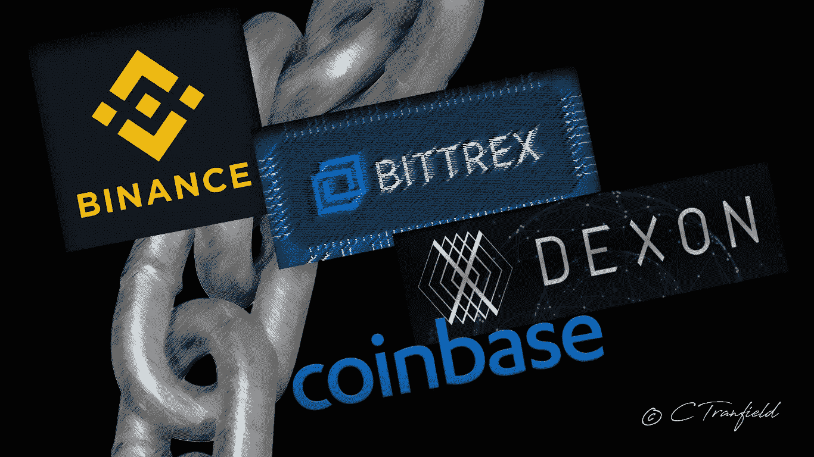

# 去中心化交易所的未来:#ChangeYourExchange

> 原文：<https://medium.datadriveninvestor.com/the-future-of-decentralized-exchanges-changeyourexchange-d5bad277ba40?source=collection_archive---------16----------------------->

Pick’n’mix.

我们已经听到了比特币基地和币安的弟子们，加密领域最重要和最多产的交易所，特别是在他们的用户体验(比特币基地)，创新开发部门(币安实验室)和监管批准(两者目前在这一领域表现良好)。我们也知道有些人没能逃脱加密媒体的审查，在他们身后散布失败的 Stablecoins(我们指的是你，Bittrex)。让我们深入探究一下最有效、最受欢迎的交易所——它们为什么如此受推崇？—在把我们的注意力转向他们的竞争对手之前，静静地潜伏在阴影里，等待他们进入拳击台的机会。

## 比特币基地——我们还没完。

有无数这样的例子，它们都在以下领域进行自我整理:用户体验、初学者的轻松访问，以及法定货币的无缝实现。当你第一次购买与密码相关的东西时，比特币基地显然是必去之地:牵着你的手，这是一个令人舒适的坚实的数字存在，因为你迈出了重要的一步，从正常而彬彬有礼的监管不确定性的野生和奇妙的洞穴。玩笑归玩笑，比特币基地被普遍认为是初学者理想的加密货币“在线零售”门户——而不是活跃的交易者交易所。这当然是公认的零售银行兼容性——也就是说，在一定程度上。虽然最初的比特币基地交易仍然被某些零售银行标记为欺诈，交易仍然需要一天以上的时间才能完全完成，但我们还没有达到足够的能力水平，当然还不足以坐以待毙并宣布胜利。作为一个社区和一个蓬勃发展的行业，我们必须将纠正的激光束对准彼此，同时抵御无数的反对者。

## 币安——艰难的攀登

币安有一系列计划，准备在 2019 年发布——其中最有趣的是他们自己的分散式交易所，这是他们更广泛的“币安链”计划的一部分，旨在支持任何数量的加密资产。预期的功能包括一秒钟的交易阻塞时间，以及强制卖点，即**用户控制自己资金的能力**。私人密钥的个人所有权应该是一种保证，而不是一种让步——用户需要承担责任，如果必要的话，几乎是被迫控制他们自己的资金。极具讽刺意味的是，在我们努力购买和完全拥有加密货币的过程中，我们作为用户必须面对传统上与集中式模型相关的威胁:黑客攻击、大量资金损失、信息被盗或泄露。

## 冻结资金:HitBTC —为什么？

最近——似乎是为了进一步说明集中的、固有的脆弱模式所带来的种种困难:HitBTC 冻结了所有客户的账户，为一年一度的“钥匙证明”活动做准备。该客户通过 Reddit 以前的论坛表达了他的关切，提醒交易所他成功地通过了“了解你的客户”程序，包括交易账户的六个月强制等待期。一大笔资金已经被提取，但是，该客户在用于当天交易的公开地址中仍持有大量资金。交易所方面的错误？是的。一般贸易领域的潜在灾难？也是的。

"在发送了 40 多封电子邮件的几个月后，HitBTC 最终解冻了我的账户."(PEDXS，受害用户)。可以接受？在分散化的 21 世纪的上半叶，情况并非如此。评论者 Harsh Agrawal 特别刻薄:“HitBTC 最初是一个有前途的加密交易所，在 2016 年和 2017 年的大加密浪潮中运气不错，但它[肯定]未能跟上**创新和用户需求**。”症结所在。最后一击:“他们几乎无法生存。”当你对一个理想的用户体验所需要的不断创新视而不见时，预期的结果。

约翰·麦卡菲(John McAfee)的讽刺最为尖锐:“加密交换已经成为我们最初反对的东西。他们的力量是巨大的。抵制他们。”

极具讽刺意味的是，这种恶毒的反弹和广泛的不满发生在一个相当拙劣的试图通过“密钥证明”运动来提高用户资产和整个网络的安全性的过程中。将加密货币密钥留在交易所可能有风险，因为在过去十年中，已有数十亿美元被盗。这种担忧形成了由比特币播客主持人 Trace Meyer 发起的“钥匙证明”运动的基础。其背后的意图是检查第三方纪律钱包的 l**合法性，并对其偿付能力进行测试，运用清晰的审查。积极的动机是存在的；死刑没有执行。**

本质上，比特币所有者被鼓励将他们的持有物从交易所移除，转而转移到他们可以控制的钱包中。然后，他们还被鼓励旋转一个完整的节点，其中包含比特币网络上每笔交易的历史记录。

你认为交易所在某些方面是集中的吗？以比特币基地、币安、Bittrex、北海巨妖的方式，在加密领域的死亡挑战高度上发挥央行标准力量——所有这些人都遭受了某种形式的侮辱，一些正当的反弹，以应对最近在加密 Twitter 的隔板上贴满他们名字的丑闻。交易所黑客攻击，其中 90 起发生在过去 9 年中——Mt . Gox、BitGrail、Coincheck——以及最近通过比特币基地的以太坊经典双消费攻击。集中式交易所缺乏对政府禁令的辩护，其中大部分禁令只是由于他们坚持使用集中式模型而出现的，交易所所有者以一种持续的方式维护这些结构，用用过的纸巾擦鼻子，把它们扔进垃圾桶，然后小心翼翼地把它们拣出来，再次在脸上涂抹。这从整体上挫败了比特币、加密货币和分布式账本技术的初衷。我们沿着这条轨迹走得越远，妥协就越多:我们必须保持一定程度的权力下放，或者至少是表面上的权力下放，但如果不在基本原则上做出让步，我们就无法完全致力于这样一个令人敬畏的、重大的、必不可少的概念。迎合不可信实体的概念——这甚至是一种可能性吗？不——如果你认为自己是一个真正的信徒，或者——谁会相信呢？—理性思考者。

## 德克森——杰出的新人

Dexon 和 cobin hood——犯罪的伙伴。一个是分散的交换中枢，另一个服务于 ico。COB 将通过链间协议桥接到 Dexon 上。

问:Dexon 承诺如何积极影响充满弹坑的交易所景观？回答:根据他们的说法，没有 DApp 会再承受“缺乏可伸缩性、低交易延迟和高交易成本”的巨大负担。听起来好得难以置信？显然不是。

DEXON 通过其前卫的 blocklattice 架构抓住了难以捉摸的无限可扩展性。(**Blocklattice**:Dexon 部署的 block lattice 结构并行处理块，而不是像传统的区块链那样顺序处理块，从而实现更快的交易时间、更低的费用和更高级的安全级别。两条链同时运行，都能够相互通信。每个块相互确认，每个验证器以不同的顺序查看块。)事务处理吞吐量与参与 DEXON 一致性算法的节点数量成线性比例关系。此外，一旦节点达到其最大吞吐量，它就可以扩展到无限数量的碎片，以平衡事务处理负载，从而实现理论上无限的、可扩展的事务处理吞吐量。正如标语所宣称的那样，Dexon 确实在帮助推动人们梦寐以求的去中心化的未来。

## 集中式与分散式交换

让我们找出问题所在——为什么集中而不是分散？两者都有相同的利弊，权衡我们心理的每一面，就像停滞状态下的绳梯一样。坚定地朝一个方向走，你会把另一边推向疯狂的摇摆。无论是分散式还是集中式交易所都不能完全免受黑客攻击——然而，对于分散式交易所来说，破坏性黑客攻击的风险肯定更低，因为架构上存在差异:分布式节点提供了分散式优势。然而，当我们考虑无缝用户之旅的开始时，集中式交易所具有优势:它们促进了直接的法定货币支付选项，允许用户将法定货币兑换为密码，反之亦然。(然而，他们肯定需要在支付兼容性方面下功夫。集中交易所还具有流动性高、交易量大的优势，特别是由于用户数量增加，而分散交易所由于用户基础狭窄，目前还没有达到同样的流动性和交易量水平。政府很容易对集中交易实施铁腕监管——这既有负面影响，也有正面影响。当然，监管是一只相当不受控制的野兽，可以对业务扩张计划和用户体验等造成相当大的破坏——然而，那些获得权威批准的人具有可用性，他们没有约束，还有保险的额外津贴和明确定义的物理位置。

请继续关注我们#ChangeYourExchange 系列的下一部分，在那里我们将剖析不同加密钱包和人工智能驱动的交易所的优势和劣势。