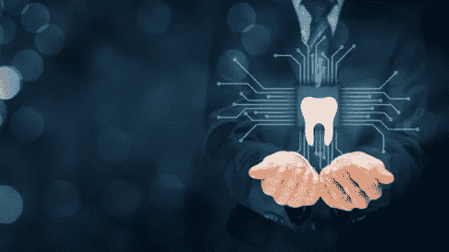

# 牙科的未来——技术将如何改变牙科实践？

> 原文：<https://medium.datadriveninvestor.com/the-future-of-dentistry-how-technology-will-transform-dental-practice-81a74be918fc?source=collection_archive---------23----------------------->

数字技术的进步极大地改变了我们的日常生活，让一切触手可及。医疗保健行业也发生了翻天覆地的变化，如健康记录的数字化、虚拟患者就诊、高分辨率数字成像等。牙科也不例外，在 CAD/CAM 辅助牙冠/牙桥、用于种植手术/修复的数字辅助治疗计划、龋齿诊断工具(如数字射线照相术、光纤透射照明的数字成像、光学相干断层扫描术、激光荧光等)的形式中看到了数字革命的显著影响。这些进步不仅提高了牙科护理的质量，而且提高了程序的效率和可预测性。将对牙科护理产生巨大影响的一项技术是人工智能(AI)。随着围绕人工智能将如何改变医疗保健面貌的一系列活动，牙科保健将不会落后。

凭借对过去数据进行训练的能力，最先进的人工智能技术将开辟许多新途径，使临床医生能够提供更好的牙齿护理。牙科将受益于人工智能的广泛应用——从优化患者日程安排和与患者的有效沟通到做出更好、更明智的诊断。

**人工智能在咬翼片龋齿检测中的应用**

人工智能在牙齿护理中的一个应用是从咬翼 x 光照片中检测龋齿。检测龋齿可能存在几个挑战。平均而言，一名普通牙医每天会解读 10-15 组咬翼片射线照片，同时扫描 300 多个近端表面的龋齿。因此，由于医务人员的疲劳，忽视龋损并不罕见。由于临床训练中的变化、感知中的误差以及健康和疾病分类中的认知误差，操作者之间在正确诊断和治疗龋齿方面的差异进一步增加了问题。

这些挑战可以通过利用人工智能来突出射线照片上的潜在问题区域，从而减少龋齿的漏诊，并在从业者中建立一致性，从而轻松克服。由[牙科开发的人工智能软件。](https://dentistry.ai/)人工智能突出咬翼片上潜在的龋齿病变，从而帮助牙医进行龋齿诊断。此外，它可以用作患者教育工具，从而提高疾病意识和治疗接受度。

**人工智能在牙科的其他应用**

智能调度:人工智能可用于安排患者预约，以优化提供者利用率并最大限度地提高生产率。这也将减少调度人员的负担，并可能消除对新员工冗长培训会议的需求。

智能患者沟通:如果情况需要，可以使用人工智能有效地回答患者的术后查询，或将其引导至牙医。这将减少调度和临床工作人员在处理处方再配药请求或回答简单询问(如术后护理说明、手术后会发生什么、如何识别紧急情况等)上花费的时间。

**牙科的未来**

我们对这些应用还只是皮毛。人工智能的更多应用将改变今天为患者提供牙科护理的方式。所有这些应用程序将缓慢但永久地集成到日常工作流程中，最大限度地提高效率和准确性。这将转化为更短的治疗时间、更少的患者就诊、更少的过度治疗和更低的失败率，从而降低总成本并增加牙科服务的可及性。

我们非常高兴能够通过利用人工智能的力量，在将牙科带到一个新的水平方面发挥我们的作用。请继续关注我们的许多有趣的应用。

我们希望你喜欢这篇文章。如果你是一名牙医，你可以在[注册](https://dentistry.ai/signup)成为一名临床调查员来测试[牙科。艾](https://dentistry.ai/)在你的诊所。

**关于作者:**

(一)Sanket Nagarkar 博士，公共卫生硕士:Sanket 博士是美国明尼苏达州明尼阿波利斯市的一名执业牙医。

(二)Angam Parashar: Angam 是[牙科的联合创始人。人工智能技术初创公司 AI](https://dentistry.ai/) ，从事牙齿和口腔护理。