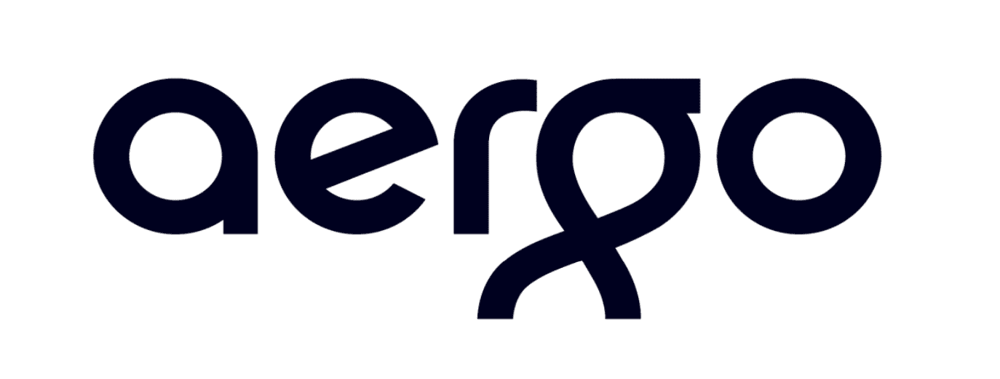

# 企业和区块链技术的未来

> 原文：<https://medium.datadriveninvestor.com/the-future-of-enterprise-and-blockchain-technology-8a94c3aef5d?source=collection_archive---------16----------------------->

[Source](https://www.finder.com.au/events-exploring-blockchain-ticket-solutions-to-combat-scalping)

区块链已经在技术社区甚至主流媒体中产生了许多积极的反响。围绕区块链技术的大肆宣传导致了喜忧参半的结果。区块链的优势和它的能力已经让他们的案例扩散到了科技社区之外；这种炒作也产生了负面影响，尤其是对可能没有认真对待区块链的商界。

区块链有可能以类似于甚至高于互联网的方式影响企业。当商界仍对这一革命性技术不屑一顾时，科技公司正在进行一系列投资，试图挖掘区块链的潜力。作为一些阵容投资，其他人提出了区块链空间内的解决方案。

✳️AERGO 是为现实世界的企业提供解决方案的公司之一。它的平台是专为企业服务的。这种排他性意味着通过限制可以参与 AERGO 生态系统的 dApp 的类型来保持平台尽可能高效。

# 认真对待区块链

通过分析德勤对区块链的调查，人们感觉区块链确实有一个光明的未来。因此，企业有责任在为时过晚之前采用这项技术。技术正以极快的速度发展，过时就像跳过智能手机的更新一样容易。

区块链有一些强大的火力，无法在集中式平台上复制。企业将会喜欢能够降低运营成本并最大化效率的平台。在这个时代，只有区块链能提供这些。通过 dApp 整合区块链的公司很可能在未来变得更加成功，尤其是如果区块链的技术将被全球整合的话。

✳️Blockchain's 的主要优势；信任、透明和安全使其处于创新的前沿，因为这些是关系到世界市场的关键因素。

# 未来的挑战

就像任何新技术一样，在行业完全适应它们的工作方式以及如何最好地利用它们来获取最大收益之前，可能会有一段时间的铺垫。区块链仍处于所谓的“实验阶段”。大多数公司都在测试它，看它是否适合他们的运作模式。关于区块链技术，还有很多需要理解和揭穿的东西。

目前，最大的挑战是区块链平台处理流量的能力。这一障碍是 AERGO 平台解决的主要领域之一。有效且高效地处理通过 dApp 提供的使用服务的变化是任何区块链平台的关键目标。阿尔戈的处决会导致这样的经历。

✳️Apart 从可扩展性来看，由于比特币和以太坊等平台的波动性，基于区块链的平台的吸收一直很慢。公众尚未完全了解区块链的整体情况，并对平台失败等后果感到担忧。然而，随着越来越多的人了解区块链的能力，它的采用将随着时间的推移大幅增加。

区块链平台上使用的✳️Programming 语言也是创新的障碍。开发人员熟悉 C++等语言，而大多数区块链平台需要用 solidity 编写的智能合同，这种语言只有极少数开发人员知道。这一要求的改变也将有助于促进区块链技术的接受和采用。

# 创造和创新的自由

[Source](https://www.google.co.uk/url?sa=i&rct=j&q=&esrc=s&source=images&cd=&cad=rja&uact=8&ved=2ahUKEwjOh6CZ8-XdAhUN1xoKHfa2A4sQjxx6BAgBEAI&url=https%3A%2F%2Fmedium.com%2F%40block42%2Fico-review-aergo-35435c96535b&psig=AOvVaw3Tc9wM-6UFGeKWzzcPkIVw&ust=1538505885613715)

世界正在经历 dApp 应用的激增。然而，它们的服务之间的差异很小。与众不同是大多数即将到来的 dApp 的目标。大多数 dApp 是基于以太坊的，因为它是行业标准，然而它的明显挑战可能会妨碍 dApp 的正常运行。因此，所使用的协议在使开发者和创新者能够提供优于其他应用程序的应用程序方面起着至关重要的作用。

AERGO 创造了一个平台，在这个平台上，创造力和创新的表达受到尽可能少的限制。通过平台采用的开发人员友好的方法，这个机会就足够了。语言问题阻碍了对区块链技术的合理利用。AERGO 通过 AERGOSQL 处理这个问题。

*   AERGOSQL 专注于使用编程领域的流行语言开发智能合约。它包括一个带有 SQL 的智能合同引擎。
*   开发人员可能会欣赏 AERGO 的这一举措，因为它使他们的工作变得更加容易。

COINSTACK 背后的公司 Blocko 将帮助创建一个对开发者友好的环境。AERGO 为开发者和 It 供应商提供灵活性是至关重要的。AERGO 专为面临共同和独特挑战的企业打造。这需要灵活性，以适应每个企业可能需要的服务的众多变化。

✳️Blocko 正在开发核心元素，为 AERGO 上的 dApp 提供广泛而全面的集成和支持服务。通过 AERGO，开发人员将拥有所有的资源来创建 dApp，由于 AERGO 展示的有限限制，这些 dApp 可以按照客户的要求工作。

# 目标企业

AERGO 的范围仅受限于设计用于其平台的 dApp。任何有创新 dApp 想法的企业都可以通过 AERGO 平台充分利用他们的方法。简化各行业服务的需求很可能会增加 AERGO 在商界的受欢迎程度。

[Frederic Köberl](https://unsplash.com/@internetztube?utm_source=medium&utm_medium=referral) on [Unsplash](https://unsplash.com?utm_source=medium&utm_medium=referral)

政府也将从 AERGO 的建立中受益。许多政府正在采用新技术，而区块链因其在隐私、透明性和安全性方面的显著优势而成为评估的关键技术之一。

# 政府和政府机构

政府管理整个国家。他们需要最好的工具来提供能够取悦其公民的管理。许多政府机构每年都会遭受大量的安全漏洞。这种情况很常见，尤其是在可以获得以数字形式存储的数据的情况下，因为这样会吸引黑客进行潜在的数据窃取。

第三世界的政府更加脆弱，因为数字化在他们各自的国家仍然是一个不断发展的概念。由于世界经济的未来在很大程度上依赖于以第三世界国家为主的新兴市场，因此这些国家的政府拥有最合适的、有助于刺激增长的技术是至关重要的。

身份识别等敏感领域需要 dApp 能够提供的最高级别的加密。AERGO 的平台能够比几乎所有现有协议更好地处理流量，因为它是专为管理企业而设计的第四代区块链。

政府识别系统可由 dApp 根据政府的指导方针和要求进行维护。区块链提供了这些数据所需的安全性、隐私性和安全性。公民也可以放心，因为他们知道他们的信息是安全的。发达国家也将需要这些系统，因为它们也曾遭受过黑客攻击。

以✳️For 为例，2015 年 12 月，美国选民数据库被攻破，影响了超过 1.91 亿美国选民。通过此链接查看关于这些数据泄露的更多案例。

除了身份识别，政府还简化了机构——例如，DMV 和发放驾驶执照时遇到的延误。同样的问题也在发展中国家遇到，如 T2，肯尼亚，那里的申请人可能几个月都拿不到驾照。

然而，在这两种情况下，✳️The 问题可能是不同的，通过一个经过深思熟虑的分散式应用程序来解决。区块链带来的透明度可以提醒申请人其许可证开发的阶段以及可能准备就绪的时间，因此申请人将得到明确的答案，而不是评估，如这里解释的肯尼亚案例所示。

# 医院

医院是其他可以从 AERGO 平台中受益的机构。医疗保健需要符合医院运营的专业应用程序。设计医院 dApp 时涵盖的归档系统、药品库存管理和类似活动。AERGO 的技术特点允许它创建私人连锁店，在那里可以进行这种专门的操作。

[rawpixel](https://unsplash.com/@rawpixel?utm_source=medium&utm_medium=referral) on [Unsplash](https://unsplash.com?utm_source=medium&utm_medium=referral)

医院也是按时运营的，任何延误都会给医院的运营带来灾难性的影响。AERGO 的私有链功能将确保只有医院数据存储在该特定链中，并且可以在任何需要的时候检索。该 dApp 还可以覆盖紧急警报，这可以帮助医院提前做好准备，在潜在灾难的情况下，给他们一个合理的病人数量估计。

✳️Records 也将得到安全可靠的保护，只有相关患者和参与治疗的医生才能访问这些数据。这将有助于增加医患保密。随着流程在区块链的顺利运行，医院运营也可能变得更加精简。

AERGO 中使用的✳️Sidechain 技术将允许医院和任何其他企业基于不同部门甚至相同或不同连锁的其他医院的贡献来工作。每个医院或科室都有自己的主网。这有可能提高所提供服务的效率。

# 与未来保持一致

AERGO 提倡自主经营。这些企业是在个人投入最少的情况下运营的。交易是在生产商和最终消费者之间直接完成的。因此，AERGO 有可能彻底颠覆这个世界已经习以为常的商业模式。

这种改变可能会让人不舒服；然而，如果世界要在日常运作中达到更高的效率，这些改变可能是必要的。例如，即使把摩擦成本考虑在内，商店里农产品的价格也要高得多。在农民和最终消费者之间存在的大量中间商是价格上涨的原因。

区块链可以减少这一数字或精灵消除它们，从而使这些产品更便宜。

这种中间商数量最终影响产品最终价格的结构存在于各行各业。通过各种各样的 dApp，它将主办，AERGO，有潜力改变这一点，从而使每个人的生活成本更便宜。

大多数企业现在都在采用物联网等技术来提高效率，并在不断发展的商业世界中保持相关性。物联网的采用将需要分散的应用程序和能够安全、有效和高效地处理多个数据流的平台。

[Christian Wiediger](https://unsplash.com/@christianw?utm_source=medium&utm_medium=referral) on [Unsplash](https://unsplash.com?utm_source=medium&utm_medium=referral)

跟随物联网的✳️Enterprises 是那些处理供应链管理的公司。为了提高透明度和效率，物联网被证明是最合适的技术。当与区块链相结合时，这种组合变得几乎不可战胜，消除了任何可能模糊供应链目标的障碍。

✳️AERGO 可以处理 dApp 与物联网的合作。

# 核心要素

## ▶️AERGO 枢纽

## ▶️AERGO 链

## ▶️AERGO 市场

# 阿尔戈链

这将作为区块链的一种开源操作系统。它将容纳 AERGOSQL，还将包含由节点提供商运营的公共分散企业区块链 AERGO Hub 充当了 AERGO 链的某种网关。它是底层 AERGO 链的公共接口。

# 阿尔戈枢纽

AERGO Hub 还将提供公共和私有存储库。由于 blocko 是 AERGO 中一些核心技术的幕后推手，所以这些存储库符合 COINSTACK 业内测试的实现框架和 API 兼容性也就不足为奇了，coin stack 已经被其全球客户所证明。

# 阿尔戈市场

阿尔戈市场将只是一个市场。它将包含软件应用程序和计算资源，以便在 AERGO 生态系统中高效运行。软件应用程序很可能提供 dApp 或企业可能需要的通用解决方案所需的基本元素。

✳️All 通过 AERGO 生态系统交易的这些服务需要 AERGO 令牌，aergo 令牌是在。

✳️AERGO's 平台在技术上是可靠的，并完全有能力处理区块链技术在世界范围内的采用。这是一个平台，它将使开发者能够开发更多改变世界的 Dapps。一旦企业通过 AERGO 采用了区块链的技术，它们很可能会成长，甚至变得更好。

要了解更多关于 AERGO 及其提议平台的信息，请访问此链接。

## 官方链接

[网站](https://www.aergo.io/) **|** [电报](https://t.me/aergoofficial) **|** [推特](https://twitter.com/AERGO_IO?lang=en)|**|**[脸书](https://www.facebook.com/AERGOofficial/)

## ➕ ➕ ➕ ➕ ➕ ➕ ➕ ➕ ➕ ➕ ➕ ➕ ➕ ➕ ➕ ➕ ➕

**如果你喜欢看我的文章，请一定要鼓掌，关注我的** [**中**](https://medium.com/@moarman) **！**