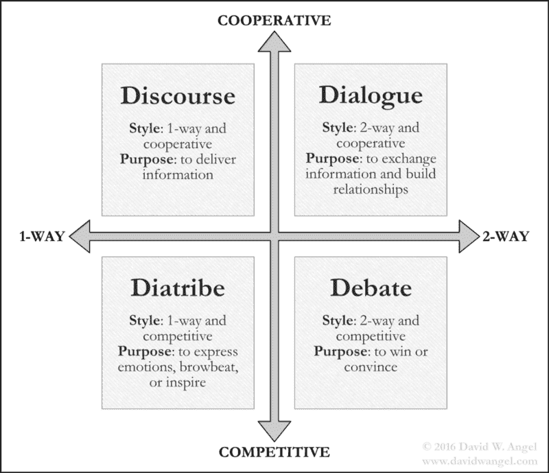

# 企业机器人的未来——第二部分

> 原文：<https://medium.datadriveninvestor.com/the-future-of-enterprise-bots-part-ii-2fb40d717ded?source=collection_archive---------19----------------------->

在[文章](https://medium.com/smartbots-blog/the-future-of-enterprise-bots-12295bb95d7f)的前一部分，我们讨论了一个未来的企业聊天机器人，它可以帮助用户做很多决定。我们还讨论了支持聊天机器人所需的后端系统。

如果你没有读过之前的文章，这里是:“[企业机器人](https://medium.com/smartbots-blog/the-future-of-enterprise-bots-12295bb95d7f)的未来”

在我们进一步讨论前端语言系统之前，让我们简单讨论一下人类对话的简单分类。这里的想法是，我们需要在很高的层次上理解什么类型的对话在企业环境中是必不可少的。

来源:大卫·W·安吉尔的[对话类型](https://medium.com/@DavidWAngel/the-four-types-of-conversations-debate-dialogue-discourse-and-diatribe-898d19eccc0a)

根据上图，典型的人类对话分为:

*   辩论:这是一种涉及对特定话题进行正式讨论的对话。在辩论中，对立的论点被提出来为对立的观点辩护。这是一场竞争性的双向对话。目标是赢得争论或说服某人，例如其他参与者或第三方观察者。
*   对话:这是一种参与者之间的对话，目的是交换信息和建立关系。这是一个合作的、双向的对话。
*   **话语**:这是一种说话者/作者向听者/读者传递权威信息的会话类型。这是一种合作的、单向的对话。
*   **谩骂:**这是一种对话类型，其中涉及的各方表达情感，吓唬那些不同意的人，和/或激励那些持相同观点的人。这是一场竞争激烈的单向对话。

在这里，我们不是在谈论辩论和抨击类的对话，因为我们希望机器人与用户建立一种人类类型的关系。所以我们的主要焦点是关于对话，尽管话语在向用户提供有价值的信息方面也发挥了作用。

在当今时代，大多数机器人的对话更像是话语，而不是对话，用户提出一个特定的问题，机器人会传递有关该问题的信息。要将企业机器人中的对话从对话转移到对话类型的对话，我们需要以下系统。(*如果你有兴趣知道如何评估机器人是否像人类一样交谈，这里有一篇有趣的文章*“[如何让聊天机器人像人类一样交谈](https://chatbotslife.com/how-to-make-chatbots-converse-like-humans-39a791b5887?source=your_stories_page---------------------------&gi=a03c13a6d766)”)

*   **强大的自然语言模型**:理解复杂的查询和人性的情绪，像人一样交谈。
*   **生成式商业语言引擎**:根据处理后的数据即时生成人工对话。

所以，让我们探索它们…

# 强大的自然语言模型

在我们让机器人像人类一样交谈之前，首先机器人需要像人类一样理解对话。它需要像人一样把握上下文，以填补对话中缺失的信息。为了像人类一样理解，我们使用自然语言模型。这些自然语言模型有助于处理对话的各个方面。对话的一些重要方面是:

**自然语言建模(NLM)* 是现代自然语言处理(NLP)最重要的部分之一。

*   **解析**:解析是对接收到的信息进行修正，以更自然的理解用户意图的过程。一般来说，即使文本在语法上不正确或者语音不清晰，人们也能在瞬间解析对话。

比如 LOL。我非常喜欢这个笑话(实际陈述)

大声笑出来。我非常喜欢这个笑话(解析语句)

*   **理解**:在会话中，每一个经过解析的语句都包含了很多关于用户意图的信息。陈述中的一些元素有助于识别用户的意图，而其他元素有助于消除歧义或澄清意图。人类的这种理解过程也发生在几分之一秒内。

比如我想吃披萨。这里，用户的意图是“吃”，而阐明用户想要吃什么的意图的信息是“比萨饼”

*   **情绪/情感分析**:是对一段文字中表达的观点进行计算识别和分类的过程，主要是确定作者对某一特定话题、产品等的态度。是正的、负的或中性的。这一点很重要，因为仅仅识别用户的意图无助于向用户明确提供准确的信息。

这些自然语言模型通常通过以下方法构建:

*   **基于规则:**这种方法使用语言和语法规则的组合来遵循对话中的特定结构。这种方法有一个局限性，即人们在交谈时可能会跳过该结构。尽管这不是一种非常准确的理解方法，但它有助于解析数据。
*   **统计:**这种方法不知道语言。它依赖于提供给系统的训练数据的统计信息。需要大量的训练数据来准确预测并提供对话中的元素。这种方法主要用于数据的解析和情感分析。
*   **机器学习:**这是一种新的方法，它使机器在训练数据(以大脑为模型的多个处理设备)的帮助下，学会自己理解。这种方法类似于统计方法，但是这种方法包括反馈系统，用于根据数据重新计算分配的权重。这种方法一般用于理解。现在，这甚至被用于数据的解析和情感分析。

即使是采用机器学习方法的模型也有局限性。一些限制是:

*   当使用多种语言时，如西班牙语+英语。对这种语言组合的解析成为一种挑战。
*   当使用口语术语或缩写时，如 SEO(搜索引擎优化)得分、mecretary(男秘书)。
*   当对话中使用复杂的名称时，如化学名称、植物名称、疾病、医学症状。
*   当使用复杂语言时，例如在通用搜索中，或在复杂指令中进行工作时。

可以采用混合方法来减少当前语言模型中的一些限制。然而，这种方法可能无法解决快速发展的语言的所有问题。正在进行研究来改进自然语言模型，以覆盖不同领域中广泛的用户查询或请求。

# 生成式商业语言引擎

在语言模型之后，我们关注生成性业务语言引擎。尽管生成式业务语言引擎使用与上述强大的自然语言模型类似的方法，但它还是用于基于各种方面构建对用户的响应:

*   用户的意图
*   用户的情感
*   对话的上下文
*   分析引擎提供的数据
*   基于数据对用户情绪的可能影响。
*   BOT 的个人特征
*   用户的响应自定义(如果有)。

在引擎的响应中考虑到所有这些方面，向用户展示了人类类型的个性。这种人情味不仅能以一种信息丰富的方式帮助用户，也有助于与用户建立健康的关系。

现在最大的问题是:是什么阻止我们在企业空间中构建这种类型的引擎？构建这种引擎的最大限制是业务对话形式的数据。即使是目前最好的方法，机器学习，也需要大量的数据来创建一个良好的语言构建模型。为了获得这些数据，我们需要业务对话。在企业空间中，大多数日常对话都无法捕捉到。电子邮件中很少捕捉到互动，即使捕捉到的也不是一对一的对话，而大多是简短的要点。

例如:例如，首席运营官和他/她的秘书每天早上的对话可以非常简短地包含在电子邮件中，但不是以实际的对话方式。

这种情况使我们别无选择，只能寻找可能找到与企业相关对话最接近的数据的替代方案。一些训练数据可以从外部来源获得，例如

*   松弛的
*   商务化人际关系网
*   Reddit
*   Quora
*   Yammer(如果组织选择该社交网络)

**从上述来源获得的培训数据应考虑数据隐私法。*

现在获得的数据在使用方面有其局限性。例如，LinkedIn 可以在组织外很好地帮助我们，但不适合组织内的对话，因为它可能涉及行业或组织特定的语言。除此之外，这些数据在根据不同行业对其进行清理和隔离方面提出了挑战。这种数据准备本身就是一个广阔的研究领域。

假设数据问题已经解决，下一个挑战是如何将上述对话的所有方面整合到生成式业务语言引擎中。这个挑战可以通过采用混合方法来解决，就像强大的自然语言模型一样。如上所述，我将把这个挑战留给一流机构的伟大教授和博士生。

# 结论

在经历了未来企业聊天机器人在各个领域的所有挑战后，我们可能会问这样的问题:这在未来十年内可能实现吗？我对这个聊天机器人在未来十年的可能性非常乐观。这种 BOT 在未来十年内可能不会在大型组织(财富 500 强公司)中出现，但会在中小型组织中迅速采用，因为它们的基础架构较小，涉及的风险也较小。从这个机器人中获得的好处将为更大的组织把它们介绍给他们的组织铺平道路。

最近，媒体上有关于企业聊天机器人在一个组织中的使用越来越多的新闻。此外，好消息是，即使是首席执行官也开始理解企业聊天机器人及其底层系统的重要性，并分配资金将他们的业务转变为人工智能驱动的业务。

作者:Girish Kumar Dandamudi，SmartBots.ai 的解决方案架构师

领英:[https://www.linkedin.com/in/girish-kumar-dandamudi/](https://www.linkedin.com/in/girish-kumar-dandamudi/)