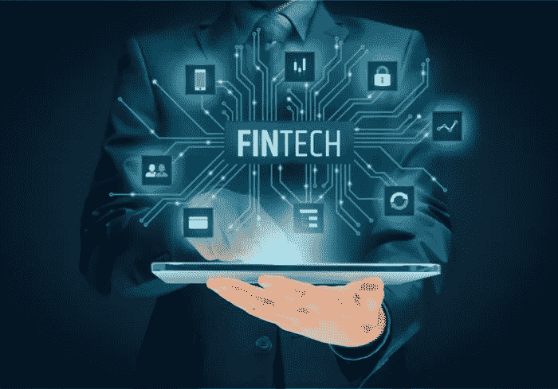

# 金融科技的未来

> 原文：<https://medium.datadriveninvestor.com/the-future-of-fintech-480a9e0c91fc?source=collection_archive---------32----------------------->

今天，我采访了 FinX 的创始人亚历克斯·瓦特。FinX 是一款移动应用，通过独特的互动教育内容，让千禧一代的投资变得有趣和有吸引力。在与瓦特先生交谈时，我们讨论了金融科技的未来，也就是金融科技。采访是这样进行的:

你认为未来五年金融科技会走向何方？
“我认为在区块链和加密货币方面，我们会看到更多的大规模采用。我们将走向一个更加分散的经济，现金在未来可能会变得过时。消费者将对自己的财务有更大的控制权，甚至钱包也会过时，因为除了手机，你再也不用随身携带任何东西了。至少在一段时间内，它可能不会完全取代法定货币，但区块链本身肯定会彻底改革许多行业。”

**您认为这项技术将进入哪些行业？**
“我可以看到区块链进入许多行业，主要是因为数字支付和安全的验证和交易。它可以为医院提供一种更安全、更分散的方式来保存医疗记录，从而使医疗行业受益。”

**你对比特币有什么看法？“我非常尊重比特币，因为它是区块链和加密货币的起源。同样，它也很像 Myspace，因为它的实用性很低。流通供应量确实很低，所以随着交易量的增加和区块规模的减小，它使得价格大幅波动，进而大大降低了实用性。”**

**未来还有哪些形式的加密货币可能成功？**
“以太坊和涟漪肯定。他们拥有追随者和声誉，而且还在不断壮大。电子是另一个。他们开发了一个移动采矿应用程序，在那里你可以开采硬币并轻松赚钱。因为这个应用，他们的交易时间极快。因此，我可以肯定地看到他们在加密领域变得越来越大。”

**FinX 的未来如何？**
“我希望我们有一个超过 50%的千禧一代投资于金融市场的世界。对他们来说，投资需要成为一项更具娱乐性和趣味性的活动。一旦我们让这些缺乏经验的年轻人进入金融和投资领域，这将创造出新一代受过教育的年轻投资者，可能会给金融科技行业带来积极的变化。像 Robinhood 这样的应用程序通过吸引千禧一代在这个市场上取得了积极的进展。基本上，我们希望通过创造一个互动和吸引人的环境，让投资成为人们真正想参与的事情。”

Alex Vawter 是一位来自弗吉尼亚州的企业家，在金融领域有所作为。他创建了 Investment Made Easy，这是一家成功的在线学习公司，教学生如何在各种金融市场上投资和日交易。他还创建了 Capture，这是一家实时图片分享初创公司，肯定会吸引你的注意力。有了这个应用程序，你可以在世界任何地方点播实时图像。亚历克斯·瓦特正在行动，所以确保你跟随他和他的努力。

**继续前进**亚历克斯。

www.alexvawter.com