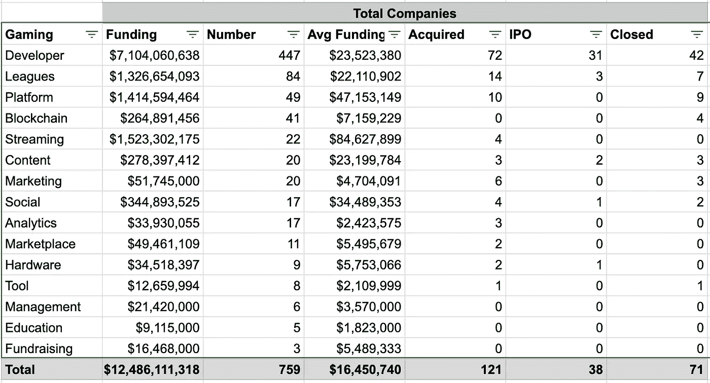
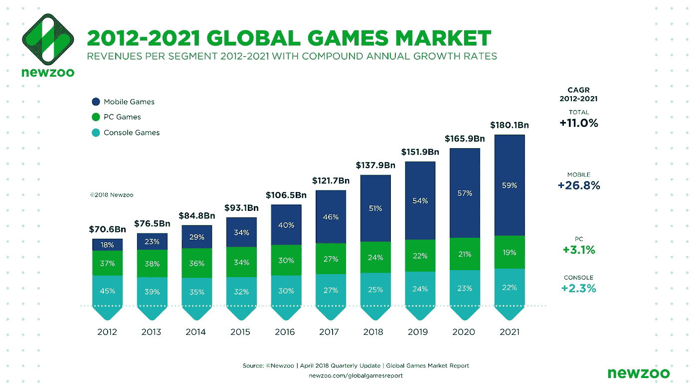
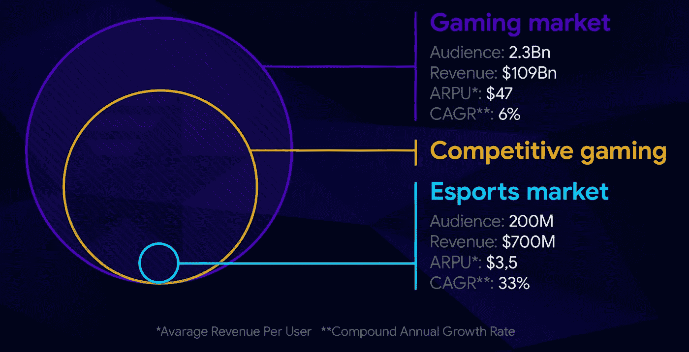
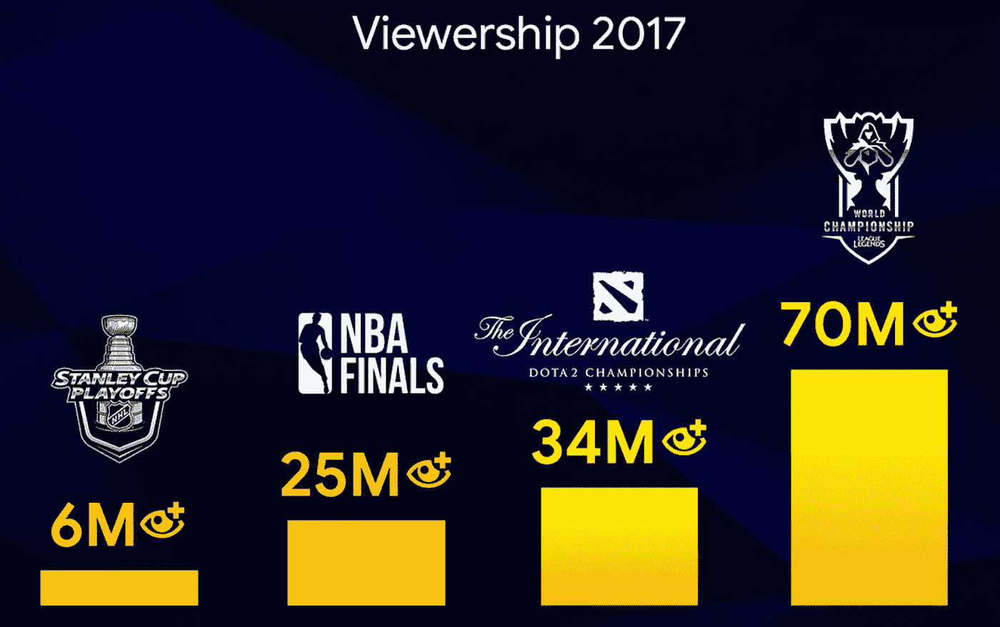
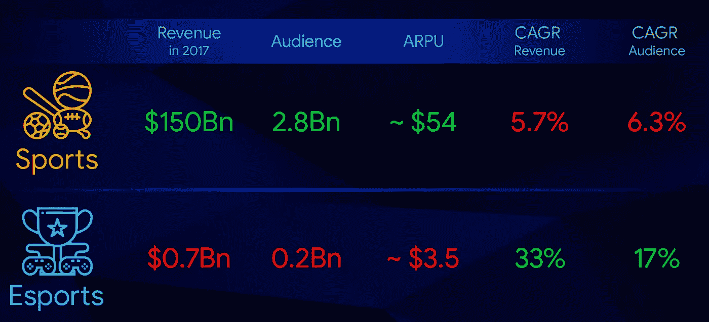
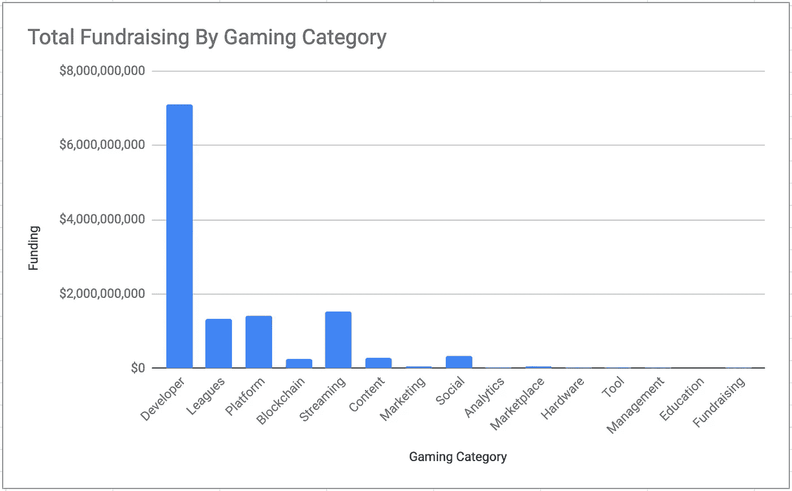
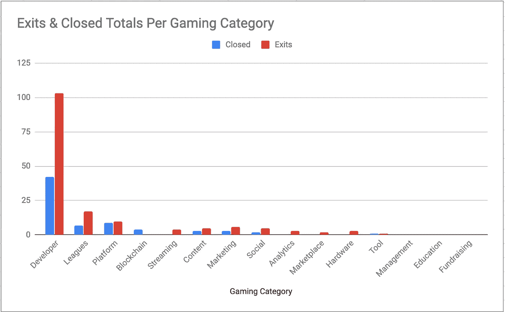
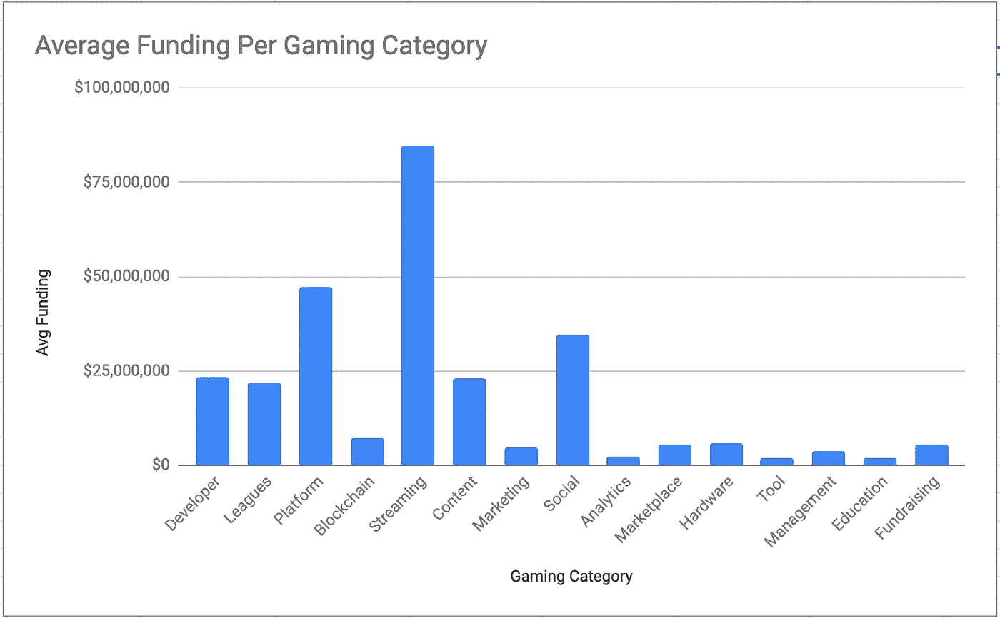
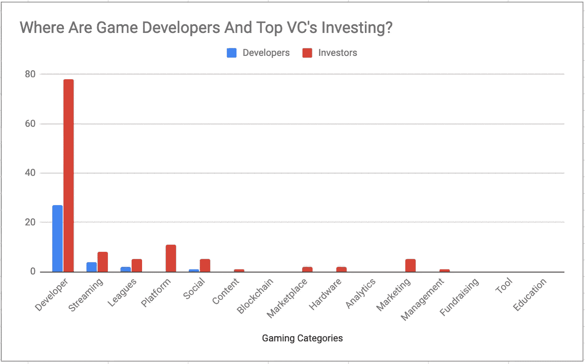

# 游戏的未来

> 原文：<https://medium.datadriveninvestor.com/the-future-of-gaming-c90523ca605c?source=collection_archive---------6----------------------->

Credit Jamie McInall

在这一系列文章中，我想打破游戏/电子竞技生态系统。这个行业对大多数投资者来说似乎有点忌讳。但是，这个行业的成长性是不容忽视的。

**什么**:我将 759 家游戏/电子竞技初创公司分为 15 类。然后，我根据它们在功能、特性或用例方面的创新程度，将每一个类别进行了细分，以了解每一个类别是如何演变的。

My Personal Data Set

**目的**:加深对游戏/电子竞技行业的理解，鼓励投资和持续创新。

**为什么它很重要**:在我深入探讨游戏类别之间的区别之前，我想给你一个行业的宏观视角。这样就更容易理解行业的哪些组成部分是重要的。

游戏和电子竞技行业正在迅速崛起。比赛和开发商 DAU 的收视率不断显示出杰出的数字。像 [Supercell](https://supercell.com/en/) 这样的游戏开发者比 Evernote、Eventbrite 和 BuzzFeed 加起来还要值钱。《英雄联盟》2017 年世界锦标赛拥有超过 7000 万观众。作为参考，NBA 总决赛只有 2500 万观众。([梦之队](https://token.dreamteam.gg/documents/DreamTeam_Whitepaper_ENG.pdf))。这个行业是体育运动的下一个发展方向，许多投资者应该予以关注。

> [DDI 编辑推荐—虚幻引擎 C++开发者:学习 C++制作视频游戏](http://go.datadriveninvestor.com/unreal/matf)

# 市场趋势

博彩业有多少钱在流动？下图展示了它令人难以置信的大小和成长。手机是游戏行业的主导平台。未来是移动的。

Newzoo 的自 2012 年以来各平台的增长图表更好地展示了这种增长。该行业通过手机游戏增长了一倍多。

电子竞技也是迅速崛起的游戏生态系统的重要组成部分。梦之队的白皮书非常出色地将电子竞技与传统运动进行了比较。令人兴奋的是电子竞技生态系统中的大众观众以及这在未来将如何货币化。下图比较了电子竞技市场和整个游戏市场的规模。

电子竞技锦标赛的收视率可不是闹着玩的。英雄联盟的比赛远远超过了传统体育。[这是否意味着我们将很快看到全国各地建造大型体育场来迎合这些新的电子竞技比赛](https://www.curbed.com/2018/6/28/17514410/arlington-esports-stadium-video-games)？

下图显示了与传统运动相比，电子竞技的巨大机遇。我们可以期待这些数字有望很快赶上传统体育。

# 筹资趋势

面对如此大的市场规模和机遇，如何投入资本来推动这一增长？目前，大部分资金流向游戏开发商和发行商。那些能创造出合适 IP 的人就中了大奖。例如， [Supercell](https://supercell.com/en/) 在《部落冲突》中的成功让它们的价值超过 Evernote、Eventbrite 和 BuzzFeed 的总和。流媒体作为消费游戏内容和游戏联盟的主要手段，将随着收视率和电子竞技的上升而继续上升。

下图还突出显示了每个类别的出口和关闭。开发者和出版商是一个独特的类别，大约 23%的初创公司退出，10%关闭。哪里的出口多，哪里的资金就多。

下图突出显示了每个类别中每个初创公司的平均值。这张图表表明，投资者对游戏流媒体类别的重视程度远远高于任何其他类别。然而，中国有一些异常的流媒体初创公司已经筹集了大量资金。如果将它们剔除，流媒体类别的平均价值将降至约 2400 万美元。游戏平台的平均资金也很高，但这是由于像 [Unity](https://unity3d.com/) 或[impossible](https://improbable.io/)这样的大型游戏引擎推高了平均资金。如果剔除这些公司，这一类别的平均融资额将下降至每家初创企业约 600 万美元。同样的结果会发生，如果你从社交类别中去掉 [Discord](https://discordapp.com/) ，平均会下降到大约 600 万美元。

接下来，我想关注游戏发行商/开发商和顶级风险投资者的投资方向。最突出的开发者是[腾讯](https://www.tencent.com/en-us/)。他们正在全球范围内大举投资新的开发商。战略角度必须是获得有价值知识产权的合作伙伴，以便在中国重新分配。令人惊讶的是，你没有看到开发者在生态系统的其他部分积极投资。你会注意到顶级风险投资者非常关注开发商，基于上述融资和退出趋势，这并不令人惊讶。大多数投资者青睐的第二个类别是游戏平台。请注意，不考虑区块链类别，我没有把开发商或投资者计算在内。请继续关注区块链工业的崩溃。

# 结论

移动是游戏的未来。它是开发者发布产品组合的最重要平台。此外，投资者似乎非常关注寻找下一个热门游戏 IP。你可以看到对开发者的资助远远超过了其他所有类别。尽管如此，电子竞技的崛起正在构建一个全新的生态系统。成为游戏玩家首选的顶级平台或社区的竞赛已经开始。就目前而言，感觉我们仍然处于电子竞技的早期阶段，令人兴奋的增长即将到来。我将很快发表一篇文章，介绍每个类别是如何分解的。

注:投资者对我创建的数据库感兴趣，给我发消息，我很乐意分享。