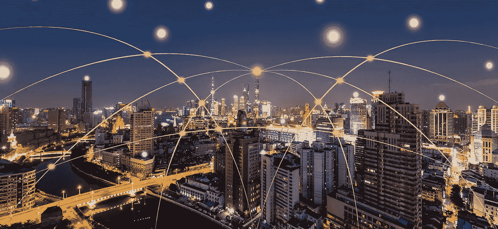
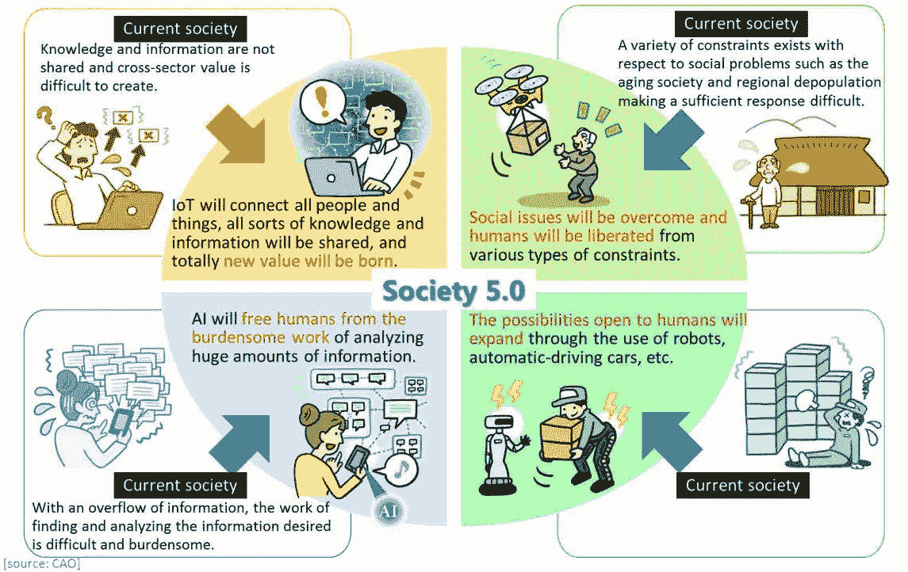
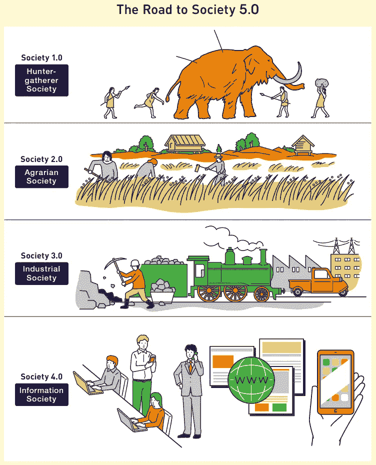
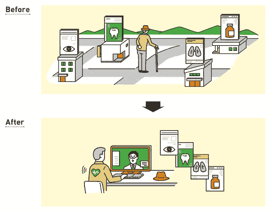
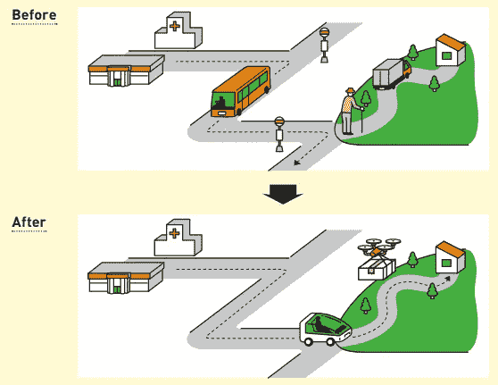
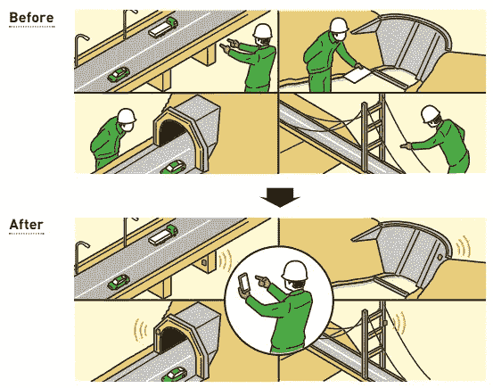
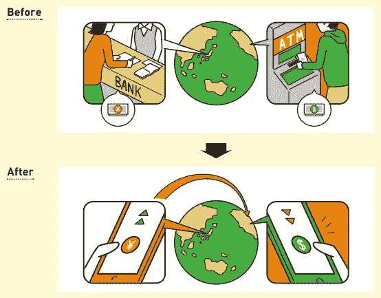

# 人类和技术世界的未来——社会 5.0

> 原文：<https://medium.datadriveninvestor.com/the-future-of-humanity-and-the-world-of-technology-society-5-0-6e4dd5952bae?source=collection_archive---------0----------------------->

Era of Technology

你有没有想过我们的世界在 10 年或者 20 年后会是什么样子？那时的人类生活如何？它会被像《终结者》电影中那样的机器殖民吗？有可能…但是在这里我会试着描述一下根据日本政府的说法，我们的生活会是怎样的。为什么是日本？因为日本的基础设施和技术发展非常先进，当然很有可能通过技术支持实现人类可以生活得更好的理想条件。这个概念被命名为社会 5.0。

**什么是社会 5.0？**

社会 5.0 是一个以人为中心的社会概念，它通过高度整合网络空间和物理空间的系统来平衡经济进步和解决社会问题。
这个概念是基础科学技术路线图的第五步。

What to expect in Society 5.0

**通往社会之路 5.0**

让我们想象一下通往社会 5.0 的道路

Society 1.0 — Society 4.0

*   社会 1.0(狩猎时期)——人类开始用岩石制造装备。这种设备被用来捕猎野生动物作为食物原料，动物皮被用来做衣服。
*   社会 2.0(农业时期)——人类开始寻找用铁制造工具的方法。除了打猎，他们也开始耕作来满足他们的食物需求。
*   社会 3.0(工业时期)——人类通过制造机器找到了更高效的工作和生存方式。运输设备也在这一时期开始迅速发展。
*   社会 4.0(信息时代)——这是我们当前的时代。所有形式的人类活动都离不开数据流。互联网是这个时代最大的发明，持续快速增长，与人类日常生活密不可分。

**社区如何在社会 5.0 中生存？**

Solution for Better Human Life

当进入社会 5.0 时，所有从社会 4.0 时期开始收集的数据都将被人工智能(AI)处理并转换为一种新的智能形式，并传播到人们生活的各个领域。人们的生活预计会更加舒适和稳定，因为人们会在正确的时间获得正确数量的产品和服务。

我们可以预期这些部门会有所改善:

**(1)健康**

Improvement in Health Sector

通过连接和共享分布在不同医院的医疗数据，可以提供基于数据的有效医疗服务。偏远地区的医院可以通过应用程序提供服务，让去医院有困难的人仍然可以获得健康服务。在技术的帮助下，每个家庭都可以进行基本的健康检查，如心率检查、血压检查等，从而保持社区的健康，延长人类的预期寿命。

**(2)运输和机动性**

Improvement in Mobility Sector

自动驾驶汽车是一种常见的使用方式。这些车辆将帮助那些难以到达医院等公共设施的人。自动驾驶汽车可以带不能开车的人安全到达目的地。此外，自动无人机技术使物流过程更容易、更高效。

**(3)基础设施**

Improvement in Infrastructure Sector

传感器的使用将随处可见。传感器被放置在隧道里，桥上，水坝里，以及整个城市。这些传感器将计算通过的车辆数量，记录交通违规行为，检测水位，并在建筑的某些部分需要维修时发出警告。机器人和自动机制也有望降低事故风险，提高安全性、效率和生产率。

**(4)金融科技**

区块链技术将是日常金融交易中常用的东西。随着区块链技术的实施，预计将能够减少交易时间和成本，同时提高日常交易的安全性。

**结论**

因此，在看到社会 5.0 的愿景后，我们似乎可以更轻松地呼吸了。人类不会被机器取代，但人类将成为社会生活的中心，机器将成为他们周围的支持系统。人工智能将帮助人类做出替代选择，人类将做出决定。将会有更多更高效、更环保能源可供选择。农业部门的自动化将提高生产效率，减少粮食困难问题。在卫生部门，将有更多来自人工智能和机器人的支持系统，以便降低事故风险和拥堵水平。在金融部门，区块链将在开展日常金融交易方面开辟新天地。

哇，我迫不及待地想看看我们在社会 5.0 时期的生活。你们呢？

来源:

> [https://www . Japan . go . jp/aben omics/_ user data/aben omics/pdf/society _ 5.0 . pdf](https://www.japan.go.jp/abenomics/_userdata/abenomics/pdf/society_5.0.pdf)
> 
> [https://www.gov-online.go.jp/cam/s5/eng/](https://www.gov-online.go.jp/cam/s5/eng/)
> 
> [https://www . global Japan . world/article/Japan-leads-world-in-education-for-society-5-0/](https://www.globaljapan.world/article/japan-leads-world-in-education-for-society-5-0/)
> 
> [https://www8.cao.go.jp/cstp/english/society5_0/index.html](https://www8.cao.go.jp/cstp/english/society5_0/index.html)