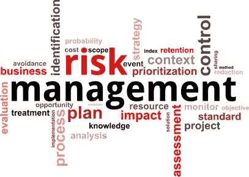

# 管理金融风险的未来

> 原文：<https://medium.datadriveninvestor.com/the-future-of-managing-financial-risk-5d2d1a2b451e?source=collection_archive---------47----------------------->

到 2025 年，金融机构将需要以比现在更根本的方式处理风险。如果他们现在不开始行动，为这些未来的变化做准备，新的需求和要求将远远压倒他们。随着客户越来越不容易出错并期望更高的服务，适应这些变化势在必行。

幸运的是，不断发展的技术和高级分析的使用开始帮助经理们对当前的选择做出更明智的决策。随着金融科技行业初创企业的蓬勃发展，机构的一个痛点是选择最可靠的、在质量和服务方面享有声誉的企业。

Crediwatch 的业务是通过应用人工智能和深度学习来提取有价值的见解，并将其提供给首席决策者。

它提供以下解决方案来满足您的财务需求

反洗钱

了解你的客户

早期预警系统

信用风险评估

通过使用最新的技术，Credit watch 不仅可以减少人为错误，还可以持续监控您的供应商、销售商和竞争对手，从而帮助您做出准确的决策。

许多这些技术创新可以降低因无数因素导致的风险管理成本。随着最近的大量采用，公司应该在它仅仅成为基础设施技术而不是提供战略优势之前实现这些。

那么你还在等什么呢？