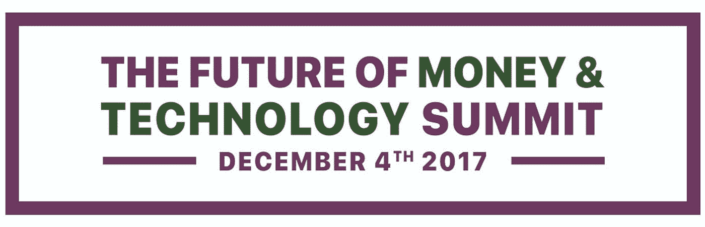

# 金钱和技术的未来

> 原文：<https://medium.datadriveninvestor.com/the-future-of-money-technology-4f8cdb3e1561?source=collection_archive---------25----------------------->

我正准备参加下周在旧金山举行的金融科技峰会。这是我几年来第一次参加首席支付会议…

你可能会发现，对于一个组织了专注于金融科技的活动的人来说，这种长时间的缺席很奇怪。但我不得不休息一下，退一步，重新组合，想想自己和金钱的未来。

是的，我一直在阅读许多关于支付的新闻，并在脸书、Twitter、LinkedIn 和其他社交媒体渠道上分享它们。我跟上了不断变化的风景；P2P 支付的增长、比特币泡沫以及 Face ID 支付认证的魔力。

我本人还没有深入参与其中的任何一个领域——我一直满足于观察、吸收和增长我对金融科技领域和相关参与者的理解。

在一年内发生三起车祸后，我还花时间集中精力让自己恢复健康。但现在我准备好穿上我的战斗服回到角斗士的竞技场，

还有什么比 12 月 4 日在旧金山日本城歌舞伎酒店举行的未来货币与技术峰会更好的开始呢？

那么金钱和技术的未来是什么样的呢？

我很乐意为你提供一个明确的答案，并为你指出正确的方向，但与任何行业一样，有许多利基和市场——我应该将注意力和意图集中在哪里？

我的朋友正是我要去加州寻找的。

我带着开放的心态，清醒的头脑来参加这个活动，并且不在烤架上放鸡蛋-

似乎比以往任何时候都更难找到一个起始点。源源不断的新闻和信息铺天盖地而来——让我们很难找到这个纱线球的起点。

尽管这是一个为期一天的活动——峰会挤满了来自不同公司的重量级人物。但我的灵感可能来自于一个创业完成参赛者

正如我所说的，我会带着开放的心态去，把我的疲惫的思想留在机场，就像一个无人认领的袋子。从天使投资人到 Zebit，超过 45 位演讲者将阐述他们对当今支付格局的看法。

然后是观众…能认识一些我在过去几年里通过社交媒体交流过的人会很棒。布拉德利·雷默、比尔·巴海德特和约比·本杰明都在我的必见名单上。

但是我想从整体上来看待这件事，而不是从战略上-

我发现，用我天生的把握时机的超能力加上一些老式的意外收获来处理事情，会比像一头设定好议程的公牛一样冲进去产生更好的结果。

我没有一个终结游戏，我只是想迈出第一步回到混乱中，并希望找到一个开始点，我可以专注于前进。我相信活动地点及其与旧金山地标的接近将极大地增加旅行的深度和美感。

我们正在接近这个十年的尾声，我喜欢称之为 m 代。2018 年即将到来，我们正在快速向 2020 年加速前进——它就在地平线上。

我们会超越我们今天所依赖的那块石板吗？移动需要一个我们随身携带的设备吗，或者它会集成在我们的生活中并无处不在吗？卡和银行会像我们今天所知道的那样存在下去吗？加密货币会摧毁美元吗？

我的意图是让这篇文章成为三篇文章的第一篇……如果你愿意的话，可以说是三部曲。这篇文章是序幕，随后的文章详细介绍了这次活动的主要收获，最后展开了这个毛线团，让我自己参与到一个提供承诺和潜力的项目中。

我期待着与大家见面，并了解金钱和技术的未来。