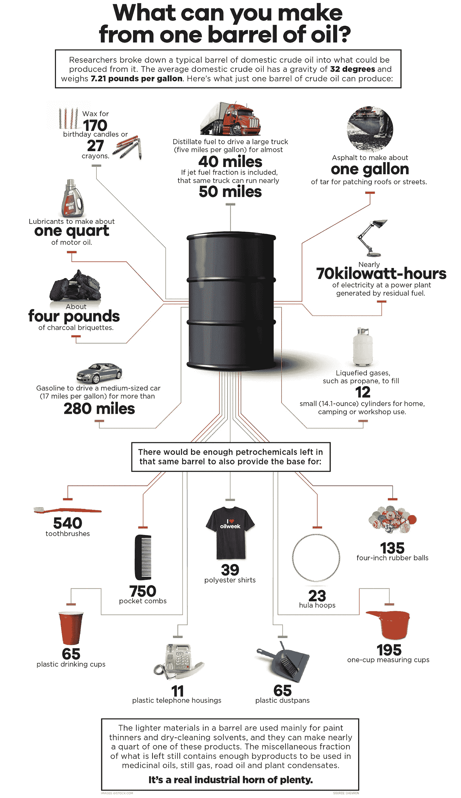

# 石油的未来

> 原文：<https://medium.datadriveninvestor.com/the-future-of-oil-12e79566322e?source=collection_archive---------2----------------------->

自 20 世纪中期以来，石油一直是我们的世界赖以运转的燃料。尽管石油在 19 世纪被用于制造油灯等基本物品，但 20 世纪世界上第一口商业上可行的油井的发现才是火花。它出现在新兴技术创造出可以从石油中提取的新产品的时代。从那时起，由于许多因素，如对汽车、汽油、柴油和取暖燃料需求的增加，石油消费呈指数增长。

尽管全球都在使用石油，但最大的需求总是来自发展中国家。这种需求是由于政府和消费者的消费增加，导致对石油产品的需求增加。石油被用来制造受欢迎的产品，如交通燃料、燃料油，以及不太明显的产品，如布料、轮胎、行李、头盔、雨伞，以及下图中可以看到的许多其他产品。

picture from visualcapitalist.com

尽管如此，随着新兴市场对石油需求的增加，发达国家正在转向绿色能源。全球对气候变化的担忧导致了推广插电式电动汽车的重要法规，但这些力量是缓慢的，至少需要 10 年左右的时间。这些力量是缓慢的，因为世界经济和基础设施对化石燃料的投资达到了一个真正令人震惊的水平，非专家无法左右。由于下降缓慢，石油公司将有足够的时间来更新他们的商业模式，以适应新的规范或即将到来的技术，或者收购它们。

电动汽车可以结束大部分的石油消耗，但它们需要在技术和电池方面进行重大改进，并在世界各地建设充电基础设施，才能被视为全球替代产品。正如詹姆斯·伍尔西所说，“我们不会对石油上瘾，但我们的汽车会。”像特斯拉这样的公司正走在实现这一目标的正确道路上。电动汽车的基础技术是可信的，但这些汽车的成本对发展中国家来说太高了。然而，在发达国家，电动汽车正在兴起。最近，英国石油公司(BP)达成了一项收购电动汽车充电公司 chargemaster 的协议，该公司在英国各地拥有超过 6500 个充电站。英国石油公司还投资了一家初创公司 StoreDot，该公司最终可以在五分钟内为一辆汽车充满电。尽管像英国石油公司这样的石油公司正在投资电动汽车，但 R&D 的大部分支出都集中在非常规石油上，而不是替代石油。

尽管可再生能源的使用越来越多，但全球石油需求每年仍以每天 150 万桶的速度增长(过去五年增长了 8%)。)此外，没有可信的预测显示这一趋势在不久的将来会发生变化。如果对石油的需求持续增加，而供应却在减少，我们将会看到高油价。天然气/柴油的峰值预计在 21 世纪 20 年代末至 21 世纪 30 年代中期。如果发生这种情况，我们可以看到新产品的引入，如德国人在二战中使用的煤制油工艺(如果价格达到 200 美元/桶)。在价格达到峰值后，据预测，如果监管机构提前实施该计划，旧车将退出服务。如果这种情况发生，电动汽车行业可能会出现巨大的增长。

与此同时，在过去的一百多年里，使石油成为首选燃料的方面并没有改变——这是一种生产和运输能源的奇妙方式。随着发展中国家变得更加富裕，他们购买汽车和依赖石油的产品的速度将快于发达国家削减能源使用的速度。这种趋势不会永远持续下去，正如谢赫·艾哈迈德·雅马尼所说，“石器时代并没有因为缺乏石头而结束，石油时代将在世界石油耗尽之前结束，”但这也不会在一夜之间发生巨大变化。

液体燃料的最佳替代品是我们从其他能源如可再生能源中合成液体运输燃料。这比全面转向电动汽车需要更少的基础设施支出，并实现同样的环境效益。使用压缩天然气或气转液技术可以在化石燃料的未来发挥重要作用。