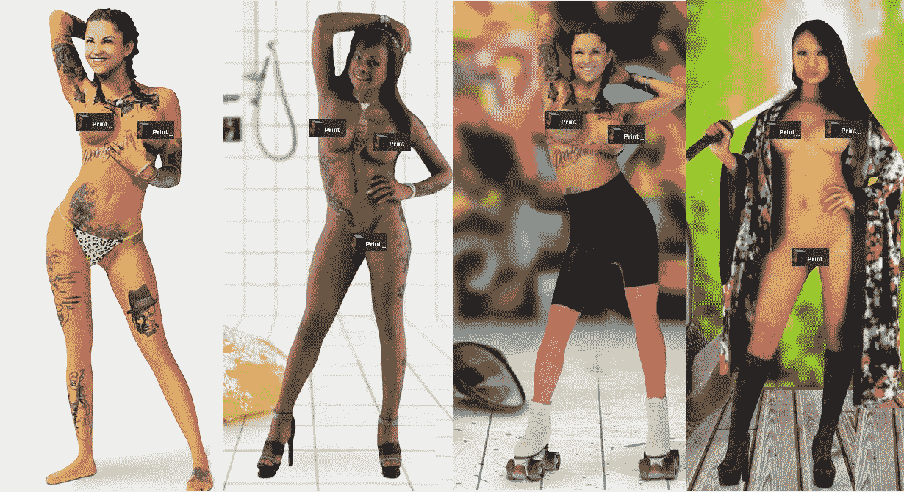
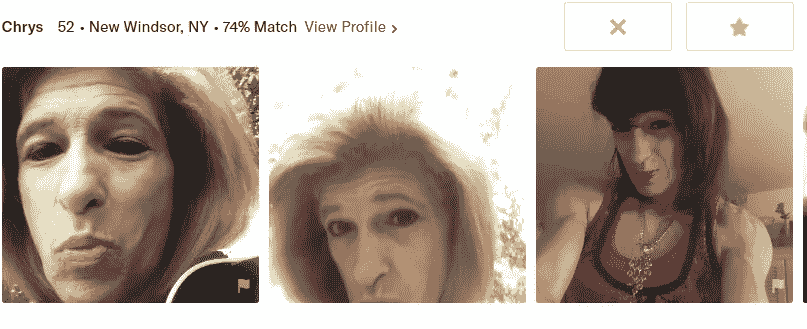
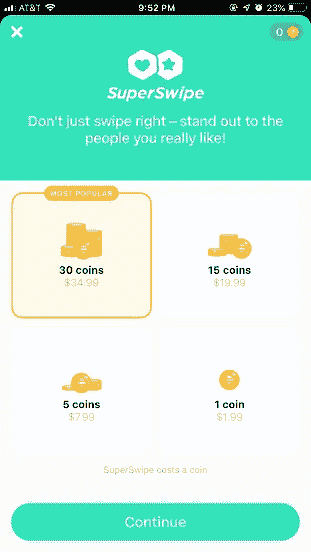
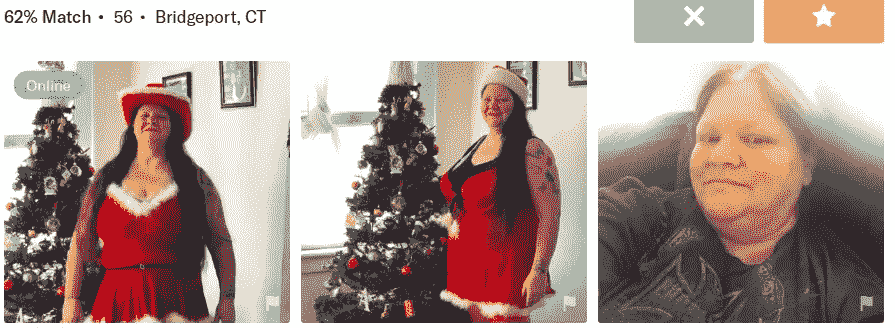
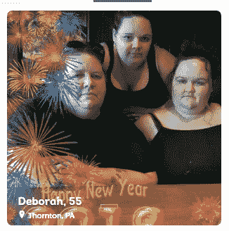

# 在线约会的未来将由人工智能驱动

> 原文：<https://medium.datadriveninvestor.com/the-future-of-online-dating-will-be-ai-driven-4129328913e5?source=collection_archive---------3----------------------->

**chivalry is dead, virtual dating has arrived: 3D printed fuck-toys. Can AI rescue us? Image DS Robotics**

> Match，OK 丘比特，POF——已经过时，非常不可分

最先进的在线约会平台起源于早期的计算机约会算法。)[回到 20 世纪 50 年代的](https://www.theatlantic.com/technology/archive/2011/02/old-weird-tech-computer-dating-of-the-1960s/71217/)。这些早期的计算机是大型机 IBM，它们使用的算法简单得就像六年级的数学电子表格。通过问卷调查，男性和女性将根据最基本的标准进行匹配，如年龄、职业、宗教和收入等级。

尽管如此复杂，今天的在线平台似乎并不比它们的模拟前辈更擅长或更可靠地实现它们的保证。刷卡平台 Tinder 和它的后代也不会犯错，只是意味着一个目的——一个可以用许多更有效的方式破解的坚果...这就是为什么 **AI 将迎来这些平台**的消亡。

> “电脑约会现在是，而且一直是，不是一个欣赏的过程，而是一个淘汰的过程。

自 20 世纪 60 年代以来发生的变化是，在没有用户界面的情况下，早期的 SAAS 平台或软件即服务(software-as-a-service)宣称计算机可以在短短几天内为您完成所有工作。早期的开发者吹捧他们的效率超过了他们的竞争对手，正如[大西洋](https://www.theatlantic.com/technology/archive/2011/02/old-weird-tech-computer-dating-of-the-1960s/71217/)对早期平台的报道:

*也考虑一下 1969 年《生活》杂志上的这则广告:* [*“如何适应电脑约会。”*](https://books.google.com/books?id=vUwEAAAAMBAJ&lpg=PA11&dq=computer%20dating&pg=PA11#v=onepage&q&f=false) *该广告宣传一项名为“兼容性”的约会服务，竭力为该公司建立信誉，强调其规模、道德和该服务的计算机能力(“我们被告知，为我们使用的 IBM 360/40 计算机在一小时内所做的事情，将超过一个高度合格的个人一年所做的事情”)……*

电脑约会也经历了跨大西洋的流行——这则 1972 年的英国广告**鼓励你加入“英国最复杂和成功的电脑约会服务”来“结识你喜欢的人”自然，这些服务想给人一种排他性的印象，一些借口，他们“试图淘汰明显的社会不适应者”，因为生活广告保证。毕竟，没有人想去约会却发现他们的约会很怪异。**

**

***frickin fuckbots on rollerskates!, image Erotic 3D print models (I am not remunerated in any way here)***

*快进到 2018 年，3D 打印伴侣是从 DS Robotics 等开发商那里定制的，DS Robotics 的网站是这样描述其产品的*

*“最新的 S 级化妆娃娃有莎伦、泰拉、白雪、凯拉、瑟琳娜和约兰达。这些新的娃娃可以在 www.cloudclimax.com 看到。*

*“新的 [***Evo 玩偶***](https://cloudclimax.com/products/ds-doll-evolution-167cm-mega-deal-free-extra-head) 刚刚发布，这是考虑购买以赞美您的机器人头部的理想身体。*

*>我必须自己购买磁头吗？*

**“头部可以自己买，也可以和 DS 娃娃身体捆绑买。与机器人头部兼容的范围在 Cloud Climax 中可用。”**

**

***叶旧时代的虚拟约会方式***

*“关键词嗅闻:你可以扫描一个感兴趣的人的个人资料，并修改你的关键词以符合他们的特定标准——比如相同的音乐、食物或艺术家——天哪，太巧了——提高你与他们的兼容性得分。而人工智能，已经看过你的个人资料，会立即嗅到老鼠，并阻止篡改的个人资料。*

*大多数人不知道如何写作，所以当他们试图用文字描述自己时，通常不会表现出他们最好的一面。事实上，如果我们假设——就像奥斯卡·王尔德说的那样——“大多数人既无聊又愚蠢——当他们写自己的时候，他们不会给人留下特别有教养或有趣的印象——但许多有趣的人碰巧是糟糕的作家，并迷失在大众中。*

> *“实际上，网上约会与其说是一个浪漫的环境，不如说是一个充满敌意的环境。*

*网上的男性——沮丧或懒得看简介——对 100 个他们几乎看都没看的女性进行群发轰炸:如果你整天往谷仓墙上扔粪肥，最终会有一些粘住，对吗？我并不总是责怪他们，因为非刷卡或“关系”平台对于他们来说，在古怪和不情愿的女性关注中导航和操作已经变得非常困难——此外，他们已经在水中下毒，并且因为最近对 R·凯利、比尔·科斯比或凯文·史派西等长期名人强奸犯的认识和媒体报道，男人的恶劣行为总是桌面上的话题。*

*在今天这个过于高科技的世界里，在线约会平台在会员群中寻找追求者的想法似乎很古怪——甚至对大多数人来说很俗气，但人们已经习惯了，或者更确切地说，他们以温和的玩世不恭态度容忍了它。像 *Coffee Meets Bagel* 这样的网站每天只能挤出二三十个“百吉饼”供选择。以这样的速度，我可能需要 1.75 个地球年才能找到一个匹配的。如果你觉得幸运，你可以买更多的“豆子”。*

*当会员群中只有极小一部分可能吸引我时，我“拿一个面包圈”的机会小于**赢得 1 亿美元彩票的机会——是**的三倍。通过这种方式，我觉得 [Coffee Meets Bagel](https://site.coffeemeetsbagel.com/) 并不是一个失败，而是一个荒谬的命题，因为我可以在多个网站上免费看到它们和数百个其他产品。也许你没有我那么挑剔或谨慎，感觉也不一样，但你的钱包可能不会。*

**

***Bumble Super-Swipe monetized poker chips or are those Ritz Crackers?***

*然而，即使在更大的网站上——像**臃肿、过时的 match、**或**snarky-arsey Ok Cupid**——有能力将搜索微调到最微小的细节标准，我们仍然像 1950 年的 IBM 650 混合匹配算法一样无能，在发现我们可能容忍的人方面没有更高的效率。在 20 世纪 50 年代，这还算令人印象深刻，但在 2018 年，这完全是一潭死水。*

*通过 1990 年代的线框平台仪表盘和下拉菜单，我们过滤掉不想看到的人。对我来说，那只剩下前面提到的上诉率下降的一小部分。别担心，作为会员订阅的一部分，开发者的垃圾邮件引擎每天都会制造出他们认为你可能会“喜欢”的人定义“想”和“喜欢”这个手势意味着向你提供服务。*

> *网上约会交易是无效的——称之为“虚拟”约会。"*

*在一个人的个人资料中加入精选关键词是必要的，我称之为“嗅觉”一些提供商爬虫抓取这些关键字并在其他成员档案中寻找它们，然后向您报告。如果你能把你的标准缩减到一点点不可部署的东西就好了——其中只有一个子集是*真正的*潜在约会对象。*

**

*Holiday Tidings, courtesy OK Cupid*

*因此，会员过滤与其说是一种欣赏，不如说是一种消耗的**过程——你“剔除了令人遗憾的东西，也剔除了“嗯”，但那些微不足道的剩余部分并不能保证什么。我曾经尝试过这种排除方法，在 Match 上屏蔽掉我不想再看到的个人资料。火柴为你追踪那些，并保持计数。如果你决定降低标准，你甚至可以取消对他们的封锁。当我卡在 999** 上时，Match 告诉我他们的开发人员从未想过在阻塞计数器上允许另一个十进制数——在我之前没有人碰到过。*

**

***‘tres faces brutto.’ which one’s for me?***

*可悲的是，在线约会——一个每年 30 亿美元的行业——充斥着基于 doofy 1960 的算法，而与此同时，人工智能颠覆了主要行业，并使改变生活的技术成为可能。改进的空间是巨大的，人工智能将填补空白。这可能看起来像什么，它将如何工作，都可以在现有的技术中想象出来，等待编码。*

> *“很久以前，我申请了 Chemistry.com。我完成了一个三小时的性格分析。他们基于我的分数拒绝了我的会员资格，他们说我的分数低于最低的百分之二分界点。回想起来，那是很高的赞美。*

*理论上，有了如此程度的精细控制，你可能会期望很快发现那些最适合你的。然而，这种情况似乎不会发生在一群可能只有 0.1%的人能够和睦相处的男女身上。*

> *“没有人——没有人——真正喜欢网上约会。*

*尽管平台对你的浪漫追求进行了微观管理，浪费了几个小时的个人资料调整和浏览橱窗，但这个过程顽固地拒绝提供任何灵感或持久的快乐。*

*虚拟约会催生了一个冷漠、防腐、同质化的乡村肉类市场，它夺走了你做自己喜欢的事情的宝贵时间。这不是建立持久关系的沃土。在网络平台上闲逛并不完全是一种肯定生活的体验，而是一种令人沮丧的体验。*

# *让我们有琪琪！*

*[**Screw online dating**](https://medium.com/@oculus_felus/why-2019-is-the-year-youre-going-to-quit-online-dating-7c73d0fea752)**: fire up the smoke machine, and put on your heels!***

*换句话说，网上约会完全是浪费你的时间和资源，它可能会让你对单身，甚至是活着感觉更糟。这只是一个时间问题，这些平台会像*的耻辱簿*一样失宠。到那时，人工智能将运行虚拟约会节目。*

*你和约会平台所做的每一项努力都只是**人工智能引擎或拉皮条机器人**的起点。从那里，人工智能从一维(数据)扩展到更直观的(识别)机器学习过程。人工智能驱动的应用程序会自动使用你的会员档案标准来搜索其档案包含符合该标准的关键字的人，释放出宝贵的自由时间来(喘息！)出去**让一场 IRL 遭遇战**自动到来，如果它真的要来的话。*

*考虑一下在不远的将来的这个假设场景:一个人工智能驱动的虚拟约会应用程序，我们将把人工智能引擎称为“Kiki”。我很吹毛求疵，所以我想在我的约定条款中非常具体:*

*Kiki，给我看看方圆 25 英里内的单身女性，年龄在 48 到 52 岁之间，无神论者，身材苗条(身高 5 英尺 6 英寸，体重 120 磅以下)，本科以上学历，离婚或丧偶，家里没有孩子，不是酒鬼，年薪至少 25000 美元。*

*“她至少提到一个我喜欢的作家，音乐艺术家，喜欢博物馆，旅游，徒步，餐饮，不抽烟。”*

*到目前为止，这些平台还能跟上，但这已经是最好的了。从这一点出发，通过一点机器学习，人工智能可以变得非常具体，并以更复杂的方式进行搜索。根据用户设置的参数，AI 可以识别和分析某些面部表情、姿势和其他微妙的细微差别，这些细微差别比你个人资料中的重要统计数据更人性化。*

*她与一个庞大的数据库协同工作，该数据库研究了所有已知的面部表情、姿势或手势，这些都被数字化记录了下来。未来的约会档案必然需要包括音频视频片段，这在呈现方面将是超越现状的飞跃。你会注意到，音频视频简介已经存在，但还没有真正得到任何牵引。还是那句话，执行力差*

*当人们的个人资料中有音频视频媒体时，Kiki 将能够评估精细和粗大的运动功能:“必须优雅，像芭蕾舞演员一样在空间中移动——言谈举止，面部过渡和眼部运动，声调和演讲，”她像一个轻盈的法国小姐一样转头的方式。她还可以做出更准确的深度感知认知，并减少对三维身体结构的假设*

*Kiki，添加以下参数:排除持有智能手机的人的主要照片，带有小型或大型流口水的狗，与奴役相关的媒体，露肩上衣，前夫，前男友，扭曲的瑜伽姿势，在 handle(用户名)中包括“女神，瑜伽或天后”，或在他们的个人资料中提到上帝，“唯一”，“犯罪伙伴”或“灵魂伴侣”。*

*“也不要包括脸部照片、没有全身照(这些照片无一例外地被证明是超重或肥胖)、护目镜或太阳镜、大发型，尤其是*骑士靴*。在最喜欢的电影，音乐和消遣，参考我的 EKB(独家关键词黑名单)。*

**

***unless you look this good, Puss, you probably should bin them***

*排除掉那些没有头发或死于癌症的人，有带刺的纹身带，有烙印的疤痕，戴着弹力耳饰的人，正在或曾经在监狱里的人，或者志愿帮助饥饿的难民的人——任何说他们志愿谋生的人都会试图欺骗你的绿色。*

*在*琪琪*独自为你拉皮条之前，你已经指示她“喜欢或刷”任何符合你标准的至少 75%的个人资料，并通知你任何超过 75%的个人资料。*琪琪*开始返回结果。如果他们被证明没有启发性，你可以调整你的标准(降低你的标准)，这样可能会有更多的限定条件。*

**琪琪*，增加:体重限制 5 磅，最小身高降低至 5 英尺 2 英寸。将年龄上限提高 1 岁。过滤器:手臂脂肪，火鸡，松饼，德国甲状腺肿，疣鼻，截肢者。*

*到目前为止，还没有真正的机器学习发生——理论上，没有什么是 Kiki 能看到的，而你自己看不到的。这是因为会员基础还不够强大。你为什么需要人工智能？因为人们不擅长写他们的个人资料，更糟糕的是决定谁可能与他们兼容。最重要的是，惊人的大多数人完全不合群或反社会。AI 会比我们大多数人更好地阅读照片，让人们在约会选择中做出更好的决定。*

*人工智能破坏在线约会引擎的潜力在于它能够识别你的在线行为模式，并从你的约会经历中输入反馈，并相应地微调其爬虫。例如，人工智能会注意到你与哪些人有过积极的约会经历，在这些日期的组合中寻找相似之处或模式，并使用这些信息来探索新的候选人。*

*使用您策划的 CGI 参数化建模标准，这些组合可能非常复杂。例如， *Kiki* 知道我喜欢苗条，所以她寻找芭蕾舞演员的体型，而不是检查“瘦”体型的成员，尤其是因为太多太多的人经常严重虚报他们的实际体重(也可参见“仅大头照照片”)。她在寻找精致、优雅、对称的骨骼结构，强健、紧致的肌肉组织和低身体质量指数。*

*脸部很放松——欧洲和非美国血统，高额头和颧骨，杏仁或东方眼窝，鹰钩鼻(梅丽尔·斯特里普，拉·约坎德)。有着优雅下巴的高骨瓷下巴曲线—(凯瑟琳·赫本)。桃色好的嘴唇，不会太薄也不会浮肿，自然微笑，*

*体重与骨骼结构和肌肉组织成正比，例如，身高在 66-68 英寸之间，115 号就很好，但低于 64 英寸(110 号)就不是这样了。皮肤表面应该显示出胶原蛋白和弹性的柔顺迹象。*

**

*never has a headache or menstrual cycle but is taught to say “no”*

*现在肉体已经不存在了，寻找关键词“正念、自由主义、左派、一夫多妻制、JRR Tolkien、JK Rowling ”,把那些简介从我的信息流中屏蔽掉。推广使用任何上下文术语的个人资料“谈话、阅读、拥抱、接吻、芭蕾、文艺复兴、乡村音乐、斯特拉文斯基、林肯中心、博物馆、画廊”。*

*或者，女性将能够定制她们的**女性-haterz 防火墙-** 让人工智能剔除坏蛋。女人比男人更需要这个保护层，这是任何女人经常收到的大量令人压抑的迪克照片和淫荡诱惑的结果。在这种情况下，两个人工智能引擎可以互相“协商”。如果结果是任何一方不符合标准，没有流血，因为 AI 不需要费心给你建议。*

> *“爱情不是来自杂乱无章的在线约会平台。*

*这样，有了人工智能作为你的代理，你就消除了一船的失望、沮丧、[道德败坏](https://medium.com/@oculus_felus/being-single-the-improbability-of-online-dating-in-the-digital-age-71194fa30af9)、愤怒、压力和拒绝。当然，你仍然会经历失望、挫折、士气低落、愤怒、压力和拒绝，只是比你习惯的要少，而且你对过程有更多的控制，如果不是结果的话。*

> *“虚拟约会的改进空间是巨大的，人工智能将填补这一空白。*

*人工智能破坏在线约会只有在人才库中有大量和强大的成员供应的情况下才有可能。任何现存的在线平台的吝啬和低质量的会员都不会有这么多。要么会员人数必须呈指数增长，要么一种新的约会工具出现，这种工具可以消除今天笨拙的平台，并允许人们在更有效的环境中探索合格的单身人士，如使用区块链技术。*

*Future Shock: ready for service now, DS Robotics*

*如果没有 dork 平台，我们可以使用简单的 Snapchat 直接与潜在客户沟通，如基于共同算法的交易或会面，或虚拟协同，这将带来 IRL 体验。开发者可以通过会员费和广告将应用货币化，提供人才库，并简单地置身事外，让爱情发生，而不是发生在他们破旧的平台上。*

*否则，十年后，很多长期单身的人会在机器人旁边醒来。*

**

*the author, with his girls, New York, 2017*