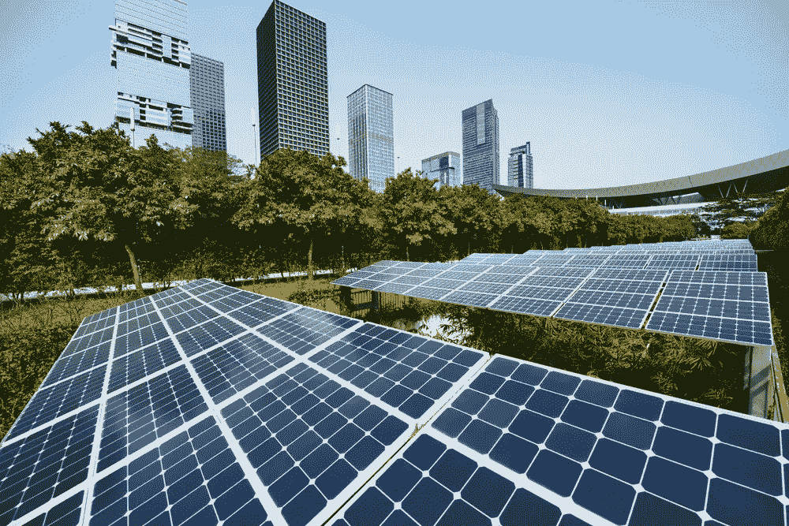

# 我们城市的未来在于共享资源。以下是区块链将如何发挥主要作用

> 原文：<https://medium.datadriveninvestor.com/the-future-of-our-cities-lies-in-sharing-resources-heres-how-blockchain-will-play-a-major-role-19cd7d736d22?source=collection_archive---------14----------------------->

无论是城市花园还是屋顶植被，走向绿色是目前设计实体场所的主要趋势。

[世界范围内生产的太阳能比以往任何时候都多。城市正在引入回收、堆肥和](https://e360.yale.edu/digest/the-world-added-nearly-30-percent-more-solar-energy-capacity-in-2017)[回收项目](https://www.npr.org/sections/health-shots/2018/07/20/630615148/replacing-vacant-lots-with-green-spaces-can-ease-depression-in-urban-communities)。拼车、自行车共享和新的交通方式正在蓬勃发展。

世界各地的人们开始意识到他们不能继续以目前的速度消耗资源。

这一事实在人口不断增长、需要共享有限资源的城市中表现得最为明显。

## 幸运的是，区块链是分配资源的完美技术。

区块链允许通过智能合同自动处理交易，以及通过公用事业令牌结构进行激励。简单地说，一旦有人买了一个系统，他们用得越多，他们得到的回报就越多。

> 这类似于包括奖励积分的信用卡会员计划——没有繁重的利率抵消奖励的机会。

这一系统已经存在，目前正在用[碳信用进行测试。但是没有理由不能用它来帮助人们减少资源消耗，并平均分配产生的资源。](https://www.coindesk.com/ibm-helping-build-carbon-credit-blockchain-token/)

它是这样工作的:

# **通过公用令牌实现资源共享可以改变社区的运营方式。**

[实用令牌](https://www.finma.ch/en/news/2018/02/20180216-mm-ico-wegleitung/)听起来可能很复杂，但它们实际上只是为持有者提供了对服务或应用程序的数字访问。

这使得代币非常适合社区和城市的可持续发展计划。

例如，随着越来越多的人开始在家里使用太阳能电池板，有时他们产生的电力对家庭来说绰绰有余。在这种情况下，房主可以重新分配他们的剩余电力，卖给其他家庭或电力公司。

## 如果一个系统能够在智能水平上连接这些类型的公用事业，并将电力重新分配到需要的地方，资源将得到更有效的利用。

智能合约是实现这类交易自动化的绝佳方式。

这种本地分布式能源的想法在区块链之前就有了。但随着智能合同的无缝自动化，我们离看到能源电网的巨大变化又近了一步。

# **正确的激励机制必须到位，系统才能运转。**

像[日本](https://www.forbes.com/sites/billybambrough/2018/06/27/japans-next-economic-boom-will-be-bitcoin-and-blockchain-fuelled/)、[马耳他](https://money.cnn.com/2018/07/18/technology/startups/malta-blockchain/index.html)、[爱沙尼亚](https://e-resident.gov.ee)和[瑞士](https://cointelegraph.com/news/switzerland-first-in-ranking-of-top-10-most-blockchain-friendly-countries-in-europe)这样的国家已经明智地选择投资前瞻性技术并将其嵌入新的基础设施。

虽然这些现代基础设施使人们更容易使用区块链技术，但人们甚至需要有机会使用它。只有这样，他们才能通过公用事业代币和贡献奖励得到激励。

如果城市和政府不负责并创建自己的用例，他们的市民将被落在后面。这类似于[充电站的缺乏](https://www.scientificamerican.com/article/electric-car-owners-struggle-to-find-a-charge/)阻碍了电动汽车在美国的广泛应用——除了一些小的飞地。

一旦合适的采用环境存在，我们就可以通过效用令牌来激励人们在系统内工作。

# 一旦激励被物质化，人们将开始采用技术和系统。

代币是当今消费者可以使用的少数几种虚拟有形技术之一。

没有物理元素，人们会犹豫是否采用新技术。想想加密货币吧。真正的加密还没有物理化——除了分散在世界各地的数百台比特币自动取款机之外，它都是数字化的。你不能走进银行为你的密码开一个账户。人们没有办法在现实世界中接触到这项技术。

> 技术专家仍然需要把这个词传播出去，帮助人们理解如何使用区块链应用程序，并以一种现实的方式使用它们。

许多现实世界的应用程序仍在构建中，人们如何使用这项技术的例子相对较少。

我们正处于营销和建设阶段，城市真的有机会在这方面起带头作用，帮助他们的市民购买，[理解为什么区块链技术如此重要](https://medium.com/ethereum-art-collective/why-its-important-for-artists-to-understand-emerging-technologies-6cbdc55271e4)，并找出他们可以用它做什么。

这就是我们如何创造一个更加可持续发展的世界——一个我们的资源不会被浪费，而是得到必要利用的世界。

**感谢阅读！**

**如果你有兴趣探索如何使用区块链来鉴定艺术品，可以试试区块链艺术集体的** [**入门套件**](https://blockchainartcollective.com/starterkit/) **。**