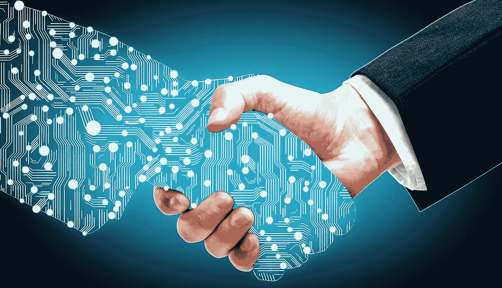

# 采购和技术的未来:无限可能

> 原文：<https://medium.datadriveninvestor.com/the-future-of-procurement-and-tech-the-possibilities-are-endless-6cd85860b1f0?source=collection_archive---------26----------------------->

我相信你已经注意到了，每个人都为区块链和人工智能(AI)等重大科技术语而疯狂。对话可以在光谱的任何地方，从相信技术将拯救世界或毁灭世界。双方都可以合理地争辩。我们周围有证据表明我们的生活可以从技术进步中受益多少。让我们以笔记本电脑为例；如果没有笔记本电脑，我们怎么能在周五穿着运动裤在家工作呢…开个玩笑，但只是一点点。严肃地说，我认为令人难以置信的是，我们可以将负担得起的便携式计算机带到世界的偏远地区，并使生活在不发达国家的人们能够获得在线教育或远程工作。另一方面，有些人担心技术进步会对我们的经济产生影响，特别是失业问题。我们是否会变得如此高效和依赖技术，以至于会消除社会各个阶层的工作岗位？一个很恐怖的想法，但也许我们并不需要像我们想象的那样担心被机器人和算法取代。许多这样的技术才刚刚出现。随着我们更多地了解它们的能力，以及如何最好地实现它们，我们将能够更好地预测每种能力带来的危险。我预测的是，技术不会消除工作，而是会引起人类工作方式的 T2 变化。在这篇文章中，我将谈论人工智能和区块链，以及我认为它们如何能够积极地影响采购以及其他功能，而不会完全扰乱人类的就业需求。

**人工智能**

AI 现在到处都是。嗯，在大多数地方，就我所见，采购还没有必要大规模地利用这项技术。我对人工智能的描述是，它是一种识别两组数据之间共性的算法，或者可以使用一组规则来识别任何不符合这些规则的情况。我看到人工智能在人力资源部门被大量使用，尤其是在招聘方面。人工智能可用于识别候选人简历中的关键词，前提是这些关键词已经出现在先前被雇用并成功担任该角色的候选人的简历中。这是一种全新的寻找简历的方法，我们可以从过去的成功中学习，现在可以审查一批候选人，这些候选人更有可能在某个职位上取得成功，因为他们与已经在该职位上取得成功的其他人相似。也就是说，招聘过程的这一部分并没有考虑筛选适合公司的软技能和文化。所以不用担心，人体筛选的需求还是极其关键的。在这个人工智能利用的例子中，我们所做的只是消除了交易性的采购过程，在这个过程中，人类接触并没有通过人工智能的自动化创造多少价值。

当我想到采购中的 AI 时，我相信有很多机会实现这项技术。根据我的经验，如果将 AI 应用到承包过程中，可以产生最大的价值。如果你读了我的第一篇文章，你就会知道我对合同的看法。这是一个漫长而艰巨的过程，但对于降低风险来说非常必要。签订合同需要这么长时间的原因是，根据每次与供应商接触的情况，风险的定义是不同的。风险不是万能的。然而，许多组织使用一些标准合同，以保持一致性，并确保所有协议涵盖最常见和必要的条款。这些条款导致了与供应商之间的许多反复，很多时候我们正在谈判的条款并不像我们认为的那样必要。然而，我们在供应商和买家之间传递文件长达数月，直到我们找到一个双方都能接受的中间立场。现在想象我们正在使用人工智能，算法的目的是识别与我们正在处理的合同相似的已完成合同。我们可以识别已经找到中间立场的已执行协议，并从那里开始，消除几个月的来回。

**区块链**

如果你不太了解区块链，欢迎加入这个俱乐部。我仍然在学习很多关于这项技术的知识，但是我已经很好地掌握了使它如此吸引人的关键特征。请耐心听我用自己的话描述这项技术。你需要知道的第一件事是区块链是用来记录交易的。它经常被称为分类账。这可能听起来像任何其他 ERP(企业资源规划)系统，但当我们谈论记录交易的过程和管理区块链中每个块的独特质量时，区别就来了。首先，关于进程，区块链被描述为一个不受监管的分布式账本，由大众而不是一个实体来管理。当区块链内的某人提交记录新交易或块的请求时，创建新块的编码由区块链网络内的许多编码员之一完成；然后，其他编码人员验证原始编码人员或“矿工”所做的工作。现在让我们看看积木本身；我刚才提到的这些编码人员会尽职调查，以验证所请求的交易，一旦他们的工作得到确认，他们就会创建区块，并使其成为区块链的一部分。块一旦创建，就不能删除或更改。这对于需要透明度和问责制的交易来说是一个巨大的好处。当你取消了对每笔交易进行调整的能力，你就保持了一个干净的活动链。没有一个实体控制区块链，就减少了腐败的机会。许多区块链的另一个关键特征是能够对块中的信息进行加密，以确保除了应该看到信息的人之外的所有人都知道该信息。一些区块链使用智能合约，这就是事情变得真正有趣的地方。我认为智能合约是写在区块链中的一条或多条规则，它允许根据智能合约的条款自动共享来自交易或区块的信息。

这是很多，所以让我给你一个例子，采购可能会如何使用区块链及其宝贵的特点。我不想浪费一个很好的例子，比如使用区块链来监控发票交易，因为这并没有使技术更加公正。让我们以采购活动为例；如果您对您的组织和潜在供应商之间的交易或互动的干净档案感兴趣，那么您可以使用区块链来管理 RFP 和跟踪洽谈。这也将是一个很好的信息归档源，并且可以将信息集中起来。这不仅能让所有供应商之间的每笔交易都透明，还能确保保持一定的道德水平。智能合同也可以成为采购的有力工具。想象一下，编写一条规则，规定任何超过一百万美元的提案都会自动触发对投标供应商的自动还价。这将使采购专业人员只把时间花在谈判中最具战略性的部分，这通常发生在你接近你最想要的结果的时候。

为了结束这篇文章，我想让你放松一下。当然，这是假设我已经让你相信人工智能和区块链在采购部门都有生存能力。像这样的技术肯定会出现，它们将永远改变我们的工作方式。这并不意味着相对于机器人和算法，这种变化将导致对人类工作的需求下降。从历史上看，随着技术的进步，劳动力也在增长。随着我们找到更有效的方法来管理工作，通过使用替代解决方案来完成日常或自动化任务，人们被重新分配到更具战略性的活动中。众所周知，这种支点实际上增加了就业率和创新的发展。停止谈论技术夺走我们的工作，并开始计划如何培训我们的劳动力以适应战略思维、终身学习和学习灵活性的需求，这符合我们的最佳利益。

*本网站上的帖子是我个人的，不一定代表我的雇主的帖子、策略或观点。*