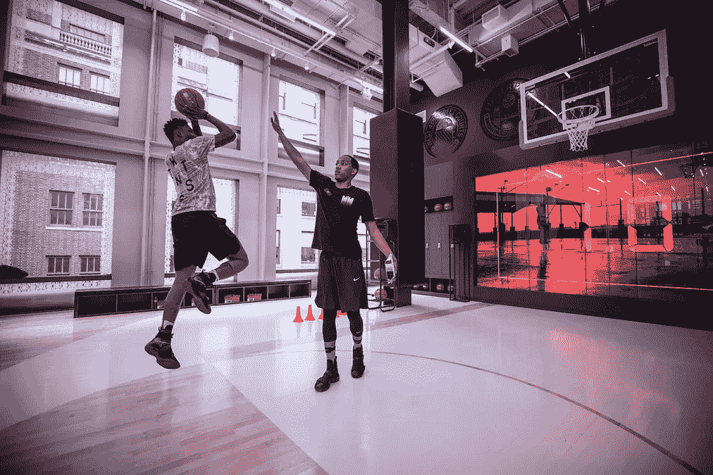
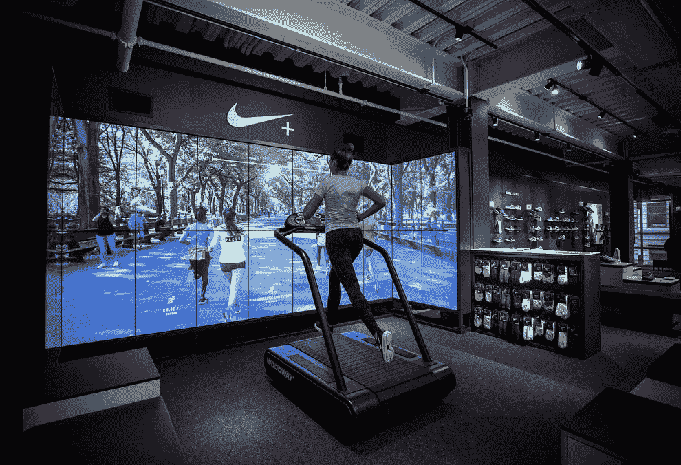
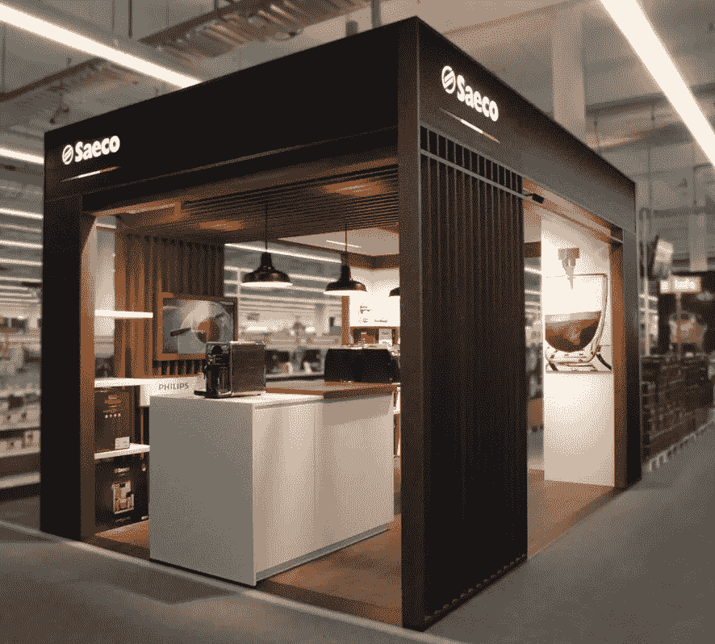

# 零售业的未来

> 原文：<https://medium.datadriveninvestor.com/the-future-of-retail-ffd8ba98bce?source=collection_archive---------16----------------------->

# 前言

“零售业正在消亡”，“亚马逊接管整个行业”，“实体店属于过去”——如果你接近零售业，你可能不止一次听到这样的说法。如果你对零售业有任何真正的了解，你现在应该知道这远不是事实。所以在我们走向未来之前，让我们打破一些神话吧:

## 零售业正在消亡

> “零售是通过多种分销渠道向顾客销售消费品或服务以赚取利润的过程”。维基百科。

出于我们的目的，我们将服务排除在外。因此，当声称零售业正在消亡时，你必须相信我们每年消费的商品越来越少，或者至少支付的商品越来越少。自 2000 年以来，美国**零售总额** **年均增长 3.5%** ，2017 年超过**5 万亿美元。**

**如果这种说法指的是实体零售，那么我们应该进入下一个神话。**

## **亚马逊接管了整个行业**

**自 2000 年以来，美国的总销售额年增长率为 3.5%，而电子商务部分的年平均增长率为 19%。这一趋势没有发生根本性变化的迹象，这意味着我们需要很长时间才能认识到电子商务是我们在商品上花费最多的领域。在 2018 年第二季度**，电子商务仅占美国零售总额的 9.6% ***。亚马逊的销售额接近美国整个电子商务销售额的 50%，但仍不到整个行业的 5%。**

**零售对很多玩家来说有很大的空间，这让我们想到了最后一个神话。**

## **实体店属于过去**

**今年美国玩具反斗城商店的关闭确实让人觉得电子商务的增长标志着实体购物的终结。**

**事实是，专家们喜欢称美国“库存过剩”。自 50 年代以来，购物中心的蓬勃发展从未因在线玩家的崛起而放缓。当市场意识到电子商务的重要性时，零售商已经在全国各地开设了太多的门店，其中许多门店对于需求来说太大了。所以，这是正常的市场调整。可以肯定地说，城市外的那些大型购物中心是最先关门的。**

**其他研究，如 IHL 集团的研究显示，新开的实体店比关闭的实体店多，并声称我们已经被媒体的“零售天启”所充斥。支持这一假设的现象是，由于需要以更有意义的方式与客户沟通，越来越多的数字本土品牌开设了实体店。**

**在明确了“零售天启”的说法后，我们可以肯定地说，零售空间正在演变。问题是 5 年后会是什么样子。在不深入市场分析的情况下**，我们必须就三个重要趋势达成一致**:**

*****城市化***——居住在人口密集地区的年轻、善于购物的人群带来了巨大的房地产和交通挑战。城市居民被零售商包围，不愿意远离他们的区域。然而，他们并不倾向于呆在家里。**

**个性化——我们希望有归属感，但又希望独一无二。我们想买知名品牌的产品，但我们的房子应该看起来有点不同。我们希望感觉自己受到了特殊照顾，我们希望系统知道我们喜欢什么，对什么感兴趣。**

*****“即时化***——指让事情变得更即时。我们试图让我们生活中的每一个过程更快、更高效、无缝，无需思考。我们希望一切都在 1-Click 距离内，并愿意支付成本。**

# **让我们跳跃到未来**

## **未来的客户**

**对价格不太敏感，更注重质量。愿意为服务的独特性和质量支付溢价。**

**寻求即时满足，他们想现在就试一试，并立即看到结果。如果你没有他们想要的型号或尺寸的库存，他们第二天不会来拿，他们会从网上或其他有库存的地方拿到。**

**他们喜欢与世界分享经验。他们不会在没有咨询移动设备的情况下做出任何决定，尤其是在购物的时候。**

**希望卖家知道他们的名字、购物偏好和风格，这样他们就可以获得更多个性化的推荐。**

**时间是他们最宝贵的资产，不要让他们觉得他们是在浪费时间等待或听他们不感兴趣的提议。**

**他们一直在改变生活方式、居住地和职业。他们经常旅行，因此适应性很强，非常灵活——他们希望自己的物品和服务保持不变。**

**他们没有很强的品牌忠诚度，老实说，他们希望保持独立。**

## **社会化媒体**

**社交媒体在我们如何接触新产品以及如何与零售商互动方面发挥着重要作用。这只会越来越强烈。Instagram 的新功能，让你点击你最喜欢的模特的照片，看看她在哪里买的这件新比基尼，只是一个开始。**

**很快我们将能够扫描我们在社交媒体上看到的任何图片，智能算法将告诉我们在哪里可以买到图片中的商品。**

## **未来的商店**

**未来的实体店将更加注重体验，是概念店。未来商店的主要目标是唤起人们对产品的情感——好奇、依恋和渴望。产品的实现会脱离购物的布局和体验。**

*****经历*****

**当然，技术将更多地融入商店，但这不是真正的变化所在。当顾客来到实体店时，他们会寻找一种更实际的体验，一种他们在其他地方得不到的体验。**

**世界各地的品牌已经显示出这种新一代商店的创造力和寓意。[诺德斯特龙的新概念商店](https://www.businessinsider.com/nordstrom-new-store-concept-opens-2017-10)就是一个很好的例子——有私人造型师、裁缝服务和酒吧供应葡萄酒。另一个很好的例子是[耐克在纽约 SoHo 的旗舰店](https://news.nike.com/news/nike-tech-pack-fall-2018)。耐克的顾客可以在室内篮球场、人造草足球场和跑步机上尝试新鞋和新装备，所有这些都有专业运动员的指导。**

**这个想法是让顾客在现实生活中尝试产品，以及随之而来的基本服务。不要告诉您的客户这款新的笔记本电脑可以运行视频编辑，给他们展示并让他们尝试。**

********

**Customers try Nike products on a real-world experience with the consultant of professional athletes. Pictures from [Nike News](https://news.nike.com/news/nike-tech-pack-fall-2018)**

*****浏览和探索*****

**在逛商店和向商店员工咨询时，顾客将能够通过他们的手机、触摸屏和 VR/AR 技术浏览商店库存。**

**交互式屏幕将向您展示产品的详细信息、不同的可用颜色、Instagram 上贴有该产品标签的人的照片等等。一旦你看中了一件特定的产品，你就要让商店系统知道这一点，然后卖家就会找到你，把产品交给你试穿。**

**adiVerse — a new interactive screen to present Adidas footwear inside a brick & mortar store**

*****试衣间和库存*****

**不再有架子和装载架。取代向顾客展示整个商店库存的是，商店将拥有高科技的密室，里面有管理和搜索库存的工具。例如，在服装店，顾客将通过交互式屏幕或他们的电话选择商品的尺寸和颜色，请求将被发送到后面的房间。所有的库存都将被编入索引，这样即使是机器人也能找到合适的产品。顾客将在试衣间拿到衣服。需要大一号的吗？在你试衣间的屏幕上点击一下，下一个尺码的衬衫就会出现在你面前，甚至不用离开房间。**

**Solebox — a shoes store that features a robot that hands customers their products**

**一些商店没有足够的空间存放所有的存货。这些商店将在城市的某个地方有一个仓库，将订单交付给商店或客户选择的快速交付。**

*****私人定制*****

**品牌理解独特的需要，并允许以各种方式互动和定制他们的一些产品。 [Build-A-Bear](https://www.buildabear.com/on/demandware.store/Sites-buildabear-us-Site/default/BearBuilder-Show?step=chooseFriends&sc_cid=ps:google_branded_exact&gclid=EAIaIQobChMIqZ_BroPQ3QIVR1x-Ch19mAqgEAAYASAAEgInkPD_BwE) 让它的客户设计他们自己的泰迪熊，带有独特的刺绣、缓冲、录音等等。在[新百伦网上商店](https://www.newbalance.com/pd/nb1-574/US574M1-BLANK.html?ICID=NB1HUB_574BLANK)你可以挑选鞋子各部分的颜色。我们希望在未来看到更多这样的东西，并整合到实体购物体验中。**

**New Balance NB1- lets the customers fully customize a number of shoe models**

*****无收银店*****

**走出去商店不是一个噱头，而且肯定不仅仅属于杂货店购物。支付将不断发展成为一个无缝的过程，融入我们的生活，当然也融入购物过程。所以当你穿上新鞋打完篮球，并按照你的要求定制了颜色后，只要走出去，收据就会发到你的手机上。**

**Amazon Go cashierless stores are just the begining**

*****批发商店*****

**走进一扇门就能立即满足你的大部分需求，这种感觉真的很舒服，很神奇。然而，这些商店有点吓人，缺乏亲切感和独特性。这些商店肯定会有更好的技术来引导你找到想要的产品。**

**店中店模式将更加普遍，有点像是将商店的各个部门分开，创造独特性。**

****

**Coffee store environment within a department store to promote Saeco — Philips premium home barista assortment. [Designed and pictured by Mojo](https://mocosubmit.com/philips-%E2%80%A2-saeco-shop-in-shop-concept/)**

## **未来的品牌(制造商)**

*****更多个性化*****

**未来的品牌将拥有更好的工具来沟通和理解他们的客户。这意味着他们将在创造新趋势方面投入更少的精力，而在理解客户的上升趋势方面投入更多的精力。更重要的是，顾客将有一种方式向品牌传达他们的愿望，并选择下一个功能或外观。**

*****短周期*****

**每条生产线的产品数量和不同型号都会变小。允许品牌对产品进行更快的迭代，更好地适应不断变化的市场。**

*****地理独特性*****

**我们会看到更多强大的本土品牌。即使是大的国际品牌也会有独特的产品系列，并适应每个国家甚至不同的城市。例如，在美国东海岸，因为潮湿，我们会看到更多的快干运动服装，而在西海岸，我们会看到更多的紫外线防护。**

## **未来的经销商**

**未来的在线经销商将很难在主要市场之外销售，除非他们将针对利基受众提供真正不同的在线购物体验。**

**一条街上挤满了出售相同库存的相似商店的现象将会消失。经销商将持有适合其位置或服务于独特受众的库存。例如，一切瑜伽店，或幼儿园外的一切母亲店。**

## **未来的交付**

**很快我们就可以送货上门了——汽车、家具、花园里的一棵新树，只要继续发挥你的想象力，就能有更多的选择。**

**从世界的另一端送货是可以承受的，所以我们可以有一个新的中国木桌送到我们家，甚至不需要专业进口商的帮助。**

**对于那些住在大都市附近的人来说，大多数产品的标准送货时间将是同一天。**

***柔韧性***

***忘记在你的房子里等半天只是为了在你收到包裹的快递服务上签字。智能最后一英里递送服务将通过您的手机为您提供快速协调递送的方式。顾客将能够实时改变送货的时间甚至地点，这样他们就可以在开会的时候在咖啡店里收到送货上门的服务。***

***我们所有人都将拥有智能家居设备，可以让我们在没有我们在场的情况下将东西送到家里。沃尔玛将食品直接送到你冰箱的测试服务就是一个很好的例子。***

***Walmart delivering groceries straight to your fridge with the help of Smart-Home devices***

# ***结论***

***零售业没有消亡，而是在快速发展，零售企业应该快速适应这个新的商业时代。拥抱新技术是这种适应的一个重要部分，但不是唯一的部分——新的商业模式和服务在这种变化中发挥了重要作用。身体的创造力是必须的，改变网站 UX 是不够的。***

******亚马逊是零售业的未来？一点也不，这是一个很大的部分，但有足够的空间让更多的球员在这个领域做出精彩的事情。******

***如果你想亲眼看看未来，你应该去中国。他们显然非常不同，但也领先世界几步。***

***China is a couple of steps deeper into the “future of retail”***

****美国零售数据来自美国商务部人口普查局。这一统计数据包括食品杂货、汽车、汽车零部件、汽油等等。一些品类通过电子商务完成的销售比例会更高，但这仍是全球电子商务百分比的官方衡量标准。不包括汽车，汽车零件和汽油将使其接近 11%。***