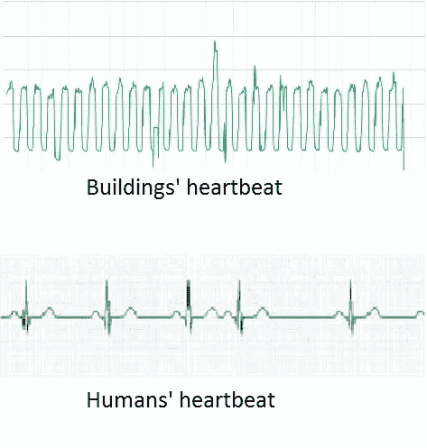

# 我们需要从建筑中得到什么？

> 原文：<https://medium.datadriveninvestor.com/the-future-of-s-ca2256f34178?source=collection_archive---------33----------------------->

Comfortable buildings

我们需要什么才能在建筑中拥有更好的环境？为了从建筑中获得更多，我们需要做些什么？大多数时候，我们会有这样的抱怨:

*   这里很热
*   里面太冷了
*   为什么灯开着
*   这里太亮了
*   我们已经投资了很多来建造智能建筑，但是现在办公室里的空气并不新鲜

我们认为最重要的问题是我们不知道我们如何使用这些建筑，我们没有从我们的建筑中获得足够的数据来了解我们的建筑中正在发生什么。我们认为建筑是混凝土结构，从第一天到永远都不会改变。但这是真实的情况吗？

Human and Buildings

我们在过去 5 年的工作和研究案例中看到，建筑和我们一样是活的生态系统。他们醒来，度过一天，然后睡觉。他们呼吸，他们感到拥挤，他们需要被倾听。这只能通过听他们白天产生的数据来实现。我们的建筑可以拥有最好的技术，我们可以拥有最新的暖通空调系统，但只要我们不跟踪或获取建筑多个点的数据并理解这些数据，我们就不会让我们的建筑舒适高效。我们必须停止假设暖通空调的设定值应该是多少，或者根据在这些建筑开始使用之前进行的计算来预先安排系统。

> 大约三分之一的商用暖通空调设备对于它们所服务的空间来说太大了——通常会导致过高的能源成本，严重影响建筑的财务表现。HVAC 系统与建筑断开。

根据在商业建筑中进行的十几个不同的案例研究，如果在建筑运行中考虑到居住者的存在/不存在，大约可以节省 10%-40%的能源。

我们的行动、行为和使用建筑的方式会影响这些建筑的能源消耗。建筑物中居住者的存在和行为对空间加热、冷却和通风需求、照明和电器的能量消耗以及建筑物控制有重大影响。

占用率(居住者的存在和数量)是影响 HVAC 系统能效的最重要因素之一，因为占用率通过改变空调周期和设置来确定需求侧的加热/冷却负荷。

**结果:**

1-用建筑物不同部分产生的数据支持你的建筑物。

2-不要只依赖一种传感器。在你的大楼里使用不同的传感器。

3-使用具有开放 API 并支持第三方交互的系统。

数字化是下一个石油。数字化您的建筑组合。