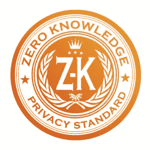

# 安全互联网应用的未来

> 原文：<https://medium.datadriveninvestor.com/the-future-of-secure-internet-applications-ca16e05f4147?source=collection_archive---------30----------------------->

当被问及我使用电子邮件或云存储等服务时，我总是建议未来防止侵犯性数据违规或信息泄露的证据。严重依赖尊重客户数据的隐私和安全应用程序。现在有更多几年前还没有的服务。人们在寻找这些安全工具，你只需要知道寻找什么。在决定使用哪种类型的服务时，您应该考虑几个方面。

# 零知识服务到底是什么？

顾名思义，服务提供商，无论是 VPN、文件同步软件还是视频通话应用，都没有任何东西可以识别他们的最终用户(因此被称为零知识)。服务提供商不持有解密密钥来查看您的明文消息。提供商只能访问密文数据。如果正确加密，服务提供商将不会知道您存储了什么。为什么有人希望对他们的服务提供商保持匿名？这似乎只是一个隐私问题，这怎么能让任何人更安全呢？这取决于两个主要的公理。隐私与安全——不必担心任何人会访问您的数据。

为什么不直接使用端到端(e2e)加密提供商，一劳永逸呢？这是一个主要的痛点。端到端加密比让你的数据以明文形式到处流动要好得多。单独使用 e2e 加密的问题是缺乏该服务提供的零知识。仅使用加密的好处是，您不必担心外部攻击者在传输过程中拦截您的数据。但是，您使用 e2e 加密发送的数据仍然可以在服务提供商端被解密。如果您的密文存储在服务提供商的服务器上，可能会有许多不同类型的攻击者来获取您的数据。恶意员工、试图通过破坏服务来利用信息的外部攻击者，或者公司本身——出售您的信息。去年在中国的一家苹果工厂发生了同样的事情。一群员工被收买出售个人客户数据。即使 iMessages 是加密的，苹果服务器上解密对话的能力也给用户留下了很大的攻击面。

# 在零知识服务中寻找什么

在选择您计划使用的服务时，您应该能够决定哪种服务最适合您的具体情况。你应该知道你的目标是什么，看看是否有最适合你需求的服务。您的威胁模型将告诉您应该从服务提供商的角度寻找什么。

你想避免被人认出你的隐私，因为任何别人能发现的关于你的信息，都能帮助他们拼凑出更多的信息。这增加了你的攻击面。如果您正在存储机密/私人信息，并且攻击者知道您的用户名或您使用的服务，他们现在可以瞄准该服务。你已经大大缩小了他们的范围。零知识提供商将避免任何类型的数据泄漏，并进一步保护您。

我建议你不要相信我的话，而是自己去研究你认为最适合你的方法。有许多网站会创建“十大安全应用”或类似的列表。小心这些网站——它们从兜售特定产品中获利。考虑一下这个:

*   永远要知道你的数据去了哪里。如果在一家提供零知识解决方案的公司出现数据泄露，您几乎不用担心，因为服务本身并不持有解密密钥。

如何验证服务现场没有解密密钥？对于大多数服务，你必须相信他们的话。你可以审计他们的代码，但是没有多少人这么做，原因很明显。你可以看看他们其他的商业行为。如果他们以某种方式将你的用户数据货币化，或者他们正在做一些不利于安全的商业行为，这通常会给我带来危险。有某些[服务](https://protonmail.com/blog/transparency-report/)被送达传票，还没能交出任何有用的信息。Lavabit 是爱德华·斯诺登在美国国家安全局曝光他的数据之前使用的电子邮件提供商。Lavabit 不是一个零知识提供者。收到传票后，这位[创始人解散了他的整个公司](https://www.theguardian.com/commentisfree/2014/may/20/why-did-lavabit-shut-down-snowden-email)，以避免放弃客户的安全/隐私。一个零知识提供者会使这种情况更容易成为这位创始人的同谋，并且仍然不会危及他的客户的隐私。

寻找零知识提供者时的一些有用提示:

*   阅读服务条款和隐私政策。所有关于商业实践的重要信息都将在这里列出。有一个[有用的网站为具体网站总结了 ToS 协议](https://tosdr.org/)的法律术语。
*   该服务的商业模式应该证明他们重视安全性。商业实践应该加强他们对实现最安全的解决方案的关注。
*   查看是否有特定的 IP 地址或登录凭证记录。如果服务没有记录这些可以用来识别您身份的信息，那么您的状态很好。

你想避免被认为是隐私，因为任何人能发现的关于你的信息都会帮助他们拼凑出更多的信息。这增加了你的攻击面。如果您正在存储机密/私人信息，并且攻击者知道您的用户名或您使用的服务，他们现在可以瞄准该服务。你已经大大缩小了他们的范围。ZK 提供商将避免任何类型的数据泄漏。

有助于进一步讨论这些不同服务的两个资源是[隐私工具](https://www.privacytools.io/)和[隐私网站](https://thatoneprivacysite.net)。隐私工具为安全领域提供建议，并且一个隐私网站审查 VPN 和电子邮件服务提供商。他们的目标是在提供服务/建议时保持公正。

*如果您对本帖中提到的零知识应用有任何疑问，或者有任何其他与加密货币安全相关的安全问题，请随时通过 J@CryoSecurity.io 联系我，或者访问*[*cryo security . io*](https://www.cryosecurity.io/)