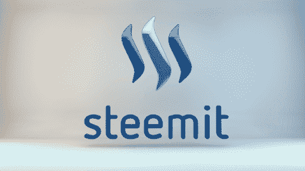
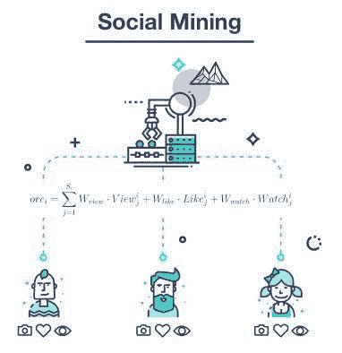
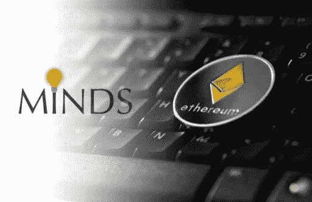
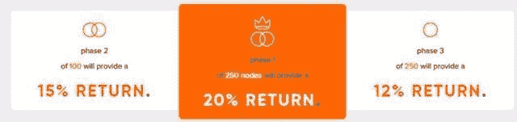

# 区块链上社交媒体的未来

> 原文：<https://medium.datadriveninvestor.com/the-future-of-social-media-on-the-blockchain-5626d6b75aa3?source=collection_archive---------20----------------------->

社交媒体在区块链有前途吗？

即使在剑桥分析数据泄露的灾难之后，我们仍不断听到围绕脸书帝国的新丑闻。这导致越来越多的人需要寻找替代平台，让我们相信我们的个人数据是保密和安全的。

区块链及其“不可破解”的特性是构建我们都可以信赖的新可信解决方案的理想基础。

自从比特币诞生以来，已经出现了一些社交媒体平台。一些好的一些坏的，一些会生存和茁壮成长，一些不会。还有一个博客网站——Steemit(我不把它归类为社交媒体)也在其中。

区块链上有一些实时的或正在开发的社交媒体平台。在这里，我只简要地写下其中的四个。

*   Steemit :最近，Steemit 宣布裁员 70%。这主要归咎于当前的加密市场条件。嗯，老实说，我不认为市场状况是催化剂。Steemit 充其量是一个笨拙、笨重、看起来普通的博客网站，类似于互联网早期的一些东西。将其归类为社交媒体平台有点牵强。Steemit 似乎从一开始就有问题，不仅是设计、外观/感觉和用户体验，还有客户服务方面的问题。从个人经验来看，从注册开始，我花了大约 8 周的时间才收到我的登录凭证；我很幸运。我知道有些人 6 个月后还在等待。如果这是在市场健康、Steemit 员工充足的情况下体验到的那种客户服务，那么未来会是什么样的呢？Steemit 是一家名为 Dan Larimer 的初创公司，它证明了区块链内容的符号化是可能的，也是革命性的。公平地说，它为区块链其他(合法的)社交媒体平台开辟了可能性。也许如果丹留在这里，而不是离开它，走向新的牧场，他可以通过改进。

*   **秘银**:使用 ERC-20 代币奖励平台用户。平台本身不是分散的，不运行在任何区块链上。Mithril 大约有 10，000 名活跃用户，并且还在增长。秘银的符号化是建立在他们的“社会采矿”概念上的。当用户在网络上生产内容时，他们就获得了 MITH。他们的采矿奖励与他们作为网络贡献者的影响力和成功直接相关。他们给平台带来的网络价值越多，他们赚的 MITH 就越多。所有的采矿努力和奖励都通过以太网交易。

*   Howdoo 即将上线，它将在自己的区块链上运行。通过提供定期更新和在线演示，Howdoo 团队正在建立一个非常感兴趣和高度支持的社区。Howdoo 吸引了许多专门从事某些内容类型(如音乐、游戏、DJ 和其他领域)的平台“大使”。Howdoo 不仅是一个面向普通用户的前沿社交媒体平台，也是一个以内容创作者为中心的平台；在这里，品牌可以建立和营销，同时确保每个人都得到公平的回报。许多社交媒体网站只奖励那些能够投入大量时间进行内容创作的人。如果你有一个激情，你可以分享它，赚取。艺术、音乐、游戏、角色扮演、健康博客等等；你可以建立和营销自己的渠道，创造一个被动收入和忠实的粉丝群。该平台的用户可以选择分享自己的哪些信息，确保他们愿意的话保持匿名，或者暴露某些信息，反过来用代币奖励他们。也有能力阻止所有或只查看某些广告，再次奖励可根据所做的选择。

*   **Minds** :已经有一段时间了，有很多用户。然而，它仍然只是一个驻留在另一个区块链上的 DApp(去中心化的应用程序)。目前它是以太网上的链上和链下混合模型。事实上，Minds 在以太坊投入了大量资金，他们的目标是成为以太坊区块链最大的 DApp。随着以太坊在最近几个月的突然消亡，人们不得不怀疑如果以太坊继续消亡或不复存在，人们将如何应对未来。大脑的长期未来现在看起来相当不确定。心灵令牌也是一个 ERC-20 令牌。遵循 Howdoo 的领导，创建自己的区块链，而不是依赖第三方解决方案，这可能符合他们的最佳利益。

**总结**:虽然很高兴看到社交平台走向区块链，类似于早期的 MySpace 和脸书，但可能只有少数赢家。考虑到这一点，并判断这一领域的愿景、交付能力和潜在领导者，我不得不说，对我来说，Howdoo 是最佳选择。虽然还没有上线，但我已经密切关注了几个月，对这些人构建平台、社区和后端支持的方式印象深刻。

与其他社交媒体相比，Howdoo 似乎提供了过多的功能。从通过分享内容赚取代币的能力，到决定看不看什么广告的能力；同样，通过在自己的生态系统中利用令牌化，令牌和区块链完全不受以太坊等外部因素的影响。

通过拥有自己的区块链，Howdoo 能够提供投资主节点的机会，这似乎有一个有吸引力的回报结构。更多详情见[https://howdoo.io/nodes/](https://howdoo.io/nodes/)。

这些家伙在船上的伙伴数量令人印象深刻，他们似乎越来越强大。

注册人数超过 35，000 人(在撰写本文时)，他们的 live 平台上的用户数量已经是 Mithril 的 3.5 倍。

作为一个投资人，如果你对比一下 Mithril 和 Howdoo 的价值，再考虑用户数量，两家公司都拥有的平台和价值；你可能会得出结论，Howdoo 潜力巨大。虽然这不是财务建议，纯粹是我的意见，但你可以自己看看细节，自己拿主意。

更多信息:

[斯蒂米特](https://steemit.com/)

[秘银](https://mith.io/)

[你好](https://howdoo.io/)

[心术](https://www.minds.com/)

***免责声明:*** *本文纯属个人观点。我不认可我所写的任何公司或品牌。我使用它们只是为了演示，说明一个观点或作为一个例子。这不是财务或任何其他形式的建议。永远做你自己的研究。*

# 评论

评论

*原载于 2018 年 12 月 13 日*[*www.datadriveninvestor.com*](https://www.datadriveninvestor.com/2018/12/13/the-future-of-social-media-on-the-blockchain/)*。*