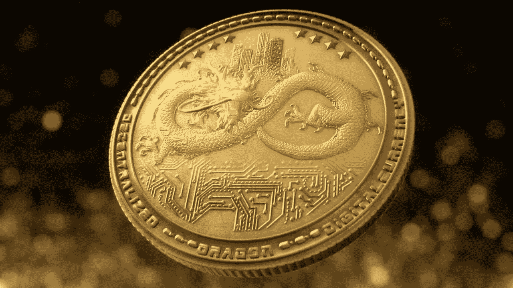

# 代币的未来属于证券吗？

> 原文：<https://medium.datadriveninvestor.com/the-future-of-tokens-belongs-to-securities-d4b128c2455?source=collection_archive---------13----------------------->

## 投资者对公用事业代币失去信心

2017 年的标志不仅是区块链各种 ico 和项目的繁荣，也是所谓的公用事业令牌的广泛使用。与证券交易委员会等同于股票的证券代币不同，公用代币的发行不需要复杂的法律程序。它们被设计成在区块链的平台上工作，而它们的第一批客户获得了使用该公司产品或服务的特权。

ICO 期间公用事业代币的发行让初创公司能够轻松快速地开展众筹活动。反过来，投资者被匿名和购买加密货币没有任何障碍所吸引。在风险投资市场，这种情况简直不可想象。

2018 年已经成为加密货币市场的转折点。在此期间，至少发生了两次严重的比特币价格下跌。与此同时，许多国家确定了虚拟货币的法律地位，并通过法律规范其流通。这就有可能吸引机构投资者投资于 ico，增强他们对区块链项目的信心。

2018 年初，很多人意识到市场在变化，不再会有“容易的投资”，需要“抓住时机”。所有这些都是今年上半年 ico 数量惊人的原因，其中大多数都是失败的，这也是加密货币市场衰退的一个症状。尽管这一时期通过 ico 筹集的资金数量创下纪录，但人们不能不注意到投资者对公用事业代币和区块链项目的信心下降。

当新令牌在加密交易所上市时，这一点尤其明显。很多主要交易所根本不增加新的加密货币。其他交易所——通常不是很受欢迎的交易所——愿意接受任何代币，但要收费。挂牌价从 10 BTC 左右开始。其他公司不收取上市费用——至少官方不收取——但由于监管证券流通的立法，它们要求公用令牌的状态应经过法律认证。一些交流不仅需要扫描法律意见书，还需要律师的个人数据，包括他的 Linkedin 页面。更不用说上市需要注册一个法人实体并遵守许多其他手续，这取决于项目注册的国家和证券交易所。

总的趋势是，市场上的公用令牌数量将会减少，我们应该预计未来会出现安全令牌的繁荣。

> 前几天，在一个成功的与游戏相关的 ICO 的子页面上，我看到一个投资者提出的有趣的问题。他说，在 ICO 期间出售并在交易所上市的该项目的代币应该成为证券。作者写道，该项目团队已经推出的区块链产品将无法在代币上工作，因为持有人玩代币无利可图(我说的是一个游戏平台)。通过使用已经在证券交易所交易的代币来玩游戏，他们冒了风险，并且在某种程度上玩了一场双重游戏，因为他们不知道代币的价值在不久的将来会上升还是下降。相反，他建议在游戏中使用筹码或其他固定价值的代币。

自然，他的评论在公司的 subreddit 中没有得到积极的回应，社区谴责了作者对项目的不耐烦和不信任。尽管在现实中，这是与加密团体对实用令牌的日益增长的不信任相关的非常有代表性的情况。毕竟，除了区块链的游戏平台，还有谁应该发行公用事业代币？

与此同时，一个与本文作者提供的方案类似的方案打算在中国赌博平台龙币上实施。整合到平台中的赌场应该使用 DGC(龙卡全球芯片)，可以兑换成 DRG 代币，反过来，它们可以在交易所出售或交易任何其他加密货币。该项目增加了对 DRG 代币的投资，最有可能的是，大多数投资者将这些代币视为投资工具，而不是实用代币。

许多项目认为在 ico 期间发行安全令牌对投资者更诚实，因为在这种情况下，投资者至少可以指望从投资中获得长期利润。另一方面，对公用事业代币失去兴趣可能是由于这样一个事实，即大多数区块链项目，这些相同的代币本应起作用，结果却是完全无用和不必要的。简单地说，它来自于对区块链技术及其在现实世界中应用的可能性的普遍失望。如果区块链技术的一些问题最终得到解决，那么公用事业代币将再次受到欢迎。