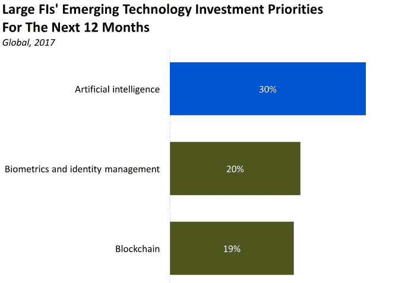

# 交易的未来属于人工智能

> 原文：<https://medium.datadriveninvestor.com/the-future-of-trading-belong-to-artificial-intelligence-a4d5887cb677?source=collection_archive---------1----------------------->

计算机已经彻底改变了金融交易，它在不到一秒的时间内促进了大量的计算，并跟踪以光速变化的市场。现在，人工智能交易系统正准备催生第二波创新，这将是金融史上最重大的变革。

具有讽刺意味的是，人工智能和金融是天生的一对，人们甚至可以更进一步，称他们为“灵魂伴侣”机器学习和不同的技术创造了新的系统，以发现人脑无法识别的模式，而且由于金融是量化的，首先，很难不注意到牵引力。过去，金融公司在人工智能方面投入了大量资金，许多其他公司也开始研究和实施机器学习(ML)和深度学习在他们运营中的金融应用。例如，人工智能和股票交易的结合肯定不是一个全新的发展。不幸的是，传统上只有大公司才能获得其可能性和利益。幸运的是，随着人工智能变得更加主流，这一现实正在改变。

## **人工智能征服华尔街。**

2010 年，仅在美国，高频和算法交易就占了交易的 60%至 70%。到 2014 年，这个数字上升到了 75%。到 2017 年，摩根大通报告称，传统交易员仅占交易量的 10%。

2016 年，由 Ben Goirtsel 领导的香港公司 Aidiya 成立了一家对冲基金，该基金完全通过人工智能进行所有操作交易，没有任何人类干预。“如果我们都死了，它还会继续交易，”— Goirtsel 评论道

2017 年，华尔街有了第一只 100%人工智能驱动的股票交易基金(ETF)。在运营的第一周，它上涨了 1 %，因此超过了标准普尔 500 指数。值得注意的是，到 2018 年 8 月，其股价上涨了 20%。ETF 在 IBM Watson 的前提下运行，这是一台处理和分析与 6000 家美国公司相关的新闻和报告的超级计算机。此外，Watson 的持续学习能力会检查其自身的性能，在无利可图的交易中，算法会从错误中学习，以便在未来做出更准确的决策。

## **人工智能可以革新加密货币交易**

加密市场生态系统的高度情绪化已经成为试图提出基于人工智能的解决方案以增加利润回报的开发者的研究主题。在这一领域采取的第一步是创建使用神经网络进行加密货币估值预测的模型。

## **情感分析**

人工智能和人工智能影响加密交易的另一种方式是通过情绪分析。情绪分析是对来自各种来源的大量信息进行处理，如文章、博客、评论、社交媒体帖子，甚至是视频转录，以计算出市场对某个主题的“感觉”，从而确定它是积极的、中立的还是消极的。

## **预测&预测**

神经网络不断提高精确度。神经网络可以更快地做出与密码市场相关的预测。他们的本性是不断处理关于加密货币汇率的信息。然后用于预测分钟、小时和天的市场运动。

## **区块链分析**

人工智能和区块链都是高度技术性的，计算机科学家似乎有一个共识，即这些技术将在未来 5 到 10 年内对加密和传统金融市场产生重大影响。这两种技术的使用可能会极大地改变商业和技术范式，足以迫使商业领袖对这些领域的发展采取行动。

## **基本面分析**

加密货币和股票交易商都采用基本面分析。在基本面分析中，投资者将相关性应用于硬币或股票估值，以确定定性和定性因素的范围。基本面分析在股票市场中被用来衡量宏观经济，如市场的健康状况和在其中经营的公司。在这方面，加密和股票有许多相似之处。此外，项目试图解决的问题及其背后的核心团队也在考虑之列。

加密货币和人工智能的集成将使交易的执行变得无限、更容易、更多样化。它会变成一个痴情而值得信赖的网络。由于人工智能系统能够准确地进行市场预测，因此机器将比人类更有效地分析市场的动荡气氛。有了人工智能，所有行业，无论是信息、技术还是运营，都将变得相互依赖、相互联系。庞大数据集的维护和快速处理将是加密货币交易世界中缺失的一环。提供了急需的确定性水平，使加密经济更加健康和易于采用。为金融的未来铺路。

*感谢您阅读我的文章，它最初发表在我的个人网站*[*https://renatozamagna.com/*](https://renatozamagna.com/)*。如果你想联系我，或者如果有你想让我报道的话题，请给我发电子邮件到 thesparkblog@renatozamagna.com。*

