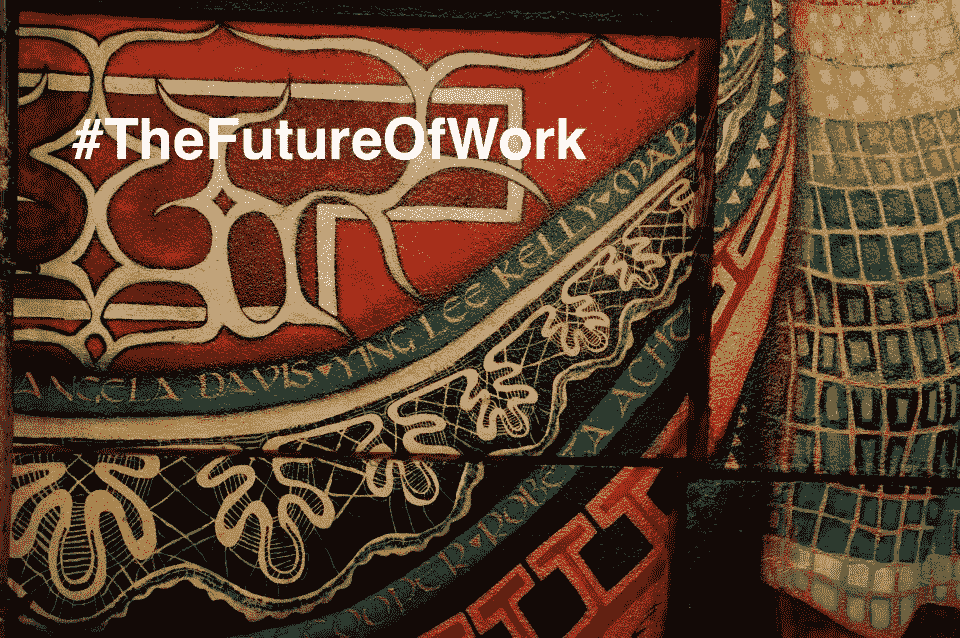

# 工作的未来

> 原文：<https://medium.datadriveninvestor.com/the-future-of-work-8169f4c1ae4a?source=collection_archive---------2----------------------->

Somewhere on Austin’s dirty sixth street, 2013

今年早些时候在达沃斯，在一个出席人数众多的关于就业前景的小组讨论会上，世界经济论坛(World Economic Forum)教育、性别和工作负责人兼执行委员会成员萨迪亚·扎希迪(Saadia Zahidi)阐述了 WEF 的研究重点:“虽然我们可能会看到未来有 7500 万个工作岗位被取代，但我们也看到未来可能会在大约 20 个发达和发展中经济体创造 1.33 亿个工作岗位。”

围绕工作前景的积极影响和担忧，有大量的言论。小组讨论了这一领域的研究和其他研究，重点是:管理快速技术变革造成的工作替代；提升员工技能以适应新工作要求的挑战，以及这一全球变革带来的成本负担。

出席达沃斯论坛的国际货币基金组织(IMF)总裁兼主席克里斯蒂娜拉加德(Christine Lagarde)谈到了这将如何影响新兴和发展中市场年轻人的重要性。她说，20%的年轻人没有上学，没有工作，也没有接受培训。此外，年轻人的失业率为 18%,这两个数字加在一起是惊人的，影响着未来几代人。2018 年，印度铁路公司发布了 6 万个工作岗位的广告，收到了 2000 万份申请。简而言之，这是一群想要流动的人才——并不意味着他们都失业了，但他们属于经济学家所说的那一类——未充分就业或失业。拉加德还表示，总的来说，自动化和其他“复合技术”对女性的影响将大于男性。9%的男性工作和 11%的女性工作将受到置换、变化和完全淘汰的影响。总的来说，女性比男性从事更多的日常工作。

 [## 零工经济如何改变未来的就业前景——数据驱动的投资者

### 随着自动化的发展和 Z 世代的出现，劳动力的构成和动态正在发生变化…

www.datadriveninvestor.com](https://www.datadriveninvestor.com/2018/12/19/how-is-the-gig-economy-changing-the-future-jobs-landscape/) 

工作和就业的未来是这些天的热门话题，它带来了复杂的问题，这些问题在我们生活的每个方面都根深蒂固。对我们许多人来说，工作不仅是一种维持生计的方式，也是尊严的来源，有助于实现更大的目标，是一种社会和经济保障。国际劳工组织(International Labor Organization)总干事盖伊·赖德(Guy Ryder)说，国际劳工组织(International Labor Organization)的章程谈到“工作是确保物质福祉和精神自我发展的一种方式”，虽然有点过时，但从我们对工作的看法来看，这并没有错。赖德也是拉加德的小组成员。

在过去的几十年里，技术进步一直在稳步增长，那么为什么现在感觉很紧迫呢？我们努力解决的问题是，是否每个人都有足够的工作，我们的工作是否会自动化，从而被淘汰。过去，我们已经看到机器自动化了一些例行的机械工作，但现在这种情况正在改变。我们正在制造机器来自动化认知工作。《职业的未来》一书的合著者、牛津大学的经济学家丹尼尔·苏斯金德在 Ted 演讲中讲述了自动化的三大神话。

1.  他说的“*智力神话*是我们认为机器必须模仿人类的行为。机器必须有能力比人类做得更快更有效率的理论已经不再正确了。这在某种程度上限制了自动化的能力。因此，非常规任务和人类无法掌握的任务是自动化的未来。对于机器能做什么，常规和非常规之间的区别是模糊的——任何需要创造力、判断力和直觉的任务都是非常规的，但机器可以完成。
2.  “*终结者神话*”是指我们相信自动化将消除由人类完成的任务。机器不仅消除了任务，而且几乎更重要的是间接称赞了我们所做的工作，使我们工作更有效率，并为我们付出的努力产生更高质量的结果。300 年前人们在农场工作，而今天我们大多在办公室工作，随着我们工作环境的变化，这一事实带来了一系列非常不同的需求。因此，承认机器是如何辅助人类工作的是一个重要的考虑因素。
3.  “*优越神话*”，指的是被称为“[劳动谬误](https://en.wikipedia.org/wiki/Lump_of_labour_fallacy)”的东西——人类之间没有固定的工作量可以分配。随着螺母和螺栓越来越容易生产，它们的价格下降，需求增加。Susskind 说，随着经济蛋糕越来越大，我们的问题是，我们假设人类最适合完成这项“新工作”。随着机器变得更有能力，它们最终可能会吸收这些新工作。只有当我们在这些新任务中占上风时，我们人类才能受益。

随着我们开始更好地理解这一挑战，量化影响并为新的工作世界做准备，关注转变至关重要。政府、政策专家和商界领袖将如何让人们为新工作做好准备？一个人如何重新设计工作结构以适应新的工作类型，我们如何再培训和重新部署人才到工作场所？在我们进行转型的时候，可以提供哪些类型的工人失业支持？我们以何种方式支持工资制度的改变？尽管这些问题仍不确定，但对话是重要的。

了解我们每个人的未来让我们能够控制自己的转变能力。行为改变可能需要几十年的时间，但我们再也没有缓慢转变的奢侈，我们必须接受并管理这种改变。