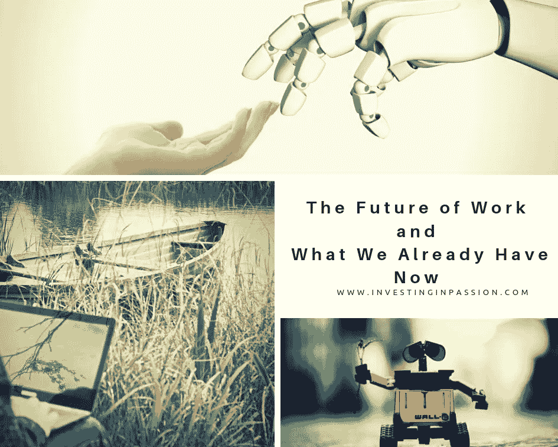

# 工作的未来和我们现在已经拥有的

> 原文：<https://medium.datadriveninvestor.com/the-future-of-work-and-what-we-already-have-now-e22890b1cbbe?source=collection_archive---------8----------------------->

现在我们生活在机器和技术的包围中，我们可以轻松地在全球范围内工作，跨越国家和大陆，我们可以像这样预订[到](https://www.sciencealert.com/nasa-is-opening-the-space-station-to-tourists)T2 宇宙的旅行。然而，仍然有一些人在工作环境和工作中挣扎，而这并不一定会对他们的生活产生积极的影响。我在这里没有提到失业问题和难以获得工作和谋生收入的领域，我现在想把重点放在未来的工作上，这意味着能够摆脱非人类可以完成的任务，工作不仅仅意味着生产力的报酬，工作可以成为我们生活的一部分，我们不再把它视为只是支付账单的负担。
我想到了用创造力和智力努力取代简单重复的任务的未来，让人们做自己喜欢的事情的未来，大致如下图所示。

 [## 技术颠覆和就业的未来——数据驱动的投资者

### 随着技术颠覆和自动化与日俱增，关于……问题的争论也越来越激烈

www.datadriveninvestor.com](https://www.datadriveninvestor.com/2018/10/23/technological-disruption-and-the-future-of-jobs/) 

**灵活性**，这里值得一提的是*休假*越来越多地由个人分配，而不是由每个国家的法律规定。越来越多的公司(主要是初创公司)允许员工无限休假，这种做法是基于简单的信任，即员工不会超过需求，也不会危及公司的质量和良好业绩。这是很大的自由，但矛盾的是，对你的休息时间负责更要求你，如果你把它整理好的话。你需要在自己的需求、利用自己的自由管理时间的愿望、保持同事的信任以及为公司做出最大贡献之间找到平衡。我有机会管理我的休息日，这对我保持健康总是很好的锻炼，当我想休息时休息，但对工作负责，并确保我的同事知道他们可以永远依靠我。

**工作环境**。如今，工作场所越来越现代化，配备了最新的技术、精美的家具、强大的工具、免费午餐、大楼内的健身房、医疗检查、游戏空间，让人们留在办公室，并为他们提供工作时放松所需的一切。看起来如果我们想的话，我们甚至可以在工作的时候睡觉。几年前，雇主的唯一责任是提供一个安全的环境和饮用水。现在，它发生了巨大的变化，吸引了优秀的人才，也让员工的工作时间更加高效。你可以看看 [Etsy，谷歌，Airbnb，耐克，亚马逊，YouTube 等。](https://freshome.com/office-spaces-and-office-design/)

**距离** **工作**(家庭工作、工作空间、合作倡议)。许多人选择了创业之路，并致力于自己的商业理念。因为你是创业公司的所有者，所以你的家通常就是你的办公室。然而，我们都知道在家会带来很多干扰。你可能想洗衣服，做午饭，你的邻居可以过来喝杯咖啡，但实际上你在一天结束时没做多少工作。一个很好的主意是出去使用一些共同工作的空间，那里有你的桌子，食物，咖啡就在你的指尖，除了坐着工作没有别的事情可做。实际上， [**Codi**](https://www.codiwork.com/) 搜索你最近邻居的客厅，你可以用它来工作。这真是太棒了，这是一个诞生于湾区的最新想法，不管你是否有吵闹的室友，或者你只是想在你家以外的地方工作，你都可以查看一下[**Codi Work**](https://www.codiwork.com/)**看看它是否适合你。**

****激情的创作者 vs 工人**。无论你是初创公司的创始人还是公司的老板，现在越来越多的是使命，而不仅仅是支付账单。人们寻找有意义的工作，当他们创造一些东西并把他们的想法带到桌面上时，他们可以产生影响。他们想要塑造过程，而不仅仅是一言不发地做应该做的事情。这是一个更具互动性和创造性的环境。它的变化比几年前快得多，因此人们不仅需要适应，还需要走在这个快速增长的市场的前面。世界上的机会越来越多。你现在可以很容易地在一个不同的国家申请工作，任何人都不会对你搬到另一个城市或国家感到惊讶(好吧，也许对我父母来说这还不太自然)。如今，人们的根扎得不那么深了，如果需要做他们觉得完全符合自己信念的工作，他们可以流动。你可以花一个[遥远的一年](https://remoteyear.com/)，做你的项目，去几个不同的地方旅行。如果它能引起你的共鸣，你就不需要在工作和探索世界之间做出选择。**

**人工智能的迅速普及正在塑造着工作的未来，这可能会影响我上面描述的所有 4 点。它可以帮助我们更快地完成工作，它可以提高我们空闲时间的质量，它可以帮助我们更快地学习，不带任何人为偏见地做出决定，治愈疾病或尽早发现疾病，以便为完全恢复带来巨大变化。它有巨大的能力收集无限的数据，分析计划和趋势，并提出报告，否则我们将工作 3 周。这是一种强大的力量，现在被所有努力理解和实现人工智能的人所接受。他们有一个伟大的使命，并将被命名为第一批戏剧性地改变我们今天的生活方式，使我们今天看到的工作更加适合每个人的人。这是可能的，因为除了其他人之外，还有富有远见的投资者、风险资本家，他们投入大量资金来支持创业公司，这些创业公司的想法乍一看很难让人相信。“这是关于投资看起来像坏主意的好主意”(出自斯科特·库波尔最近出版的书《沙丘之路的秘密》)，所以继续支持革命性的公司，让工作的未来成为一个令人惊叹的地方。**

**最初发表于 www.InvestingInPassion.com 的**