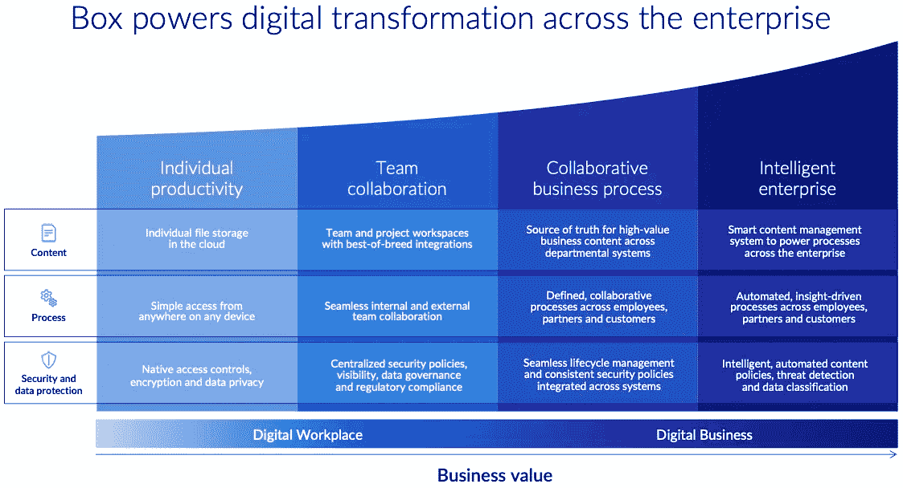
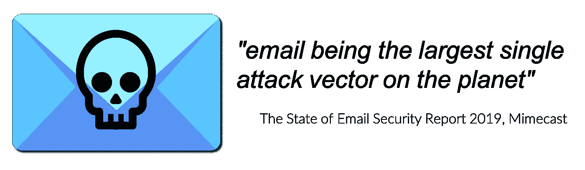
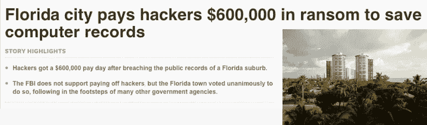
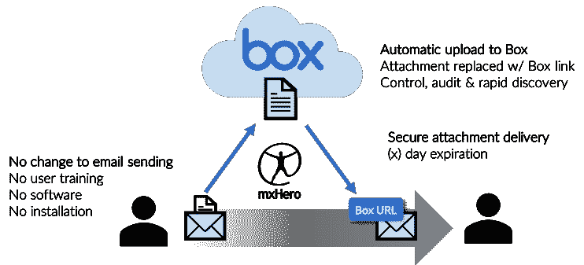
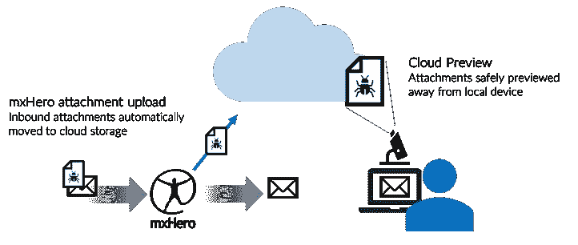

# 工作的未来:由盒子云内容管理和 mxHero 的 Mail2Cloud 支持的内容管理策略和安全威胁面减少

> 原文：<https://medium.datadriveninvestor.com/the-future-of-work-content-management-strategies-security-threat-surface-reductions-powered-by-f0df2af6440d?source=collection_archive---------9----------------------->

*我很高兴发表这篇由唐纳德·R·哈蒙斯(Donald R Hammons)撰写的精彩文章，作者是 MBA、首席执行官佩里吉 360 & mxHero 顾问委员会*

The Digital Enterprise

今年 2 月，Box HQ 宣布聘用前 SAP 高管拉克什米·汉斯帕尔(Lakshmi Hanspal)为公司新任首席信息安全官(CISO)。正如 Box 联合创始人兼首席执行官 Aaron Levie 在公告中指出的那样，安全性是 Box 所做的一切的核心，因此找到合适的首席信息安全官绝对至关重要。Box 的这一姿态强调了一个非常重要的考虑因素，因为企业开始实施集中的云内容管理战略，旨在实现其数字业务目标。

众所周知，Box 坚定地致力于满足客户对数字工作场所的渴望。凭借超越企业文件同步和共享的市场方法，Box 的云内容管理战略是一个更优雅的解决方案，尽管对许多最大的客户来说这是一场漫长的游戏。

 [## 人们对隐私的不理解是什么？-数据驱动型投资者

### 你知道那种感觉。无论是访问应用程序、订阅还是你最喜欢的运动鞋。你按下…

www.datadriveninvestor.com](https://www.datadriveninvestor.com/2019/04/11/privacy-and-convenience/) 

在回顾他们为客户制定的从左到右的数字之旅战略时，从个人生产力目标到团队协作、协作业务流程和智能企业的最终成就，有一个明确的客户之旅图。

The enterprise digital journey, courtesy Box Inc.

这种数字工作场所到数字业务的战略将被证明对第四次工业革命中最灵活和最具创新性的公司至关重要，并将巩固 Box 作为 21 世纪领先的基于云的主内容管理平台的市场地位。单个基于云的体系结构的愿景在适当的时间推动内容及其组件向最佳边界应用程序和 IT 堆栈解决方案的提升，这是一种全新的 IT 体系结构方法，无疑将组织置于最终控制其非结构化数据并从中获得未开发价值链的道路上。正如 Box 的 Jeetu Patel 经常说的，“内容在盒子里更有价值。”一旦客户承诺利用 Box 强大的企业内容平台，就可以利用 Box 的边界平台优势来进一步推动数字化之旅，包括用于区域内容驻留的 Box 区域、用于确保合规性和促进内容安全性的 Box 治理、新发布的用于促进关键内容驱动的工作流自动化的 Box 中继等。与 Salesforce 的核心 CRM 解决方案不同，Salesforce 的 360 度平台功能，包括其营销云、服务云、支持 API 的平台架构以及最近对 Tableau for business intelligence 的收购，都创建了一个单一平台来推动 360 度客户体验。Box 的战略是成为一个组织所有内容管理的中心平台，其好处同样深远。

Box 已经并将继续最有把握地解决这种方法的优势，同时解决企业首席信息官、商业领袖和 CISO 的一个关键考虑因素，即:安全性。根据哈佛大学肯尼迪商学院(Belfer Center，2017 年 11 月)发布的网络安全运动剧本，传达了“使用云”的姿态，因为云平台和服务可以提供比大多数组织能够有机实现的更强大的安全能力。有人可能会说，当考虑这种方法时，财务成本扣除本身也是未来企业的一个重要优势。

Box 专注于客户的数字化之旅，专注于“解决方案”而非简单的内容存储，并专注于围绕其平台的创新，以推动实现智能企业的道路，我们将为踏上这一旅程的人带来深远的结果和创新。当你将这项事业与 Box 新发布的平台功能(如用于人工智能和机器学习的 Box 技能)相结合时，由单一内容聚焦平台方法驱动的下游创新的潜力是爆炸性的。

那么，如果我所有的内容都在一个平台上，而且是安全的，那么电子邮件呢？这是企业开始“智能企业”之旅的一个关键考虑因素。根据 Digital Guardian 的说法，“电子邮件是寻求在企业网络中获得立足点并获取有价值的公司数据的攻击者的常见进入媒介。”现在，我们几乎每天都能在新闻中看到这种情况，这种违规事件的代价是巨大的，通常涉及赎金攻击和公司内容的丢失。

USA Today headline from June 19, 2019\. What has become routine news, namely, email used in attack by hackers to compromise yet another organization.

市场对这种违规事件的看法也对品牌造成了损害，因为供应商、供货商甚至客户经常处于风险之中。一些观点可能适用于此。首先，如果组织完全致力于采用单一平台或主数据管理(MDM)类型的方法来处理非结构化数据和内容，那么将重要的电子邮件和电子邮件有效负载排除在该策略之外就是一个错误。研究表明，在底层，大约 40%的企业最重要的内容实际上是通过电子邮件通信流动的，对于具有大量内容负载的企业，如律师事务所(80% IDC，2017 年)、法律业务部门、咨询机构等，这一数字要大得多。此外，尽管电子邮件寿命很长，而且无处不在，但它从未被设计成协作平台或内容引擎。从内容的角度来看，我们可以说电子邮件负载代表了企业中一些最重要的内容。因此，首先要考虑的可能是，组织如何消除或减少组织内部和外部电子邮件中流动的内容(知识产权和有价值的内容),自动将其从电子邮件中取出并放入能够利用其价值的平台，同时确保合规性和安全性。任何组织范围的内容管理方法都必须考虑电子邮件的有效负载。随着 mxHero 的 Mail2Cloud 等技术的加入，结合 Box，一个数字桥梁已经完成，允许全自动、无中断和智能地捕获双向电子邮件和电子邮件附件，并自动提升到目标和安全的 Box 文件夹结构中。然后，在 mxHero 智能平台和元数据丰富功能的支持下，围绕捕获的内容在框内实现强大的搜索。

MxHero makes email safer by moving email content & attachment payloads out of insecure email and into the Box Cloud Content Management solution securely and without requiring effort by the sender or receiver

用户无需安装软件、接受培训或中断工作流程。他们只需像往常一样发送和接收电子邮件(包括附件)，通过 mxHero 与 Box 相结合的智能平台解决方案，内容可以自动提取，用元数据丰富，并安全地放入 Box 的云内容管理解决方案中。带有集中定义的安全和共享规则的安全链接会自动放回电子邮件中并得到处理。该解决方案既适用于入站通信，也适用于出站通信，并且可以唯一地集中定义规则来驱动设置，例如仅内部共享、链接自动过期、仅允许唯一定义的接收者访问链接等。凭借 Box 强大的预览功能，电子邮件的威胁载体被降至最低，因为同事可以在下载前“预览”内容附件，系统甚至可以自动阻止下载。

Requiring attachments to be previewed before download keeps users from opening potentially malicious content (that has passed through corporate defensive systems) directly on their local devices

这种方法在基于电子邮件的内容有效负载和更广泛的企业内容管理战略之间架起了一座桥梁，不仅推动了企业内容管理的单一平台方法，还提供了独特的“所有”企业内容捕获功能，包括电子邮件本身(可以保存到邮箱中)和电子邮件的相关附件。这种方法的安全优势是深远的。成本削减，尤其是对于那些仍然使用本地备份和内容存储来存储基于 Exchange 的电子邮件内容的公司来说，是这些客户的衍生投资回报。

> “内容安全仍然是 Box 战略的核心原则，通过 mxHERO Mail2Cloud，我们将这一能力扩展到了基于电子邮件的重要内容。这对企业来说是一个强大的组合”
> 
> *保罗·查普曼，首席信息官框*

一个整体的企业范围的内容管理策略可能是那些瞄准未来工作的公司实现“智能企业”目标的关键。将内容的定义扩展到重要的电子邮件记录，同时降低成本、推动创新(包括移动和自动化工作流)并减少安全威胁载体，这必将成为未来企业的一项重要竞争优势。MxHero 旨在为企业解决一个问题。当 Mail2Cloud 与 Box 这样的强大平台相结合时，我们可能会有机会实现这一目标。我们很期待接下来会发生什么！

【www.mxhero.com 号