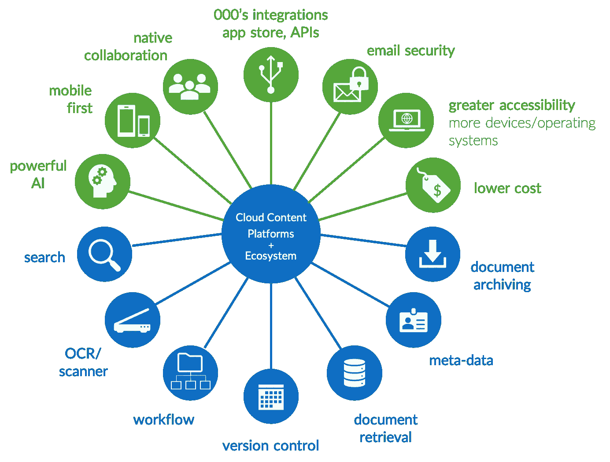

# 工作的未来:反思文档管理系统(DMS)

> 原文：<https://medium.datadriveninvestor.com/the-future-of-work-rethinking-document-management-systems-dms-3ae31869aa2a?source=collection_archive---------0----------------------->

*文档管理系统正在被同类最佳的云内容管理平台所取代。对组织而言，其结果是更好的信息安全性、治理和协作，同时降低成本。*

Modern cloud content management (CCM) platforms, like Box, when combined with 3rd party capabilities like mxHero for intelligent email capture, encompass all Document Management System (DMS) functionality (blue) plus add additional capabilities (green)

随着组织转向高度协作、安全和集成的云支持生态系统，包括 iManage 等 DMS 平台在内的传统解决方案将面临危险，因为组织的目标是扩展其数字业务目标。高成本的传统解决方案将被打破，取而代之的是更灵活的内容管理平台解决方案。尽管传统解决方案为组织提供了包括存储、版本控制和组织内部访问在内的内容管理功能，但也有一些权衡因素不再推动最具创新性的企业正在进行的数字化之旅。虽然 DMS 通常被视为市场上更广泛的企业内容管理(ECM)解决方案的子集，但创新步伐根本不足以保证保留这些高成本的传统解决方案。

 [## 零工经济如何改变未来的就业前景——数据驱动的投资者

### 随着自动化的发展和 Z 世代的出现，劳动力的构成和动态正在发生变化…

www.datadriveninvestor.com](https://www.datadriveninvestor.com/2018/12/19/how-is-the-gig-economy-changing-the-future-jobs-landscape/) 

早在 20 世纪 80 年代，供应商就开始向市场推出解决方案，以推动从纸质文档向支持多文件格式的电子版本的转变。随着这些解决方案的发展，它们成为存储数字化内容的事实上的中心。在当今技术驱动的环境中，简单地存储数字资产已不足以满足未来工作的需求。向强大的支持 API 的内容平台结合边缘技术集成进行数字化转型的企业将成为 21 世纪的赢家。

为了保持竞争力和获得市场份额，企业现在正在重新思考他们的数字战略，以推动对其组织内“内容”价值的新的和更强大的看法。推动这些新的数字客户之旅的创新主题包括:

*   不断增加的监管、安全和合规性要求(例如 HIPAA、GDRP 等。)
*   增加组织间(外部)和组织内(内部)的协作目标
*   内容保留策略和风险缓解
*   工作流支持
*   改进的搜索
*   随时随地根据需要连接到表面内容的 API
*   随时随地通过任何设备访问关键内容，符合广泛的移动战略
*   千禧一代劳动力的期望
*   以平台为中心的内容战略取代了本地存储共享驱动器和传统容器
*   降低成本和抵消投资回报预期
*   人工智能和机器学习创新

在这些新的创新要求下，企业高度意识到，要保持竞争力，现在是开始投资新一代云和基于混合平台的时候了，以推动数字业务的概念。

好消息是，我们现在看到围绕这些创新的市场正在走向成熟。像加州雷德伍德城的 Box([www.box.com](http://www.box.com))这样的公司在企业中有很大的优势，因为它们不仅提供云内容管理解决方案来推动基于云的集中内容管理战略，而且还提供平台来扩展创新、协作、安全和 API 驱动的连接到边界信息技术堆栈，包括营销自动化、社交平台、电子签名解决方案、单点登录和身份管理平台、CRM 和 ERP 后端系统。借助由“平台”内容方法支持的集中内容管理战略，同时优化内容搜索功能、安全性和协作，组织可以改善其竞争态势并推动大规模创新。

随着 Box 等技术解决方案在市场上的出现，推动了下一波创新，对于企业来说，实现 pivot 并非易事。重要的考虑因素适用于开始这些数字化之旅的公司。第一个潜在的考虑是执行所需的评估，以确保正确的平台来推动这一过渡。一旦了解并致力于集中式平台方法，组织将经历一个潜在的漫长过程来建立这些平台，处理从传统环境到新的基于云的平台的内容迁移，并进行一系列必要的过渡活动，以确保所有内容都包含在未来的企业内容管理平台中。

一旦完成了包括必要的变更管理组件在内的过渡，就可以开始通过替换遗留平台来降低成本，从而提高投资回报(ROI)目标。与此同时，数字化之旅的下一步可以开始了，包括从新的集中式内容管理平台到 IT 解决方案的边界堆栈的集成设置。这就是 API 驱动的云内容和协作平台(如 Box)的力量将开始推动重要价值的地方，因为内容在正确的时间出现在正确的应用程序中，以推动工作流自动化。

在通往更成熟的“数字企业”的道路上，公司可以利用这些解决方案的平台方面进行更广泛的创新，以推动更深入的集成、移动优先访问内容、更高的安全性、内容保留策略实施、增强的协作、机器学习和人工智能。这些平台将推动新的创新。除了这些新平台的有机和强大功能之外，更大的好处将是推动进一步创新的边界生态系统。mxHero 的 mail 2 cloud([www.mxhero.com](https://www.mxhero.com/))等解决方案通过自动捕获动态双向电子邮件内容和附件，为企业扩展了这些平台的功能。当企业数字内容来源于多个来源时，包括从传统平台的迁移、来自网络设备(例如 MFP 扫描仪、照相机等)的数字输入。)，以及电子邮件通信，将这些有价值的内容(无论其来源如何)聚合到一个单一的企业互联平台上，将为未来的组织提供一个“单一管理平台”来推动广泛的内容管理战略。

传统的 ECM 和 DMS 解决方案发挥了它们的作用。然而，为了实现真正的数字业务目标，组织需要一种新型的技术解决方案，如 Box 和 mxHero，以推动他们走向未来。好消息是:这些技术就在这里，现在正是时候！