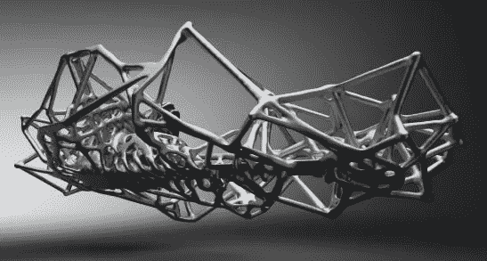

# 四轮驱动的未来——汽车行业的变革

> 原文：<https://medium.datadriveninvestor.com/the-future-on-four-wheels-change-in-the-automotive-business-88d3b6e457f4?source=collection_archive---------15----------------------->

Automotive manufacturing is beginning to look drastically different as technology brings competitors from all kinds of industries into the sector. HACKROD

汽车行业的未来是开放的。随着新技术进入市场，如传感器技术、混合现实和 3D 打印，来自各行各业的竞争者正在给董事会和 R&D 部门带来不同的思维。拼车计划、电动汽车和自动驾驶汽车可能会成为头条新闻*，但新鲜头脑带来的以消费者为中心的新商业模式正在给闭门造车的汽车巨头带来混乱。*

> *随着广泛的数字化，传统行业正在被终结，尤其是汽车行业，已经被优步、谷歌和苹果等正在抢占市场份额的公司敲响了警钟。*

*一些公司正在改变路线，以保持领先地位，但他们将不得不避开(所有双关语都是有意的)新的竞争对手，这些竞争对手从广泛的行业和新颖、强大的合作伙伴关系中带来了新的想法。*

* [## 2019 年即将改变世界的技术|数据驱动的投资者

### 很难想象一项技术会像去年的区块链一样受到如此多的关注，但是……

www.datadriveninvestor.com](https://www.datadriveninvestor.com/2019/01/17/the-technologies-poised-to-change-the-world-in-2019/) 

# **技术改造**

自从福特用 t 型车将 [*汽车带给大众*](https://www.independent.co.uk/life-style/motoring/features/model-t-ford-the-car-that-changed-our-world-790395.html) 以来，汽车制造商在销售产品方面已经享受了一段很长的时间，并取得了丰硕的成果。从那以后，汽车制造商的态度并没有太大的改变，因为他们的产品一直是受欢迎的(也是必要的)，支持他们行业的商业模式在很大程度上允许公司巩固他们自己在市场中的地位。但是随着技术在其他领域的进步，共享经济已经破坏了前几代汽车制造商所享有的稳定性，因此汽车公司已经看到他们的业务受到了更灵活、可获得和创新的服务的压力，这些服务适合更有活力的经济因此，新的想法正在被探索，以找到从要求即时满足、持续服务和更多个性化的观众中获利的方法。

Venkat Viswanathan 是[*latent view Analytics*](https://www.latentview.com/)的董事长和创始人，他讲述了一个谷歌“变革代理人”进入一家老牌高端汽车公司更新其商业模式的轶事。最让(汽车高管)兴奋的事情是，如果你向他们展示一个精密设计的汽车零部件，那就是他们成长的方式。因此，对他们来说，即使想象一下人们不再购买他们精密设计的汽车，市场份额流向拼车服务，这也是思维方式的巨大转变。主要汽车公司的高管正在努力确保传统业务得以维持，这样他们就有现金流投资于他们正在探索的新领域，因为他们不知道什么会成功。为了尝试与新的商业模式竞争，甚至像 [*戴姆勒和宝马这样的公司也在自动驾驶豪华概念上合作*](https://www.autonews.com/mobility-report/daimler-bmw-deepen-cooperation-self-driving-venture) ，但是来自其他行业的技术专长和以消费者为中心的思维模式正在给传统的行业巨头带来激烈的竞争。

# **反面**

技术正在推动 [*行业前所未有的颠覆*](https://www.mckinsey.com/industries/automotive-and-assembly/our-insights/disruptive-trends-that-will-transform-the-auto-industry) ，但这并不意味着汽车市场规模将会缩小——相反，随着新的商业模式和不同的技术专长进入该领域，它将变得更加多样化。然而，转向更加数字化和以消费者为中心的市场意味着汽车公司不再拥有市场。

> 在大型跨国公司的支持和随之而来的技术影响力下，创新型初创公司正从各行各业带来全新的理念。

西门子 PLM 软件公司 就是这样一个例子，该公司与加州一家扎根于娱乐业的初创公司 [*Hackrod*](http://hackrod.com/) 合作，以“两个孩子在车库里应该能够设计出他们梦想中的汽车，并有一个生态系统(让他们)将它们组装在一起。”

西门子产品生命周期管理软件公司(Siemens PLM Software)的 SVP 和美洲区董事总经理德尔·科斯蒂(Del Costy)说，哈克罗德的团队带来了一种全新的视角，推动他所谓的“工程游戏化”，让下一代设计师和思想家参与进来，让他们能够“挑选并选择他们希望这个东西如何工作，而且工程专业知识的背景是为他们准备的。”Hackrod 的 Autonomo 平台由西门子 PLM 的 SaaS 提供支持，这带来了西门子在设计软件和 solid-edge 机械方面的经验——“hack rod 能够利用所有这些不同的技术，并将它们结合在一起，”Costy 说。通过这个项目，西门子试图支持新技术的民主化，推动汽车行业的创新。德尔·科斯蒂说，“他们(从娱乐业)所做的一切都是可能的艺术。他们只是一头扎进去，说这就是年轻人所期望的:让系统做后端计算。

# **数字统治**

汽车行业的这种多元化和大量跨国公司进入市场将决定该行业的未来，并使人们使用、互动甚至生产汽车的方式民主化。

> 尖端创业公司和西门子这样的跨国企业集团之间的合作可以结合新兴人才和现实世界的影响力，为行业带来持久的变化，并为其他行业带来 3D 打印等技术。

作为各种行业如何适应生存的案例研究，汽车行业无法更有力地证明数字化的压倒性力量，以及以服务为中心的消费者群不可阻挡的民主化。* 

**最初发表于*[T5【https://www.forbes.com】](https://www.forbes.com/sites/charlestowersclark/2019/03/27/the-future-on-four-wheels-change-in-the-automotive-business/)*。**