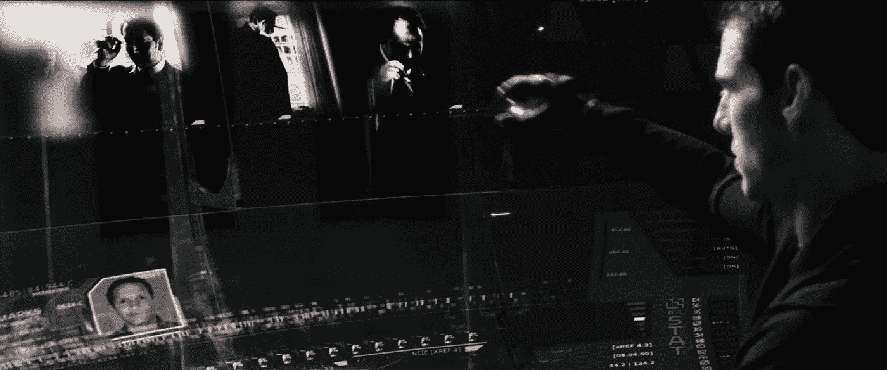
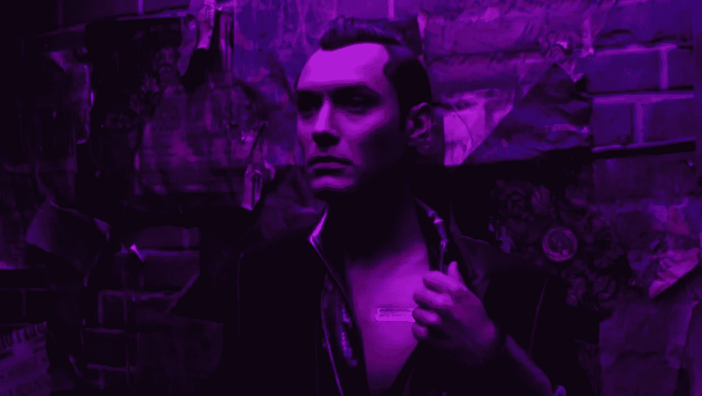

# 我们用数据科学想象的未来

> 原文：<https://medium.datadriveninvestor.com/the-future-we-imagined-with-data-science-d3dc5b0c7579?source=collection_archive---------3----------------------->

数据科学是我们作为一个社会如何前进的驱动源，并带来了未来科幻电影中描绘的那种存在。对于一些人来说，这可能是一个非常大胆的说法，但是今天我将通过一些例子来强调我们如何使用数据科学来实现一些我最喜欢的电影中呈现的能力，这些电影有望证实这一说法。

首先，什么是数据科学？嗯，数据科学可以根据你问的人而有不同的定义，但本质上它是数学、算法开发、技术以及最重要的数据的混合，所有这些都用于解决分析问题。这里的每个人都依赖于来自数据科学的某种预测或见解。你可能经常用到的一个例子是谷歌地图或其他 gps 解决方案给出的预计到达时间。ETA 计算基于对距离和预期速度的粗略估计，但也考虑了加权变量，如交通量，其影响是根据历史数据形成的。然后，计算优化模型，以决定到达目的地的最佳路线。

既然你至少对什么是数据科学有所了解，那么让我们开始谈论我们在电影中看到的东西。有多少人看过 1997 年布鲁斯·威利斯主演的经典电影《第五元素》？我希望你看过，因为这不仅是我最喜欢的电影之一，而且它的视觉效果非常棒。布鲁斯·威利斯扮演的主角是考本·达拉斯，他是一名出租车司机。如果你看过这部电影，你可能会注意到所有的汽车都在飞。好吧，我不会谈论飞行的部分，但他的出租车的另一个特点是，它能够自动驾驶。今天，苹果、特斯拉、宝马和优步等公司都在研发“自动”汽车。这些自动驾驶汽车背后的技术都可以归结为大数据。我们现在拥有比以往任何时候都多的数据，关于一切。可以通过分析大数据来揭示模式、趋势和关联。机器视觉、对象分类和预测分析等领域都需要大数据。尽管你现在能买到的汽车都是半自动的，但用不了多久，公司就会找到利用大数据与传感器和其他技术的最佳组合，来创造全自动汽车。

Credits: Screen shot from The Fifth Element (1997) showing the flying cars

另一部我非常喜欢的电影是新黑色惊悚片《少数派报告》。《少数派报告》是一部也描绘自动驾驶汽车的电影，但它最重要的故事是关于一个警察单位，他们利用三个被称为“预言师”的通灵师在杀人犯实施任何犯罪之前逮捕他们，这些通灵师被连接到警方的电脑上，显示他们的幻觉。幸运的是，没有证据表明任何人计划利用灵媒的心灵感应能力。然而，警察部门开始使用大数据和预测分析在预期犯罪率较高的地区部署警察资源，或记录潜在罪犯的档案，以此作为预防措施。例如，我们有实时犯罪中心(RTCCs)。RTCCs 通过收集、解释和分析从安全摄像机等设备中提取的数据，可以立即共享实时数据，以检测枪声等情况。通过数据科学实现犯罪预防的另一个例子是，警方对社交媒体等非结构化数据源进行网络搜索。这将如何工作是，收集的数据将被筛选出有关帖子的线索，这些线索可能表明用户正在计划大规模射击、出售非法物质或其他犯罪，这取决于算法被编程标记的内容。然后，警方会得到警告，某个人应该被审查，并采取相应的行动。

Credit: from Minority Report (2002)

我想提到的最后一部电影是“人工智能”，这是史蒂文·斯皮尔伯格导演的 2001 年科幻剧。剧情是关于一个高度先进的机器人男孩被编程为爱，但经历了一系列意想不到的情况，使他的预期目的不可能实现。现在，“人工智能”还远远没有进步到足以产生你在这部电影中看到的自我意识的程度。然而，我们确实有一种叫做“机器学习”的东西。机器学习是在没有明确编程的情况下从经验中学习的能力。我想解释的是，随着时间的推移，机器会收集更多的数据，从而自己增加决策优化。你们大多数人都接触过的人工智能的一个常见例子是虚拟助手，如 Siri 和 Google Now。从各种客户服务聊天记录中收集的数据已经被分解，其句子被标上了特定的意图。每一个特定的意图都会触发机器或“AI”来传递预定的响应或完成不同的命令。电影《人工智能》中我想指出的最后一件事是，机器人男孩撞上了另一个叫小白脸乔的机器人。正如你们中的一些人可以从角色的名字中猜到的，他是一个服务于亲密需求的伴侣机器人。今天，你实际上可以发现，像“AI-Altech”和“Realbotix”这样的公司正在实施这些机器学习算法，以生产配备人工智能的成人“爱情”娃娃，这表明你可以为各种事情建立专门的人工智能。

Credit: Picture of Gigolo Joe from A.I. Artificial Intelligence (2001)

我希望现在你明白为什么我相信数据科学是一切的未来。你不仅可以期待无人驾驶汽车、实时犯罪预防和更普遍的人工智能，而且数据科学可以帮助我们实现的可能性是无限的。这可能有点可怕，但主要是令人兴奋的，所以我希望你和我一起期待这些未来的创新。

*   注意:这是我为一般介绍数据科学及其潜力的非技术人员写的简短演示。这里表达的观点是我自己的，不一定反映我的雇主的观点。

