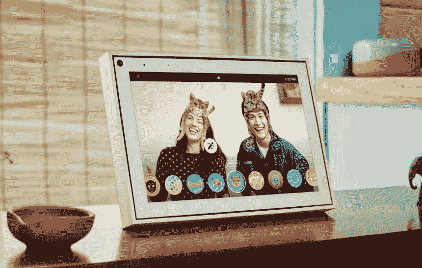
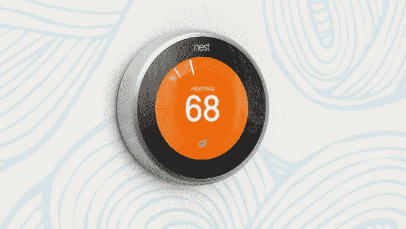
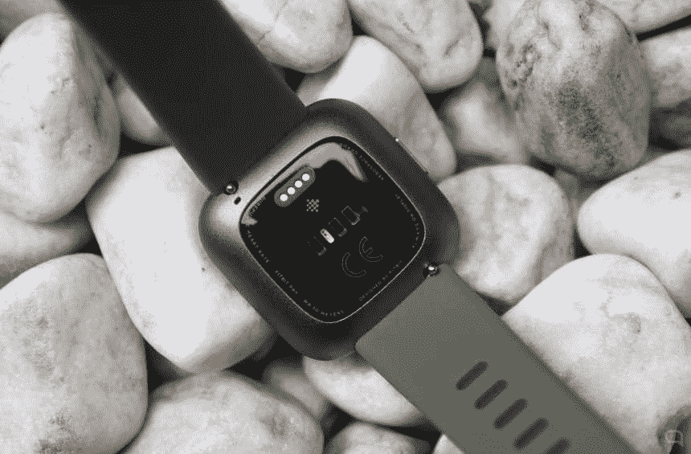

# 小工具战争

> 原文：<https://medium.datadriveninvestor.com/the-gadget-war-3ccfe64053e4?source=collection_archive---------6----------------------->

## 为什么谷歌或脸书在硬件上下注，即使它不盈利？

Photo by [Marvin Meyer](https://unsplash.com/@marvelous?utm_source=medium&utm_medium=referral) on [Unsplash](https://unsplash.com?utm_source=medium&utm_medium=referral)

谷歌收购 Fitbit 开启了可穿戴设备市场的新视野。搜索健康数据和收入多样化是这一战略的一部分。

年底给我们留下了这门课程的收获之一。谷歌最近宣布，它已就收购 Fitbit 达成协议，收购金额高达 21 亿美元。

谷歌近年来试图在硬件领域攫取一些市场份额。根据 IDC 的数据，这个星球上最大的广告公司 Alphabet 超过 95%的营业额继续依赖于谷歌广告——继续推出其 Pixel 手机，即使它们在全球智能手机市场的份额不到 1%。此外，你的 Chromebooks、谷歌家庭扬声器或谷歌眼镜现在更专注于专业领域。

它的赌注与另一家平台、数据和广告处理领域的知名巨头脸书相似——尽管要大得多——该公司在过去两年里向其增强现实眼镜 Oculus 投入了大量资金，并在几个月里一直在营销其智能家居屏幕 Portal，以应对智能扬声器的崛起。

在这两家公司中，他们与电子产品相关的业务仍然很少，主要是因为它已经被苹果和其他主要制造商如三星或中国品牌所覆盖。此外，问题应该是:当谷歌的 Android 系统已经在三星(Samsung)等商标下运行，或者谷歌的 Chromebooks 也在联想(Lenovo)等笔记本电脑行业基准的保护伞下运行时，谷歌为什么还要继续推出 Pixel 等产品？

# 小工具战争开始了。或者说，虚拟助理和数据。

答案，除了可能赋予他们的业务多样化之外，还是在数据方面，最重要的是，加强其软件和虚拟助理系统下的使用生态系统。

 [## 幸福的算法？数据驱动的投资者

### 从一开始，我们就认为技术正在使我们的生活变得更好、更快、更容易和更实用。社交媒体…

www.datadriveninvestor.com](https://www.datadriveninvestor.com/2019/03/08/an-algorithm-for-happiness/) 

正如我们所说，苹果每年投入的 2660 亿美元让库比蒂诺的公司成为了山上孤独的领导者。与谷歌、脸书或亚马逊的最大区别在于，苹果公司一直以混合硬件和软件创新为特征。

与此同时，谷歌凭借 Android 在移动设备操作系统方面处于领先地位，但在移动设备销售方面却不是。这是一个很大的区别，只要它不改变这个游戏，每个制造商将继续以最适合他们设备的方式适应 Android。因此，他们的愿望是提供一个联合系统，像苹果一样，他们控制硬币的两面，以寻求更好的用户体验和对整个过程更大的最终控制。硅谷最大的分析中心之一 Creative Strategies 的代表卡罗琳娜·米拉内西(Carolina Milanesi)写道，这些对设备的押注“设备不是最终产品，而是其中的技术。”

Google Nest device

Alphabet 从一开始就试图通过推出其替代产品来应对智能扬声器上的亚马逊 Echo 领域，这可以归结为 Alexa 和谷歌助手之间的直接斗争。Nest 是市场上声誉最好的家庭自动化公司之一，于 2014 年被搜索引擎公司收购，但这带来了用户的疑虑，他们看到了他们的数据现在是如何迁移到谷歌的服务器上的。

从家庭自动化到我们的手机，所有这些环境都在其助手的环境下，谷歌一直称之为“环境计算”。谷歌硬件主管里克·奥斯特洛(Rick Osterloh)这样描述:“我们对环境计算的愿景是，当用户需要时，在家里、在工作中或在路上创造独特而一致的体验。”

Fitbit Versa

例如，您的扬声器会在离家前告诉您到达目的地的最佳路线，您的手机会在您跑步时向您显示，当您到达时，您可以通过腕带查看您已经走了多少步，而无需打开 Gmail 或任何应用程序。

> itbit 将很快授予谷歌智能手表和智能手环市场 15%的份额

同样的还有收购 Fitbit，体育人物的主角，也是能带领谷歌与 Apple Watch 抗衡的跳板。应该记住，谷歌多年来一直在为这些设备开发自己的操作系统:Wear OS。目前，这种可穿戴设备的市场由苹果公司主导，拥有 47%的销售配额。其余的 13%到 5%在 Fitbit、三星和 Garmin 之间分配，其他公司扮演次要角色。进入的机会就在那里，它花费了 20 亿美元，这是脸书没有达到的数额，在宣布购买后，它还被称为竞购旧金山腕带公司。

但是还有一点，也不是少。通过 Fitbit，谷歌将获得数百万用户的健康和生物特征数据，这个巨头可以利用这些数据来改善其庞大的知识库，并进入利润丰厚的医疗保险市场。正如我们从《财富》**了解到的那样，谷歌有许多不太显眼的项目:所谓的“基线项目”(Project Baseline)，这是 Alphabet Verily 与斯坦福大学和杜克大学医学院以及美国心脏协会(American Heart Association)合作的一项雄心勃勃的计划。这项为期多年的研究旨在收集健康数据，在便携式设备的帮助下，创建一个人类健康参考地图。**

# **脸书和亚马逊:其他重要角色**

**正如我们所说的，脸书也竞标了 Fitbit 及其数据，但没有成功，因为它的战略是寻找一种小工具来创造特定的消费利基。扎克伯格在几次演讲中表示，其母公司希望在面对后智能手机时代时定位自己，这个时代已经从许多设备开始，如扬声器本身、智能手表或虚拟和增强现实眼镜，脸书也有一个原型市场。**