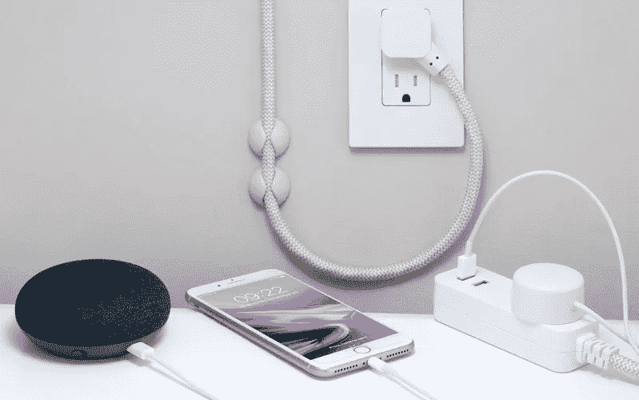

# 游戏计划是以低于 100 美元的价格建造一个智能家居

> 原文：<https://medium.datadriveninvestor.com/the-game-plan-on-building-a-smart-home-for-less-than-100-50128110745a?source=collection_archive---------21----------------------->

Photo by [Thomas Kolnowski](https://unsplash.com/@tkolnowski) on [Unsplash](https://unsplash.com)

你是不是也在梦想打造一个智能家居？

如果是这样，这篇文章可能会在各方面帮助你。

因为建设智能家居的梦想现在比以往任何时候都更容易实现。但是建造这种高科技产品通常听起来是一个令人生畏且昂贵的过程，尤其是如果你预算不足的话。对吗？

然而，一些廉价产品如智能扬声器和智能恒温器的创新已经出现，这并不一定很难。

 [## 2019 年及以后的技术趋势-数据驱动的投资者

### 要建立一个成功的创业公司，你需要 3T:TAM、团队和时机。这份时事通讯是关于时间的-更多…

www.datadriveninvestor.com](https://www.datadriveninvestor.com/2019/01/17/tech-trends-in-2019-and-beyond/) 

是的，拥有一个配备各种最新技术的专用智能家居不再是梦想。你可以简单地获得一个联网的家庭，拥有联网的灌溉系统、智能插头和开关、智能灯、电动窗等等。

所以，如果你只有 100 美元的有限预算，还是有可能让你的家变得比以前更智能、更方便。这里有一些产品可以帮助你聪明地实现你的梦想。

让智能扬声器充当中央控制系统！

首先，你需要智能扬声器，它可以作为所有家庭设备的中央控制系统。今天，一些昂贵的集线器，如医院和酒店，使用家庭专用的无线技术，如 Z-Wave 和 Zigbee，但由于您正在建立一个智能家居，所以您不需要选择这样的先进技术。

除此之外，你可以考虑使用谷歌 Home 智能手机应用程序，该应用程序有助于在一些联网设备的帮助下，通过 Wi-Fi 实现智能高效的通信。

在 100 美元的范围内，你可能有两个选择可以考虑，谷歌 Home Mini 和亚马逊 Echo Dot。这将花费你只有 50 美元，这是最适合你的预算。

因此，无论你选择什么设备，你都会看到一个小小的扬声器，它有一个智能的虚拟助手，可以回答你的问题，帮助你设置定时器，查看天气预报，阅读新闻和播放你最喜欢的音乐。

**迷你智能插座:**

当你挑选出你的智能音箱时，是时候考虑选择智能设备，以便它能以更好的方式控制。毫无疑问，智能插头将是最好的第一步，因为它会简单地给你几乎任何东西的语音控制。例如，如果你的智能插头上插着一盏普通的灯，你可以把它放在电视机后面。因此，通过你的 Alexa 应用程序，你可以设置这个插头在晚上只开几个小时。

作为一种选择，你也可以在智能插头上安装一个风扇、空调或加热器，然后获得同样的舒适度和可靠性。幸运的是，唯一的要求是你的设备应该在你想切换时开始工作，而它是在墙上的插座上。只需 15 美元就能买到。

**语音控制的智能家居灯:**

计划中的下一件事是可以通过语音命令控制的智能家居灯。飞利浦 hue 可能是许多房主的最佳选择，但这有点贵，不能以 100 美元出售。原因是，与 Wiz 和 LIFX 等其他系统不同，hue light 通常需要一个可以连接到路由器的集线器，然后需要一些额外的费用。

所以，在这种预算紧张的情况下，最好在 LIFX Mini range 找点东西。你可以花不到 25 美元买到一个白色灯泡。然后你可以把它增加到 30 美元来满足“白天和黄昏”的需求。您可以找到从亮白色到醒目橙色的各种温度结果。

你可以花所有的钱来建造一个智能家居，这将帮助你简化预算，获得一个更舒适的环境。房主倾向于找到这样的[聪明可靠的家居装修创意](https://www.renovaten.com)，这样他们可以更好地成长，利用更有创意的东西来跟上当前的潮流。