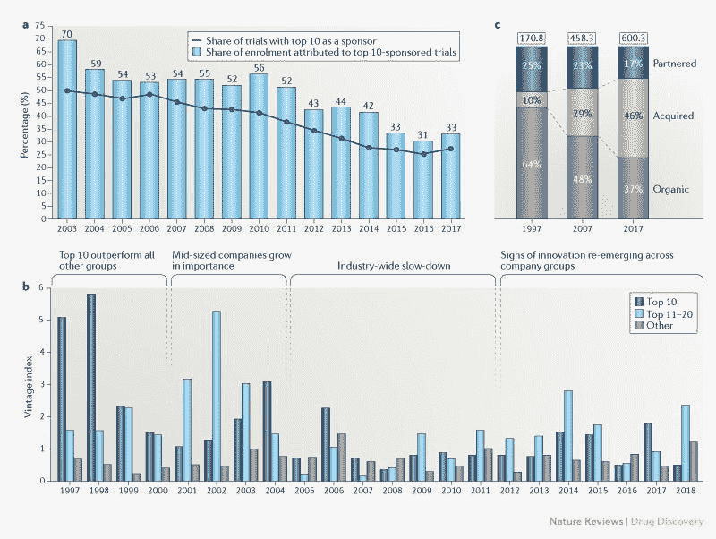
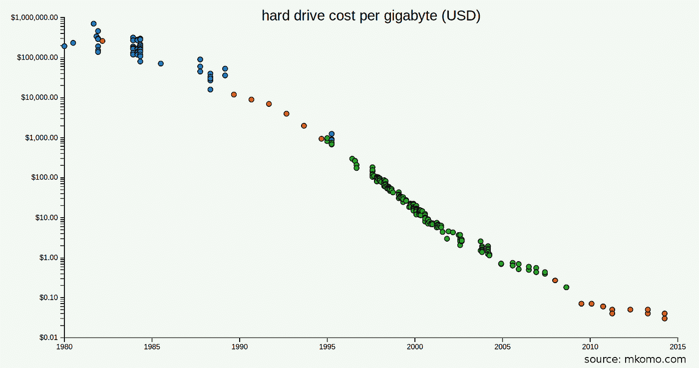
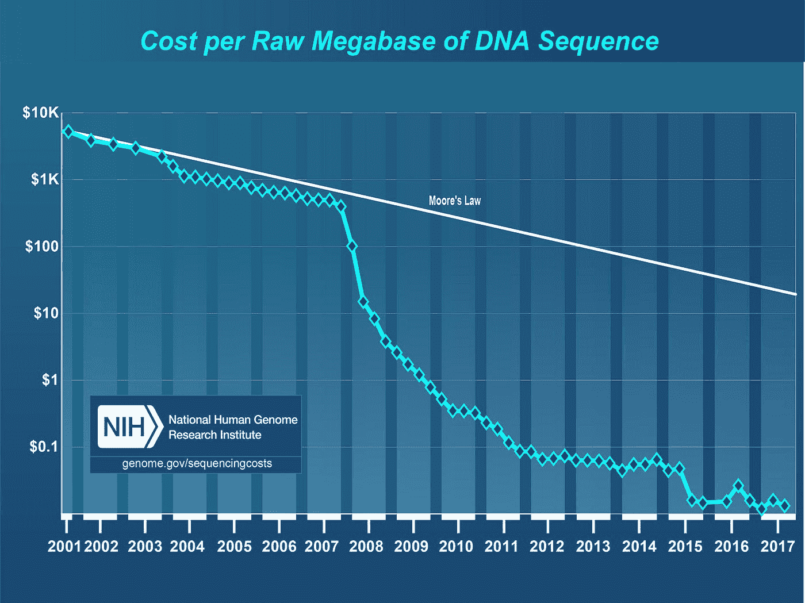

# 车库时刻——生物技术终于为创业做好准备的三个理由

> 原文：<https://medium.datadriveninvestor.com/the-garage-moment-3-reasons-why-biotech-is-finally-ready-for-startups-f9ae02af67ae?source=collection_archive---------5----------------------->

1938 年，戴维“戴夫”帕卡德和威廉“比尔”休利特以 538 美元的资本，开始在他们租用的地方使用一个只有一辆车的车库建立一个公司。车库可以说是硅谷的诞生地，从苹果到谷歌，成千上万的公司都遵循着从车库起步的惠普模式/神话。车库象征着从很少的资源开始，筹集足够的资金进入市场，并朝着一个非常大的愿景前进。

虽然车库改变了整个科技行业，但它在许多其他行业并没有真正复苏。高开发成本、长销售周期、风险和监管是历史上阻碍生命科学或汽车等领域创业公司爆炸式增长的因素。但是事情正在改变，这篇文章将特别关注生物技术，以及为什么它最终见证了车库时刻。

 [## 大笔资金和尖端技术:人工智能/人工智能投资将如何革新医疗保健…

### 在过去几年人工智能(AI)和机器学习(ML)的显著发展中…

www.datadriveninvestor.com](https://www.datadriveninvestor.com/2018/03/22/big-money-and-cutting-edge-technology-how-investment-in-ai-ml-will-revolutionize-the-healthcare-industry/) 

**1)临床试验的可及性**

生物技术以临床试验为前提，黄金标准是一项双盲纵向研究。也就是说你需要招到足够多的病人(钱)，跟到足够多的病人(时间)。这两项支出历来都不成比例地偏向大公司，但有强烈的迹象表明，初创公司的表现超出了它们的实力类别。下图来自发表在《自然》上的[麦肯锡研究，显示了前 10 大制药公司相对于新进入者(其中许多是生物技术公司)在行业中所占的比例越来越小:](https://www.nature.com/articles/d41573-019-00046-3)

初创公司更容易进行临床试验的根本原因包括更友好的监管和更高的可用资金量。随着制药公司越来越多地从收购而非合作或产品的有机增长中获得收入(从 1997 年的 10%到 2017 年的 46%)，这意味着有更多的退出，从而有更多的风投进入。

**2)数据/存储/计算的可用性**

存储成本急剧下降，这对技术领域的任何人来说都不是什么新闻。可能令人惊讶的是，即使在对数尺度上，这也是陡峭的，现在一个完整的人类基因组(大约 10 亿字节的数据)可以存储大约 1 美分:

就测序成本而言，同样的故事，我们非常接近有效地测序一个完整的人类基因组，只需 100 美元。

这一进步远远超过了摩尔定律，摩尔定律是技术的基石——计算能力大约每两年翻一番。从计算的角度来看，我们可以说生物技术比车库时代的技术更适合转型。这场革命对创业公司来说到底意味着什么？它使他们能够设计更有针对性的临床试验，需要更少的患者和更少的时间招募和进行。

**3)实验室即服务(LaaS)**

生物技术需要湿实验室，湿实验室需要钱。但是共享设施提供了一个可扩展的解决方案。从波士顿的 LabCentral 或帕洛阿尔托的 StartMedX，湿实验室设备已经为初创公司节省了数百万美元，他们可以将这些钱用于产品和市场开发。可以把它想象成云对传统科技公司的贡献。一些最有前途的生物技术初创公司，从 10X Genomics(融资总额 2.43 亿美元)，到 Foundation Medicine(2018 年以 24 亿美元出售)和 Gingko(融资总额 4.29 亿美元)，都是 LaaS 的产品。

生物技术很可能总是比科技花费更多的时间和金钱，但是所有的趋势都表明，就想法的[寒武纪大爆发](https://en.wikipedia.org/wiki/Cambrian_explosion)而言，我们终于到了。

*这篇文章的灵感来源于与*[*Deniz Kural*](https://www.linkedin.com/in/deniz-kural-0b53934/)*和*[*James Sietstra*](https://www.linkedin.com/in/sietstra/)*的对话；我是他们公司的小天使***。这些都是专注于实践见解的有目的的短文(我称之为 GL；dr —良好的长度；确实读过)。如果它们能让人们对某个话题产生足够的兴趣，从而进行更深入的探索，我会感到非常兴奋。这里表达的所有观点都是我自己的。如果这篇文章有对你有用的见解，请给个赞，任何想法请留言。**