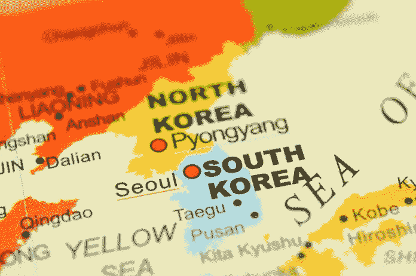

# 朝鲜的宝石:朝鲜未开发的矿产和工业潜力

> 原文：<https://medium.datadriveninvestor.com/the-gem-in-the-north-north-koreas-untapped-mineral-and-industrial-potential-345a3d3e924a?source=collection_archive---------23----------------------->

当朝鲜出现在主流媒体头条时，你最不希望看到的描述词之一是[“巨大的机会”](https://www.cnbc.com/2018/06/12/investment-guru-mark-mobius-says-north-korea-presents-a-tremendous-opportunity.html)

然而，现在美国和朝鲜在新加坡举行了一次明显成功的峰会，这正是一些金融专家采取的策略。朝鲜的自然矿产资源和自上世纪 50 年代以来基本冻结的国内经济，可能会引发下一波亚洲投资热潮。

在接受美国消费者新闻与商业频道采访时，Mobius Capital Partners 创始人马克·墨比尔斯表示，朝鲜的 2500 万公民可能代表着一个几乎未被触及的市场，其规模大约是充满活力的资本主义韩国市场的一半。

他表示，对于希望在该地区开展业务的私人投资者来说，一个经济上联系紧密(如果不是完全统一的话)的朝鲜半岛，可能会改变游戏规则。

“这意味着一个更大的市场，对我来说，最令人兴奋的事情是有机会在韩国、中国和俄罗斯之间架起一座桥梁，”Mobius 说。“因为那样的话，你就可以拥有铁路和公路，通过朝鲜北上，进入这些大国。这是一个巨大的机会。”

除了数百万渴望现代化和西式商品的公民，朝鲜还能为现代经济提供更多。自第二次世界大战后不久，这个所谓的“隐士王国”一直处于永久封锁和外部制裁的状态，其大量自然矿产资源未被外国利益集团开发。

这种[缺乏外国投资](https://www.scmp.com/comment/insight-opinion/article/2151143/why-north-korea-set-become-next-big-thing-investors)，以及朝鲜对全球经济相对孤立的立场，意味着该国现在坐拥 6-10 万亿美元的商品矿产储备。莫比乌斯补充说，这些储备可以为全新的朝鲜经济提供基础。

“我们首先从开采能力方面来看——稀土、石油、天然气——北方有大量资源可以开采。当然，一旦生活水平开始提高，消费革命就会发生，”他说。“所以，我会说，一开始会是资源和运输——铁路、公路，北上到中国和俄罗斯。”

毫无疑问，这一提议的现代化存在挑战。即使美国-朝鲜峰会被视为表面价值，在无核化和经济现代化方面仍有大量的外交工作要做。朝鲜经济长期以来一直停滞不前，依赖外国援助，要想出现类似于国内产业的东西，还需要一段时间。

过去失败的外国投资交易——比如与瑞典的汽车交易、中国的矿业投资和埃及的电信协议——最初可能会阻止一些公司进入朝鲜市场。这带来了一个问题，因为缺乏国内产业使得朝鲜相当依赖于外部资本的流入。

然而，据全球商业律师事务所 Sheppard Mullin 的合伙人 Reid Whitten 说，外国资金可能无法长时间远离朝鲜。

[在 7 月写的一篇博客文章中](https://www.globaltradelawblog.com/2018/06/07/north-korea-investment/)，当美国和朝鲜之间的谈判仍处于试探性阶段时，惠顿说朝鲜的发展很可能会由中国——其传统盟友——以及讽刺的是，韩国——其长期敌人带头。

“韩国和中国将从潜在的开放中受益最多，因为它们与这个孤立的国家有着最紧密的联系，”惠滕写道。“如果关系转暖，韩国可能会依靠语言和文化上的联系，对朝鲜进行实实在在的直接投资(也许会重开开城工业园)。”

by [Tim Easley](https://unsplash.com/@timeasley?utm_source=medium&utm_medium=referral) on [Unsplash](https://unsplash.com?utm_source=medium&utm_medium=referral)

韩国在钢铁制造领域很出名，因为它从一个相当不重要的角色迅速崛起为世界上最大的出口国之一。

事实上，截至 2018 年 10 月，韩国仍然是美国钢铁进口的[五大来源国之一](https://enforcement.trade.gov/steel/license/smp/Census/gDESC52/MMT_ALL_kr_15M.htm)，即使在 2008 年金融危机和今年实施 232 条款配额后发生了一轮毁灭性的贸易案件。事实上，韩国对美国钢铁行业如此重要，以至于其 2017 年总量的 70%的最初配额在实施后几个月就放松了。

正如《投资周刊》的 Sally Macdonald 所指出的，韩国的重工业可以为朝鲜更好的基础设施铺平道路。此外，整个韩国都可以受益于相对年轻的朝鲜劳动力，他们可以从相对受过教育(如果不完全是世俗的)的基础上接受共同语言的培训，”惠滕写道。“与此同时，据报道，中国保持着与朝鲜的非法贸易路线，看看这些联系在变得合法后是否同样有利可图，将是一件有趣的事情。”

朝鲜似乎正酝酿着一场经济复兴的完美风暴——庞大的劳动力，一个迫切需要各种基本商品、矿产资源、愿意合作的外国伙伴，以及通往亚洲发展中经济体的现成地理通道的经济体。

缺少的拼图块似乎是朝鲜政权方面的政治意愿，这似乎正在具体化，正如新加坡与美国的峰会所证明的那样。

如果朝鲜向外国投资开放边境，这很可能会成为其缓慢迈向现代经济地位的首要话题之一——有人估计[这一过程可能需要长达 20 年。](https://www.cnbc.com/2018/06/26/in-20-years-north-korea-could-account-for-nearly-a-quarter-of-a-unifi.html)

瑞银(UBS)经济学家曾黎 6 月份与分析师 Yong-Suk Son 合著的一份报告得出结论称，朝韩敌对状态的结束可能意味着朝鲜将在 20 年内承担朝鲜半岛近四分之一的国内生产总值。

这与[1 月瑞银 2018 年预测](https://www.ubs.com/global/en/investment-bank/knowledge-network/commentary/2018/north-korea.html)相去甚远，该预测标志着朝鲜与美国和其他大国日益紧张的关系是该地区经济的最大单一威胁之一。

瑞银(UBS)今年 1 月总结称:“朝鲜冲突将产生全球性影响，但对集中在亚洲的投资者而言，这种影响可能尤其严重。”。

只有时间能告诉我们朝鲜半岛最终会是什么样子。然而，朝鲜的未来似乎越来越有可能不再是一个隐士王国，而是一个资本主义前沿。

我本人实际上在 2016 年 8 月去过朝鲜，那时美国人还不能去。这是我经历过的最有趣的旅行之一，我期待着看到当事情慢慢开放时，这个国家能取得什么样的成就。下面是我在平壤的一张照片，照片上我站在主体塔的顶部，背景是尚未完工的五层楼高的 T2 柳京酒店。

*原载于 2018 年 10 月 17 日*[*www.datadriveninvestor.com*](http://www.datadriveninvestor.com/2018/10/17/the-gem-in-the-north-north-koreas-untapped-mineral-and-industrial-potential/)*。*