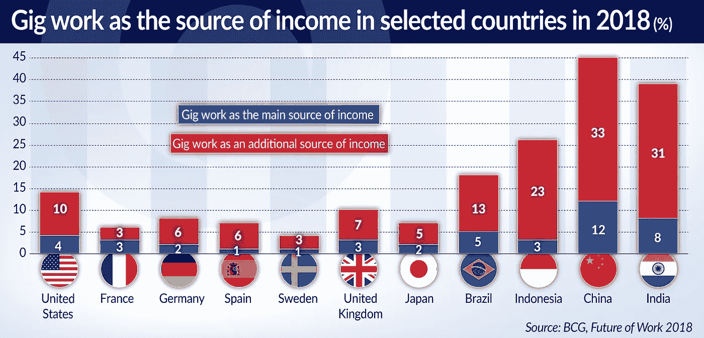
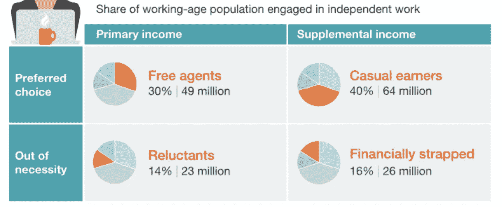

# 演出结束了:优步公司应该接受不可避免的事实

> 原文：<https://medium.datadriveninvestor.com/the-gig-is-up-uber-and-co-should-embrace-the-inevitable-74fbd339ca67?source=collection_archive---------10----------------------->

从基本层面来看，零工经济并不新鲜。关于它的最新的东西是名字，它已经被使用了大约十年。

几个世纪以来，同样的雇主-雇员关系一直存在。

 [## 零工经济如何改变未来的就业前景|数据驱动的投资者

### 随着自动化的发展和 Z 世代的出现，劳动力的构成和动态正在发生变化…

www.datadriveninvestor.com](https://www.datadriveninvestor.com/2018/12/19/how-is-the-gig-economy-changing-the-future-jobs-landscape/) 

在 18 世纪，一个男人为了收支平衡而在一系列行业中工作是很典型的。他可能白天当理发师，晚上当拍卖人。

许多人驾驶马车，由许多乘客共用。我称之为“优步拉”。

技术是 21 世纪零工经济的主要驱动力，再加上不确定的经济环境。

工人可以通过应用程序注册，并立即开始接受工作。企业可以按需获得经济高效的劳动力，而无需像通常那样麻烦地雇佣新员工。

这些是典型的任务，而不是工作，这种工作方式与我们相对现代的职业概念形成对比。

许多临时工发现这种谋生方式比典型的全职工作更灵活，有时工资更高。许多许多其他人发现这种经历令人沮丧，缺少工作和高昂的入门费用是两个主要问题。

优步已经成为零工经济的主要象征。这是一个有用的讨论焦点，但它也会分散我们对更广泛情况的注意力。

全球有超过 4800 万人通过 Task Rabbit、Upwork 和 Fiverr 等网站注册工作。我在 Fiverr 上最喜欢的家伙会用伯尼·桑德斯的声音录制你想要的任何东西，只需 5 美元。

因此，零工经济包括从开车把人从 A 地送到 B 地，到雇佣一个模仿伯尼·桑德斯的人。

难怪监管者正努力确定这一点。我们工作所依据的大多数劳动法都是在 20 世纪 40 年代制定的，更新它们将是一个严峻的挑战。

> "尽管有应用程序支持的现代性，零工经济类似于早期工业时代."
> 
> ——亚历山大·拉韦内尔，《喧嚣与演出》

尽管优步不是整个零工经济的防弹提喻体，但它本周的声明非常有启发性，并将影响其许多模仿者。

优步的核心辩护是“司机不是我们业务的核心”，这乍一看似乎很荒谬，但每读一遍就越来越邪恶。

这家打车公司声称，它是一个平台的创造者，供需可以在这个平台上满足。

有时，这意味着一个人想开车去某个地方，也许司机愿意载他们。然而，优步也与递送有关，将来还会与许多其他服务有关。

他们声称，强迫优步接受这些驱动因素，将会扼杀创新，减缓他们本已冰冷的盈利动力。

这使得优步有别于一些——但肯定不是全部——零工经济雇主。是超脱的创造者，而不是中介。如果政府不与司机接触，也不能控制他们的工作，又怎么能雇用他们呢？

如果我们重温优步的声明“司机不是我们业务的核心”，它揭示了其他意图。

首先，这似乎是对为企业发展做出巨大贡献的员工的无情漠视。

然而，它也展示了优步的未来计划。众所周知，优步的目标是推出无人驾驶汽车，以及打车以外的其他服务。仅仅因为这些野心，它的巨额亏损才被容忍。

简单地说，驱动因素真的不是他们如何看待企业未来的核心。这份声明并不像看上去那样虚伪。

如果自动驾驶汽车真的出现在我们的街道上，驾驶汽车的价值将会下降，就像优步的出现让纽约市出租车牌照的价值飙升一样。

一如既往，这将推高互补技能的价值。但是谁来支付被取代的优步司机重新培训和获得这些技能的费用呢？

对优步来说，更简单的方法就是雇佣那些已经掌握技能的人。或者，在他们看来，允许拥有这些技能的人与寻求这些能力的人联系。

大公司正在投入大量资金对员工进行再培训。裁员是有的，但主要重点是重写工作描述，让员工适应新的现实。

零工经济雇主没有任何动力走这条路。

# 演唱会的照片

在零工中，有许多不同的子类别。

皮尤研究中心报告称，56%的零工在经济上依赖于零工，而 42%的人用零工来补充收入。

这产生了一个简单的分歧，可以帮助立法者理解从事这类工作的广泛动机之间的差异。

普遍基本收入的试验最终可能会为那些依赖这种不可靠收入流的人带来解决办法，尽管这些试验仍处于初期阶段。我们需要其他临时措施。

麦肯锡进一步概述了四类临时工:自由代理人、临时工、不情愿者和经济拮据者。

目前，在这个复杂的问题上，太多的叙述都是自私自利的，并在例子中有所选择。对于一个努力成为优步司机的男人来说，就有另一个来自零工经济雇主的故事，关于他的公司如何帮助一名怀孕的妇女重返工作岗位。

这些个别的故事很重要，但必须在多面现实的背景下看待它们。

立法不应该阻碍创新，当优步说让司机成为雇员可能只会产生更多问题时，他确实提出了一个突出的观点。零工经济没有增长，因为优步有一个应用程序的想法；它需要肥沃的成长土壤，并在许多发达经济体实际收入增长停滞的劳动力中找到了这种土壤。

给这些司机标准的员工合同是把旧的解决方案强加给一个相对新的问题。

零工经济已经存在，但这并不意味着我们必须接受它目前的形式。

在破坏之后，景观会形成一个新的形状。

零工经济雇主是主要的机会主义者，他们可能会看到另一个机会。通过接受不可避免的情况，他们可以为工人提供更好的待遇，并在他们被迫这样做之前起带头作用。这可能意味着培训、工具和公司利益。

优步的创始人和他们的投资者都受到很好的保护。他们应该向那些成就了这个行业的司机提供一点他们对自己的期望，无论是好是坏。

# “零工经济并没有取而代之，但它已经成为一个有用的象征，象征着在晚期资本主义中为生计而工作是什么样的。

# 难怪它似乎无处不在。"

# —大西洋