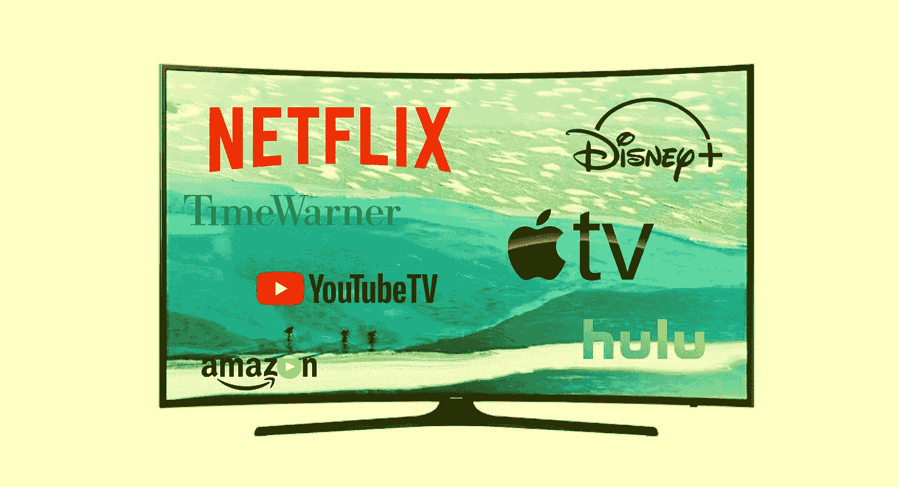
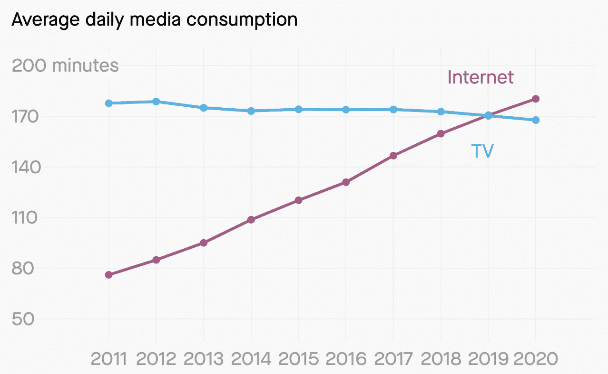
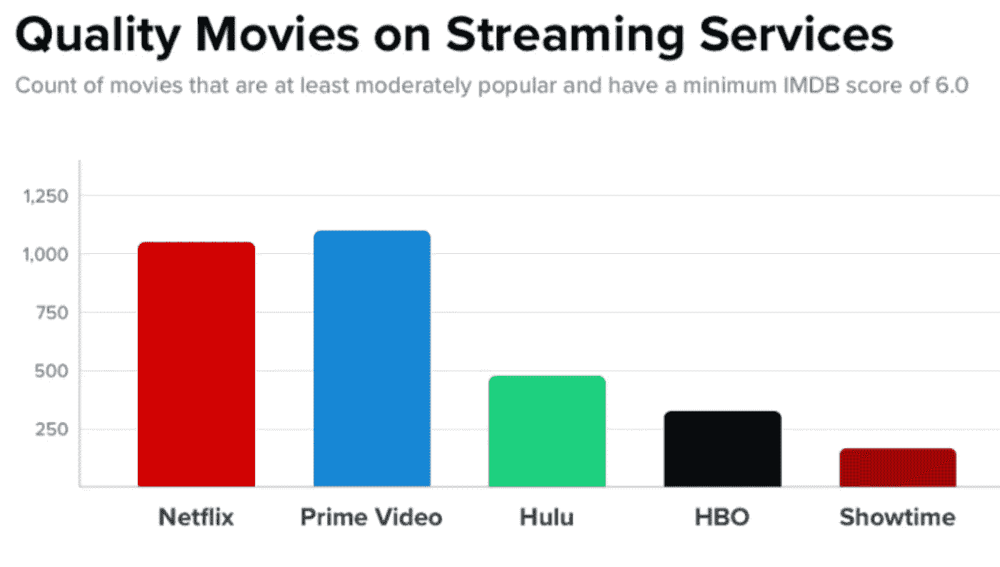
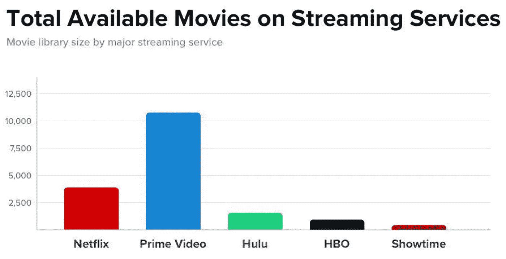
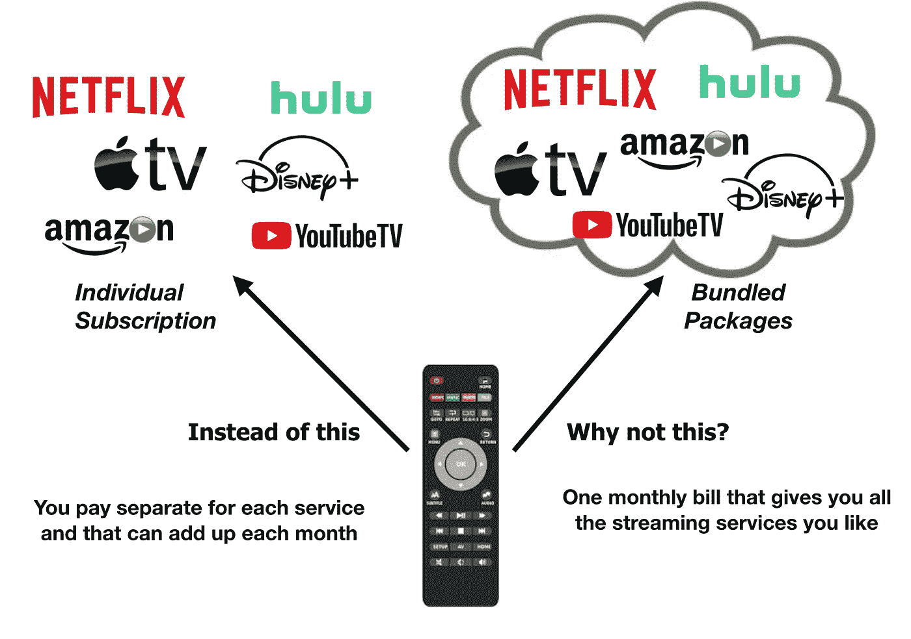
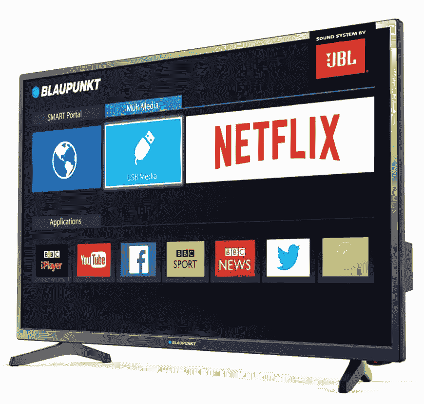

# 流媒体电视的黄金时代

> 原文：<https://medium.datadriveninvestor.com/the-golden-age-of-streaming-tv-612a4bbd23b8?source=collection_archive---------1----------------------->

## 捆绑会是访问大多数流媒体服务的解决方案吗？

我们生活在一个流媒体电视的时代(OTT 或 Over-The-Top networks 又名视频点播 VOD)。我们有许多服务可供选择，都在寻找新的用户。竞争压低了价格，或者使价格与市场价格保持竞争力。需求的增长是基于有线电视和碟形电视服务的下降以及网飞和亚马逊等供应商订阅基数的增长。随着市场的增长，事情只会变得越来越有趣。将会有新的玩家加入竞争，但是我们真的需要更多的流媒体服务提供商吗？

Average minutes of Internet usage compared to TV viewing (Source Zenith Research)

今天，人们很少看电视，而花更多的时间在互联网上。预计到 2019 年，[互联网将超过电视成为媒介](https://qz.com/1303375/internet-usage-will-finally-surpass-tv-in-2019-zenith-predicts/)。千禧一代对互联网内容更感兴趣，无论是 YouTube 上的视频、网飞上的电影还是 IGTV 上的直播。互联网是流媒体服务提供商向用户提供内容的主要基础设施。随着宽带速度的提高，互联网的使用越来越多，在家“永远在线”的环境将会吸引流媒体服务。除了物联网设备，家庭用户将需要互联网连接来工作、研究，最重要的是与媒体公司进行娱乐。对于流媒体服务提供商来说，这正是他们获得订户所需要的。

Getting subscribers means providing the best content available, which means quality films (Source PCMag Australia)

加入网飞、亚马逊和 Hulu 的还有迪士尼、时代华纳和苹果(都是大玩家)。因为有需求，所以推出流媒体服务似乎不是一个坏决定。网飞无法提供的更多内容种类将吸引客户尝试其他流媒体服务。这将改变整个市场，因为更多的竞争将推动公司提出更好的方式来提供服务和交付内容。这将侵蚀网飞本已利润丰厚的市场，不仅是在美国，而是在全世界。其他国家也将通过提供本地内容来提供自己的 OTT 服务。

像网飞和亚马逊这样的公司不仅提供内容，他们还创造内容。制作各种艺术家的原创电影和节目有更大的价值。这给编剧们提供了一个发掘素材和新才华的市场。像网飞和亚马逊这样的主要参与者将面临来自迪士尼这样的公司的激烈竞争，迪士尼是另一家创造自己内容的公司。迪士尼的优势在于，它是一个具有全球吸引力的知名品牌。

Amazon Prime Video has the largest collection of movies available, a big advantage against the competition (Source PCMag Australia)

一旦迪士尼开始提供自己的服务，网飞将失去某些内容。除非有分销协议，否则漫威影业有限责任公司的内容以及迪士尼旗下的其他工作室现在将只能在迪士尼流媒体服务上获得。这对顾客来说似乎一点也不公平。迪士尼真的要让内容独家化，这样人们才会订阅吗？对某些电影和节目来说是这样，但这都是为了让他们获得更多的收入。赌注很高，竞争也越来越激烈。

虽然流媒体提供商的基本订阅仍然很便宜，但当您订阅更多流媒体服务时，它确实会变得更加昂贵。所有这些加在一起，对于那些已经“切断”有线电视或碟形电视以减少开支的人来说，这可能是不合理的。这就是为什么这可能会导致相关性再次有线电视和碟形电视公司提供流媒体服务…捆好的包裹。但是等等，这不正是有线电视公司已经在做的吗？

Bundling streaming services into packages will make business sense

有线电视公司捆绑套餐已经有很长时间了。他们为客户提供不同的层级来选择他们想要的套餐。根据客户想要多少频道或服务，价格会有所不同。还有提供 4K UHD 流，更多频道和更快的互联网连接(光纤)的优质服务。因此，对于有线电视公司来说，通过将流媒体服务与新的套餐捆绑在一起，试图阻止他们的客户完全转向 OTT 是很有意义的。客户甚至不必保留有线电视连接。有线电视公司可以提供互联网和流媒体服务。

虽然流媒体提供商的数量激增，但并不是每个人都会订阅每一项可用的服务。喜欢体育和动作片的顾客不一定就是喜欢现场音乐和美食频道的顾客。每一种服务都有市场，但成本加起来会使支付单一费率以获得多个流媒体服务变得更加合理。流媒体服务的另一个产品是传统的 OTA(空中)和有线电视频道，如 HBO 和 Showtime。这为订户创造了更多的价值，因为他们可以观看更多的内容。

This is how much basic streaming service costs from 5 major providers (As of January 2019)

事实上，我正在考虑将互联网服务提供商(ISP)作为潜在的合作伙伴，因为他们拥有运行互联网的大部分网络。可能会出现这样的问题，即他们现在是否会抑制他们网络上的竞争，由于放松管制和废除网络中立性，FCC 无法阻止这种竞争。现在该由美国联邦贸易委员会联邦贸易委员会来研究这些问题了。时代华纳有线电视也是一家 ISP，其网络允许网飞和亚马逊等竞争对手。一旦他们开始流媒体服务，会不会因为优先考虑自己的服务而影响到其他人？这还有待观察，但首先优先考虑自己的服务确实有商业意义。可能会发生的是，像时代华纳这样的互联网服务提供商将提供他们的服务，并提供与竞争对手其他选择的捆绑包，以示公平。

Smart TVs are ideal ways to deliver bundled packages which can be accessed directly from the screen without needing to open a computer or smartphone (Photo Source Blaupunkt)

为了捆绑这些包，必须有一些方法让客户能够方便地访问。现在，当你想在同一台设备上使用网飞和亚马逊，你必须去不同的网站，使用不同的登录。这当然是为了安全。尽管单点登录是最理想的，但在竞争激烈的环境中，这也不是必须的。可能很容易忘记密码，甚至忘记登录信息。一个更加用户友好的界面，可以把用户带到一个显示他们订阅的服务的屏幕上，这总是很有帮助的。

从技术角度来看，这实际上将是广播和网络行业的一次繁荣。基础设施已经建成，预计只会随着更多光纤部署以满足需求以及 5G 无线服务的部署以实现更多覆盖而变得更好。人们正在通过各种设备观看流媒体内容，而不仅仅是家庭电视和电脑。事实上，通过智能手机或平板电脑观看的用户参与度很高。这也是广告和营销公司想要瞄准的市场，他们可以通过这些提供商来实现。这些网络肯定会扩大规模，以满足用户的预期增长，这是 FCC 主席 Ajit Pai 希望看到投资流入的一件事。网络扩展和升级是有利可图的，但这需要资本投资。这很可能是这个领域的一个千载难逢的机会。

现在，用户为什么愿意为流媒体服务付费，这已经成为一个价值主张。据《好莱坞报道》称，消费者平均每月为有线电视支付 107 美元。有些人甚至会回到 OTA，同时通过互联网连接订阅一两个流媒体服务。如果他们能放弃有线电视，转而使用更便宜的流媒体服务，那就更划算了。这就是为什么公司需要为他们的客户提供最佳价值的捆绑包。人们肯定会订阅他们喜欢观看的内容，同时期待及时的服务，这创造了保持忠诚度的良好用户体验。有线电视公司和互联网服务提供商肯定可以从 OTT 行业中获益，因为他们为这些服务提供了互联网。有一点是肯定的，没有互联网就不会有流媒体电视的黄金时代。

=========================

有关媒体和娱乐技术的更多信息，请访问:

[HD-PRO](https://medium.com/hd-pro) 在介质上