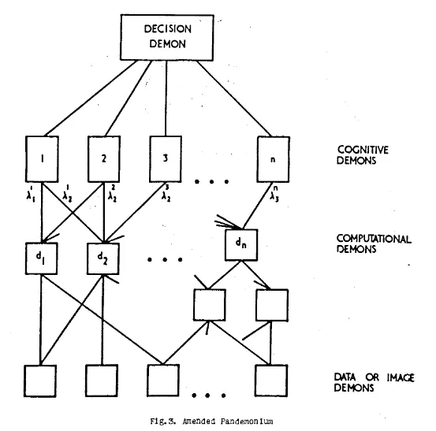

# 人工智能中的金牛犊综合症

> 原文：<https://medium.datadriveninvestor.com/the-golden-calf-syndrom-in-ai-d756404248a7?source=collection_archive---------6----------------------->

[这篇由](https://towardsdatascience.com/is-deep-learning-already-hitting-its-limitations-c81826082ac3) [Thomas Nield](https://medium.com/u/2926bb1ae46d?source=post_page-----d756404248a7--------------------------------) 撰写的关于深度学习可能如何触及其局限性的帖子让我非常高兴。它为我正在写的技术论文的第一部分指出了正确的方向。我希望我的介绍是我在之前一篇名为[的文章中提出的一些观点的延续，这篇文章是对可解释性的咆哮](https://medium.com/@camilorey/a-rant-against-explainability-473b368eb1a2)，夹杂着 Nield 的观点(完全归功于你的同事)。

Nield 得出了我大致的结论，他在他的文章中提供了几个链接来证明我的观点。最可爱的是，他引用了非常有力的文献。尼尔德的帖子让我感到被认可了。我也和他一样担心也许另一个人工智能的冬天即将到来。

除了尼尔德的 [*历史唯物主义*](https://en.wikipedia.org/wiki/Historical_materialism) 关于艾·温特斯这个主题的摘录之外，我希望用一点神话来增加一点趣味。我要用一些*圣经研究*来增加我的论证的趣味，并提出*金牛犊综合症。*我声称 AI Winters 是由一种情况引起的，当我们把它与[金牛犊悖论](https://medium.com/@camilorey/the-golden-calf-paradox-54c16aea144d)相比较时，这种情况更容易解释。

我将使用 Nield 同志在他的帖子中嵌入的 YouTube 视频作为我的历史叙述的模板，并为 Nield 讲述的故事添加一些小细节。

该视频来自 20 世纪 60 年代，以两位非常性感的男士为主角:[克劳德·香农](https://en.wikipedia.org/wiki/Claude_Shannon)(信息论之父)和[奥利弗·塞尔福里奇](https://en.wikipedia.org/wiki/Oliver_Selfridge)(Pandemonium 架构的创造者)。香农卖给我们智能机器，并被描绘成在 0:55 左右与电脑下跳棋。在 1:40 分钟，你可以看到塞尔弗里奇在展示技术专家的言论。他说:

> “*我相信* ***机器*** *都会做，男人做什么我们就说他们在想什么*”。

从 2 分 02 秒开始，该视频宣传了一种能够进行俄英翻译的机器。我们来复习一下这三个瞬间。

# 一点历史

自从 17 世纪以来，计算机就一直存在，发明了诸如 T2 的帕斯卡林和 19 世纪 60 年代的 T4 的算术表。

不过请记住，*计算机*和*计算机*是不同的*。*与固定用途的机器不同，如[帕斯卡林](https://en.wikipedia.org/wiki/Pascal%27s_calculator)或[算术计数器](https://en.wikipedia.org/wiki/Arithmometer)，艾伦·m·图灵提出了一个单一的通用机器(一个*图灵机*)可以执行*算法。*

现代计算机是基于图灵的想法，还有很多其他的贡献。然而，我想强调的一点是，图灵关心的是形式化一个自希腊时代(甚至更早)就存在的概念:*算法。*

图灵的构造基于*逻辑*。他最初的问题是在 Entscheidungsproblem 问题上的一种合乎逻辑的、建设性的方法。他在 1936 年发表了关于可计算数字的博士论文。他的工作与他最好的一个*友敌*阿隆佐·邱奇交织在一起。他们的结构是正式的，也是合乎逻辑的。

图灵是英国战争英雄。二战期间，他和约翰·冯·诺依曼一起在“谜机”上的工作至关重要。一台多功能计算机打败纳粹的故事只是在乞求一些后续，也许是它自己的漫画书。

在他 1950 年的论文[Computing Machinery and Intelligenc](https://www.csee.umbc.edu/courses/471/papers/turing.pdf)e 中，图灵对机器*思考*的可能性持批判态度，并(从逻辑上)解构了任何主张(他甚至包括了一个关于神学的章节)。可悲的是，那篇论文最令人难忘的是人工智能的[图灵测试](https://en.wikipedia.org/wiki/Turing_test)。

# 跳棋玩香农(或反过来)

当 [Shannon](https://en.wikipedia.org/wiki/Claude_Shannon) 被描绘成玩跳棋的时候，我只求你读一下[Arthur Samuel](https://cs.stanford.edu/memoriam/professor-arthur-samuel)1959 年的论文[关于使用跳棋游戏进行机器学习的一些研究](http://citeseerx.ist.psu.edu/viewdoc/download?doi=10.1.1.368.2254&rep=rep1&type=pdf)。 [Samuel](https://cs.stanford.edu/memoriam/professor-arthur-samuel) 的论文详细描述了一个使用决策树来分解学习跳棋过程的策略，这个策略可以被详尽地完成*并且包含了专家系统的*芥末籽*和 [*深蓝*](https://en.wikipedia.org/wiki/Deep_Blue_versus_Garry_Kasparov)*(糟糕的圣经笑话)。**

*塞缪尔的方法与图灵的传统非常合拍，而不是一个复杂的结构。然而，他提出了一个问题:在跳棋游戏中所有可能的选择。在数学中，这几乎不是问题，但是在软件开发中，它有一个非常华丽的名字:*组合爆炸*。*

*在这篇文章的这一点上，我想引用[马文·明斯基](https://en.wikipedia.org/wiki/Marvin_Minsky)在 1960 年发表的论文[迈向人工智能](http://incompleteideas.net/Minsky60steps.pdf):*

> *……重要的是要注意到，一个比较器本身，无论多么精明，都不能单独对穷举搜索作出任何改进。当然，比较器给了我们部分成功的信息。但是，我们也需要某种方式来利用这些信息，将搜索模式引向有希望的方向；选择新的试验点，这些试验点在某种意义上与先前给出最佳结果的试验点“相似”，或“相似”，或“方向相同”。要做到这一点，我们需要一些额外的搜索空间结构。这种结构不需要与普通的方向或距离的空间概念有太多的相似之处，但它必须以某种方式将与**试探性相关的点**联系在一起。*

*我们在哥伦比亚有一个非常有趣的说法，我们用在极端讽刺的情况下。它可以翻译成类似于“*如果我叔叔有乳头，他就是我的阿姨*”(查看[维基百科](https://es.wikiquote.org/wiki/Proverbios_colombianos)中的西班牙原文)。我觉得在这种情况下很合适。*

*明斯基在这里指出了一些显而易见的事情:如果我们有一个问题/情况的所有可能的结果，我们自然可以做出最好的选择。任何算法的本质都是能够在仅给定*部分信息的情况下做出最佳选择。**

*而经典算法(从克努特爵士或犯罪策划者东尼·霍尔爵士的意义上来说)只构建解决问题的必要案例。人工智能系统负担不起这种奢侈，它们只是简单地构造和最小化。明斯基指出，如果放任不管，“智能”方法并不比蛮力更好。*

*我们一会儿会谈到明斯基先生。他是摧毁奥利弗·塞尔福里奇作品的关键人物。*

# *迷失在英俄自动翻译中*

*关于俄英自动翻译，请注意维基百科(在其关于 [AI Winter](https://en.wikipedia.org/wiki/AI_winter) 的文章中)指出，AI Winter 的故事中有一集是关于[机器翻译](https://en.wikipedia.org/wiki/Machine_translation)失败的。维基试图让我们阅读 1966 年的 [ALPAC 报告，这是一个像失败这样强烈的词。让我们关注下面的片段:](http://www.mt-archive.info/ALPAC-1966.pdf)*

> *这种研究必须利用计算机。为了发现语言，我们必须检查的数据在数量和复杂性上都是压倒性的。计算机有望帮助我们控制与海量数据相关的问题，并在较小程度上控制数据复杂性的问题。但是，我们还没有好的、容易使用的、众所周知的让计算机处理语言数据的方法。因此，在需要做和应该支持的重要研究中有:( 1)处理语言的计算机方法的基本发展研究，作为语言科学家用来帮助发现和陈述他的概括的工具，以及作为帮助对照数据检查提出的概括的工具；(2)方法上的发展研究，允许语言学家使用计算机详细陈述他们产生的各种复杂的理论(例如，语法和意义理论)，以便可以详细检查这些理论。*

*这个片段告诉我们，计算机的强项是作为信息处理器，但它表明语言比现有的例程和方法(直到 20 世纪 60 年代)所能处理的要复杂得多。*

*语言学家和认知科学家也持有这种观点(例如[诺姆·乔姆斯基](https://chomsky.info/)和[马文·明斯基](https://en.wikipedia.org/wiki/Marvin_Minsky))。甚至委员会成员之一 [J.R. Pierce](https://en.wikipedia.org/wiki/John_R._Pierce) (也是信息论的主要贡献者)在[机器翻译](https://en.wikipedia.org/wiki/Machine_translation)上说了如下的话:*

> *我同意你对机器翻译的看法，即目前如果没有译后编辑，机器翻译就没有任何用处，而有了译后编辑，整个过程既缓慢又可能不经济。至于全自动翻译的可能性，我相信我们总有一天会达到这种可行和经济的程度。*
> 
> *然而，有相当多的基础知识是我们目前根本不具备的，而且谁也说不准这些知识多快可以获得。然而，我致力于试图获得一些这方面的知识。关于全自动翻译是否经济的问题必须等到我们看到它是否可能的时候。我觉得如果可能的话，那么在未来会很经济，因为计算机技术进步很快。*

*在 MT 上的第一次尝试中使用的技术是不切实际的。翻译是超越常规语法或 T2 下推自动机的东西。机器翻译的曾曾孙是[自然语言处理](https://en.wikipedia.org/wiki/Natural_language_processing):一个充满活力的跨学科*领域。**

*无论是图灵对语法和自动机的严格方法，还是香农的熵定律，都无法完全掌握语言中相互作用的类别的非线性和层次性。他们也不能解释像歧义这样的现象(NLP 的禁忌话题)。此外，对于人工智能技术人员在 NLP 中取得的每一项进展，认知科学家、语言学家和其他人(包括我自己)都会设法找到无数反例和现有技术的矛盾之处。*

# *奥利弗·塞尔弗里奇:杰出的学者*

*让我们现在观察一下奥利弗·塞尔弗里奇在 1:40 左右的技术专家时刻。他不仅会拒绝他的女儿嫁给一个机器人(也就是说，他是一个大机器人)，而且如果我们回到中世纪，我们可能会以一项严重的指控带他去[宗教法庭](https://en.wikipedia.org/wiki/Inquisition):巫术。*

*在他 1959 年的论文[Pandemonium:A Paradigm of Learning](https://pdfs.semanticscholar.org/8107/8917881d7111b6253912096411c2c09a0b55.pdf)[Selfridge](https://en.wikipedia.org/wiki/Oliver_Selfridge)中，塞尔弗里奇召唤出一大群恶魔，并将它们排列成一种基本形式的[深度神经网络](http://neuralnetworksanddeeplearning.com/chap6.html)(有点少线性代数，但有点相同的黑魔法)。*

*查看简介:*

> *在底层，数据恶魔仅仅用来存储和传递数据。在下一个级别，计算恶魔或子恶魔对数据执行或多或少复杂的计算，并将这些结果传递给下一个级别，即评估证据的认知恶魔。每个认知恶魔都会计算出一声尖叫，而最高等级的恶魔，决策恶魔，只会从所有的尖叫中选择最响亮的。*

*他的论文集中在使用一个在等级体系中工作的恶魔网络来翻译莫尔斯电码和罗马字母表。[塞尔弗里奇](https://en.wikipedia.org/wiki/Oliver_Selfridge)对他的[混乱](https://pdfs.semanticscholar.org/8107/8917881d7111b6253912096411c2c09a0b55.pdf)的示意图类似于许多神经网络图:*

**

*Selfridge O. Original Figure of the [Pandemonium paper](https://pdfs.semanticscholar.org/8107/8917881d7111b6253912096411c2c09a0b55.pdf). 1959.*

*论文相当模糊:缺少方程，术语有些不一致(我自己的个人观点)，论证试图创造洞察力，但留下了许多遗留问题(论文中有尖叫的恶魔，我需要更进一步吗？).然而，在论文的最后，有一份非常有趣的对塞尔弗里奇文章的反馈记录，以及术士本人的最终回复。*

*关于塞尔弗里奇的鬼神学的统计和数学方面有几个问题。最精辟的可能要数一个被戏称为**的技术问题。*首先，我们来看看塞尔福里奇对反馈的部分回应(只是为了好玩):**

> **“我坚持认为，研究自我完善系统有一定的价值，如果我要这样做，我将研究我知道我想要什么的系统，而不是更困难的问题，无论它们对数学家来说可能多么没有吸引力。数学家喜欢为了更大的荣誉而研究未解决的问题，而像素数定理这样已经解决的问题则留给了研究生。我怀疑**约翰·麦卡锡**稍后可能会提出一些关于描述的重要观点，这里我看到了我关于有用问题的观点，因为莫尔斯电码是一个有用的问题”**

**我假设这里提到的[约翰·麦卡锡](https://en.wikipedia.org/wiki/John_McCarthy_(computer_scientist))就是那个主张把*数理逻辑*作为人工智能基础的[约翰·麦卡锡](https://en.wikipedia.org/wiki/John_McCarthy_(computer_scientist))，也就是那个开发 Lisp 的[约翰·麦卡锡](https://en.wikipedia.org/wiki/John_McCarthy_(computer_scientist))(查看[这篇关于他的维基百科](https://en.wikipedia.org/wiki/John_McCarthy_(computer_scientist))文章，他稍后会回来)。**

**为了解释[爬山](https://en.wikipedia.org/wiki/Hill_climbing)，让我们把[塞尔福里奇](https://en.wikipedia.org/wiki/Oliver_Selfridge)的混乱变成*混乱矿业公司***

**低级恶魔(data demons)将数据芯片作为矿工芯片从地球上带走[矿石](https://en.wikipedia.org/wiki/Ore)。那块[矿石](https://en.wikipedia.org/wiki/Ore)被传递给中层(计算)恶魔，那块[处理](https://en.wikipedia.org/wiki/Mineral_processing)这块[矿石](https://en.wikipedia.org/wiki/Ore)把金属从泥土中分离出来。在金属被分离后，认知恶魔进行[金属加工](https://en.wikipedia.org/wiki/Metalworking)，将提纯后的材料转化为成品(读者选择:剑、结婚戒指、铸铁煎锅等等，只要你喜欢)。**

**图上方的决策精灵作为购买最优质成品的市场。要记住的一个关键想法是，这个*最佳产品*被定义为市场的函数，也许还有一些外部信息(咳，咳:[监督学习](https://en.wikipedia.org/wiki/Supervised_learning))。**

**因此，这个*最佳产品*函数的[梯度](https://en.wikipedia.org/wiki/Gradient)允许市场告诉金属工人他们需要改进他们的产品。金属工人改进他们的铸造、造型等。方法，并反过来告诉加工商他们需要改进他们的[或](https://en.wikipedia.org/wiki/Ore)加工。然后，矿石加工者告诉矿工，他们必须开采更好的矿石。**

**这种优化(训练过程)反复进行，直到市场对成品*满意*(咳咳:[反向传播](https://en.wikipedia.org/wiki/Backpropagation))。让我们回忆一下马文·明斯基，以及他迈向人工智能的[步骤。在报告中，他指出 Pandemonium Mining Corp .不同部门的变化也不例外。让我们看看实际的段落:](http://incompleteideas.net/Minsky60steps.pdf)**

> **显然，如果沿着坡度爬山的人到达一个不是真正的或令人满意的最佳点的局部顶点，他就会被困住。然后，它必须被迫尝试更大的步骤或变化。通常认为这种假峰问题是用这种方法进行机器学习的主要障碍。这肯定会很麻烦。但是对于真正困难的问题，在我们看来，通常更基本的问题在于找到任何有意义的峰值。不幸的是，已知的用于困难问题的 E 函数经常表现出我们称之为[7]的“台面现象”,其中参数的微小变化通常导致性能不变或性能大变。因此，该空间主要由平坦区域或“台面”组成尝试生成器做出小步骤的任何趋势都会导致无目的的漫游，而没有补偿信息增益**

**就 Pandemonium Mining Corp .的运营而言，这转化为三个主要问题:(1)采矿过程的任何部分的变化都可能不会对市场的升值(即产品质量)产生重大影响；(2)运营的任何部分的变化都可能导致市场的不认可；以及(3)生产单位可能会漫无目的地徘徊，不知道如何实际优化(采矿是一项风险很高的业务，还记得 2011 年的那些[智利矿工](https://en.wikipedia.org/wiki/2010_Copiap%C3%B3_mining_accident))。**

**顺便说点闲话，我引用的明斯基的论文引用了[约翰·麦卡锡【1959 年的一篇题为](https://en.wikipedia.org/wiki/John_McCarthy_(computer_scientist))[常识性程序](https://web.archive.org/web/20130319040145/http://www-formal.stanford.edu/jmc/mcc59/mcc59.html)的论文。说到魔鬼，[麦卡锡](https://en.wikipedia.org/wiki/John_McCarthy_(computer_scientist))(乍一看)对塞尔弗里奇作品的评论无疑是奉承的(甚至冒险详述了魔鬼阶级斗争:一场无意识的混乱)。**

**也许这只是我自己的想法，但我不会把他的反馈视为奉承，而是视为铁石心肠。我重读了塞尔福里奇直接针对麦卡锡的回应，以此来证明我的观点(我已经从工程师那里得到了相当多的反馈)。**

**无论如何，塞尔弗里奇的方法后来受到了批评(见[这篇维基百科文章](https://en.wikipedia.org/wiki/Pandemonium_architecture))。他的工作与人工智能历史上另一个备受争议却具有革命性的想法有很多相似之处:[连接主义](https://en.wikipedia.org/wiki/Connectionism)。正如维基百科所指出的，这种计算方法是人工智能冬天一系列悲剧事件中的一个。在[连接主义](https://en.wikipedia.org/wiki/Connectionism)下，学习是*自组织*被最小化某物(如错误泛函)所压迫的结果。在几个理论结果与实验和理论相矛盾后，它在 20 世纪 70 年代被抛弃了。**

**相比之下，麦卡锡自己对人工智能的逻辑方法和他的语言 Lisp 是 20 世纪 80 年代新兴人工智能技术(专家系统)的关键组成部分。在我看来，深蓝是专家系统的近亲(想想[只想找乐子的女孩辛迪·劳珀](https://www.youtube.com/watch?v=PIb6AZdTr-A)和[进入最佳状态的麦当娜](https://www.youtube.com/watch?v=52iW3lcpK5M))。**

**奇怪的是，马文·明斯基被排除在 T4 象征公司之外。一家冒险将 Lisp 机器商业化的公司(查看[这篇维基百科文章](https://en.wikipedia.org/wiki/Lisp_machine))，在那项业务破产之前。符号公司和其他公司的致命错误是致力于硬件而不是软件。**

# **最后:一些粗壮的小牛**

**在他的帖子中，Nield 向我们指出了加里·马库斯的两部作品:(1)他对深度学习的批判性评估(2)他对深度学习怀疑论的辩护。对于前者，我想引用一段话，对于后者我想写一封情书。**

**来看一段他对深度学习的[批判性评价](https://arxiv.org/ftp/arxiv/papers/1801/1801.00631.pdf)(我从现在开始就叫它《马可福音第一书》)。有一段话对我来说很突出(它标志着深度学习的罪恶):**

> **“深度学习的主导方法是诠释学，也就是说，它是独立的，与其他潜在有用的知识隔离开来。深度学习的工作通常包括寻找训练数据库、与相应输出相关联的输入集，以及通过学习这些输入和输出之间的关系来学习问题所需的所有内容，使用人们可能设计的任何聪明的架构变体，以及清理和扩充数据集的技术。除了少数例外，比如 LeCun 关于神经网络如何连接的卷积约束(LeCun，1989)，先验知识通常被故意最小化。**

**马库斯将术语 [*诠释学*](https://en.wikipedia.org/wiki/Hermeneutics) 引入计算机科学界。这个术语对于 STEM 人群来说可能很陌生，但在社会科学和人文学科中却是相当软的。我们可以从马库斯的文本中推断出他理解中的诠释学是不好的。关于上述段落，我想说两点:**

**(1)诠释学已经进入了计算机科学(尤其是在人工智能出现的时候)。参见[戈尔达纳·多迪格-克诺维奇](https://philpapers.org/rec/DODSTP)、[彼得·韦格纳](https://www.inf.unibz.it/~calvanese/teaching/2015-09-PhD-RM/material/Wegner%20-%20Research%20Paradigms%20in%20CS%20-%20ICSE%201976.pdf)和[保罗·费耶阿本德](https://en.wikipedia.org/wiki/Paul_Feyerabend)臭名昭著的[对抗法](https://www.marxists.org/reference/subject/philosophy/works/ge/feyerabe.htm)的作品。**

**(2)我觉得马库斯在找另一个词:[唯我论](https://en.wikipedia.org/wiki/Solipsism)。**

**深度学习的当前方法是深深的*唯我论*的，因为它将自己呈现为全新的、新颖的和独特的。正如有些人希望金牛犊代表新的神。**

**尽管我认为围绕深度学习的大肆宣传(这是以色列人的焦虑)对活跃该领域、最大限度地增加资金投入和补充计算机科学总体而言是积极的。我同意马库斯的说法，他说我们需要冷静，否则，这将是一个价值数十亿美元的螺旋式下降。**

**事实上，深度学习者的这种唯我主义方法作为最新的时尚将会招致摩西的愤怒。依我*愚见*之见:联结主义之于深度学习，正如[乔治·迈克](https://en.wikipedia.org/wiki/George_Michael)之于[无心私语](https://www.youtube.com/watch?v=izGwDsrQ1eQ)之于[外的乔治·迈克](https://www.youtube.com/watch?v=gwZAYdHcDtU)(愿上帝让他的灵魂安息)。**

**正如历史在 Nield 的帖子和我自己的尝试中向我们展示的那样:对 AI 的镇压与这种唯我主义有很大关系。特别是，认知科学和数学已经给连接主义者/深度学习范式提供了适量的教训。**

**在我们的金牛犊综合症中，生物学和数学甚至可能扮演了利未人的角色。为了弥补“异或”函数“T1”，麦卡洛克坑神经元被分食了(也许是因为缺乏神经生物学上的合理性)。此外，在仔细研究了香农、塞尔弗里奇和冯·诺依曼的文献后，我认为从随机事件到智力有很大的距离(这一点可以和大自然母亲谈谈)。**

**连接主义的黄金牛犊肯定会带来另一个人工智能冬天，甚至更糟:它在向其他神祈祷。**

**我声称，即使我们设法集成更多经典计算的功能，除非我们重建深度学习/连接主义的[认识论](https://en.wikipedia.org/wiki/Epistemology)，没有任何努力会削减它(再次检查[戈尔达纳·多迪格-克诺维奇](https://philpapers.org/rec/DODSTP)和[彼得·韦格纳](https://www.inf.unibz.it/~calvanese/teaching/2015-09-PhD-RM/material/Wegner%20-%20Research%20Paradigms%20in%20CS%20-%20ICSE%201976.pdf))。如果说我们能从明斯基、麦卡锡、Lisp 和深蓝身上学到什么的话，那就是我们仍然在向金牛犊祈祷，而不是向上帝祈祷(到底谁会用 Lisp 呢？)**

**事实上，Lisp 项目完全基于经典的计算方法，A.Samuel 的工作也是如此，在某种程度上，L.G. Valiant 的理论也是可学习的(查看我在上的[帖子)。](https://medium.com/datadriveninvestor/pac-learnable-the-future-of-work-and-conspiracy-3c17e3e6a4a1)**

**这并没有阻止第一个人工智能冬天。统计和逻辑的混合物，例如 PAC-learnibility，只是以小牛的形式铸造的黄金。**

**真实主义、唯我主义、诠释学等。是超越典型科学话语的词汇:它们是哲学性的。为了让人工智能不再遭受另一个冬天，我们在它里面工作(逻辑学家，信息理论家，软件开发者，认知科学家，生物学家，哲学家等等。)需要超越，找到合适的膜拜方式。这是团队的努力。**

**请注意在出埃及记第 32 章，是焦虑驱使以色列人建造了一只金牛犊。摩西离开了他们，他们与上帝的联系消失了。**

**我们不能忽视的事实是，Nield 的帖子中的视频是经典的冷战心理战战术，也不能忽视许多计算方面的进步，如蒙特卡洛模拟或一些运筹学方法是在曼哈顿计划期间开发的。在一个被恐怖主义、腐朽的民主和脆弱的财政吓坏的世界里，焦虑和创造力并不缺乏。**

**在金牛犊的故事中，亚伦(摩西的兄弟)是这个错觉的促成者(他铸造了金牛犊)。作为一名科学家，我告诉我的科学家同事:*不要成为亚伦*。在《出埃及记》第 32 章，约书亚对摩西说了一小段话(出 32:17):**

> **"营地里有战争的声音。"**

**AI 的同行作家/哲学家:*不要成为约书亚*。我们不需要更多关于即将到来的中国天网或 amok 机器人的声明(在[这篇文章](https://medium.com/datadriveninvestor/pac-learnable-the-future-of-work-and-conspiracy-3c17e3e6a4a1)中已经说过了)。不要误解我，我喜欢偏执狂(我最内疚的快乐是爬虫理论)。小剂量的阴谋论总是健康的，但大胆的主张只会让公众更加焦虑，并给美国技术人员带来更多压力。**

**为了完成摩西在西奈山的故事，摩西在(出 32:18)用这些美丽的话回答约书亚:**

> **“这不是胜利的声音，**
> 
> **这不是失败的声音；**
> 
> **我听到的是歌声。"**

**我认为[加里·马库斯](https://medium.com/u/d7e74ac84d28?source=post_page-----d756404248a7--------------------------------)、[托马斯·尼尔德](https://medium.com/u/2926bb1ae46d?source=post_page-----d756404248a7--------------------------------)(我也想把自己加入那个*小团体*)就是那个版本。至少我们试着从摩西口中说出这句话。我们尽力平衡观点、幻想和事实。几天前我和我的丈夫讨论这个话题，他说了一句最美丽的话，我认为可以作为这篇又长又复杂的帖子的完美结尾:**

> **认识论的辩论结束了。**

**愿新旧神保佑你们所有人…**

# **DDI 特色数据科学课程:**

*   **[**用于数据科学的 Python**](http://go.datadriveninvestor.com/intro-python/mb)**
*   **[**深度学习**](http://go.datadriveninvestor.com/deeplearningpython/mb)**
*   **[**数据可视化**](http://go.datadriveninvestor.com/datavisualization/mb)**

****DDI 可能会从这些链接中收取会员佣金。我们感谢你一直以来的支持。***