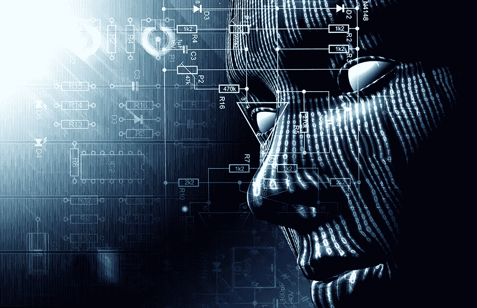

# 艾:好的，FUD，和可怕的

> 原文：<https://medium.datadriveninvestor.com/the-good-fud-and-frightening-3da0760089b1?source=collection_archive---------13----------------------->

嗯，随着人工智能(AI)、社交媒体八卦和 FUD 方面的新研究和进展，互联网再次活跃起来。首字母缩写词 FUD 是对不确定性和怀疑的恐惧的缩写，用于传播虚假或夸大的信息，旨在阻止人们采用对立的产品或想法。

 [## 人工智能与创意:作为创意引擎的 BigGAN |数据驱动的投资者

### 的确，2018 年可以被视为人工智能创造的创造力全盛时期的开始。当然可以…

www.datadriveninvestor.com](https://www.datadriveninvestor.com/2019/02/13/ai-creativity-biggan-as-a-creative-engine/) 

老实说，人工智能辩论的每一方都对在网上传播如此多相互冲突的信息负有部分责任，以至于许多观众选择回避这个话题，而没有进行足够深入的探索以形成有教养的观点。这篇文章将从人工智能争论的三个方面总结事实，好的，流行的和可怕的。

# AI 到底是什么？

定义人工智能的确切条件尚未达成一致。但是，人工智能可以被广泛地描述为一种向计算机提供类似人类智能的计算机科学。如果机器可以像人类一样做任务、解决问题或证明认知功能，我们可以称之为 AI。

## 今天所有的人工智能都是“狭义人工智能”

人工狭义智能 ANI，或称弱 ai，是当今世界的 AI。

计算机工程师设计狭义的人工智能来完成单一的线性任务，即使系统能够完成实时任务，也仍然需要从指定的数据集中提取信息。因此，这些系统不能在单一线性任务之外工作。狭义人工智能的例子有谷歌助手、Siri 和其他流行的个人辅助工具。

***所以现在 AI 无处不在。***

除了我们都听说过的相同的旧人工智能，许多离散的操作运行在计算机、电话、网络服务器和 IT 世界的其他部分。例如，您的手机还可以主动观看您的应用程序的使用情况，以管理后台任务，避免浪费电池寿命。虽然一些人工智能操作吸引了我们的注意力，但每天都有许多其他操作在我们的雷达下飞行。

## 人工智能可以利用许多超越人类的优势。

*   首先，我们设计人工智能，这样我们可以在更短的时间内用更多的信息训练计算机。
*   AI 不需要睡眠，所以它们可以不需要停下来休息就可以完成任务和分析数据。
*   除了软件错误或电源故障，计算机在高价值计算方面更加正确。
*   人工智能不受感觉、需求、情绪或任何其他经常影响人类判断和智能的因素的影响。

## 人类的智能仍然远远优于任何人工智能。

我们可以用庞大的数据库设计 AI，但它们无法像我们一样体验生活。

我们处理信息以做出选择和解决问题，不仅使用蛮力智能，还使用并行处理——我们的本能、我们的理性思考以及我们从生活经验中获得的思想和感受。

## 我们可以给人工智能编程来复制智能，但它们不能像我们一样创造。

我们经常利用我们的想象力和来自人类创造力的灵感来解决日常问题。人类可以写回忆录，即兴创作，演奏乐器，画壁画，烹饪新的食谱，梦想新的发明。

## **科技还不能取代人类的思维。**

这表明我们仅仅触及了人工智能的冰山一角。但是我们正在释放人工超级智能的全部力量。人工智能可以帮助人类繁荣或崩溃，这取决于我们如何使用它。

# 好人

技术的好坏取决于制造和使用它的人，而现在，使用人工智能做好事的人比做坏事的人多。普华永道的研究发现，到 2030 年，人工智能有可能为全球经济增加 15 万亿美元。Gartner 的另一项研究发现，到 2020 年，人工智能可以创造 230 万个工作岗位。

*   据 IBM 称，对数据科学技能的需求预计将增长 39%
*   人工智能可以用来开发专门针对每个患者的疾病治疗方法
*   根据 Gartner 的数据，到 2021 年，人工智能增强可以为企业增加 2.9 万亿美元，并增加 62 亿小时的工人生产率

## AI 有更大的机会在社会上做好事。

没有人怀疑人工智能有不可思议的潜力。但是，我们不需要害怕人工智能的接管，只要我们继续怀着良好的意愿有目的地开发这项技术。例如:

最近，谷歌的人工智能研究部门推出了 DeepMind Health initiative，用于挖掘医疗记录，以提供更强大、更快速的医疗设施。谷歌 DeepMind 可以在几分钟内处理数十万份医疗数据。尽管对这种数据收集和机器学习的研究还处于早期阶段，但谷歌正在与 Moorfields 眼科医院 SLIM Foundation Trust 合作，以增强眼科治疗。

此外，谷歌的生命科学部门正在合作其基因数据收集项目，基线研究。它试图使用与谷歌广受欢迎的搜索按钮相同的算法来分析保持健康的最佳途径。这也涉及到疾病监测技术的测试，包括可以测量你体内血糖水平的数字隐形眼镜。

## 人工智能正在改变驾驶体验。

去年，全球生产了超过 7000 万辆自动驾驶汽车。

## **AutoX 的无人驾驶送餐车。**

该公司的汽车融合了人工智能软件、传感器、实时摄像头以及数千英里的虚拟和实际测试里程，以确保安全的高速公路选择。

目前，随着对食品服务的关注，消费者可以通过他们的应用程序选择和交付产品，并能够在交付时浏览他们的车载便携式商店。

AutoX 最近在加利福尼亚州圣何塞启动了试点项目，在地理围栏区内测试该服务，并计划每隔几周扩展该区域。

## Waymo 正在凤凰城地铁区提供试乘旅行。

迄今为止，Waymo 360 度感知技术已经独立行驶了 800 多万英里，可以检测到 300 码以外的行人、其他汽车、骑自行车的人、道路工程和其他障碍物。

Waymo 带来更好的工作，让自动驾驶汽车更安全。

2019 年 4 月，Waymo 宣布了在底特律前美国车桥制造厂组装自动驾驶汽车的计划，为该地区带来了 100 至 400 个就业岗位。

## 人工智能可以帮助我们过上更安全、更有效率的生活

Rethink Robotics 是人工智能技术如何提高汽车生产线效率的一个例子。

Rethink Robotics 为工业自动化生产合作船或合作机器人。这些机器人用于自动化工厂的工作，这些工作对人类员工来说是枯燥、肮脏甚至有害的。

## **Rethink 的机器人与人并肩作战**

他们在供应链、服务计算机、管理设备、测试和成品运输方面提供帮助。

田纳西州的一家定制注塑企业开始使用 Rethink 的 Sawyer co-bot 在员工失踪时保持生产正常进行。该公司弥补了工作缺口，并在不到四个月的时间里看到了投资回报。

# FUD

大多数人会同意，人工智能是一个松散的术语。这使得市场为了营销优势而误导产品，但也让它们传播不道德的恐惧、怀疑和不确定性..

## 领先的市场研究机构 Gartner 报告了一项关于人工智能应用可行性的研究。

据 Gartner 称，

1.  90%的人工智能应用程序可能不会像宣传的那样工作，并且
2.  90%的 AI 说话大多是假的。

这也意味着对这项技术的任何恐惧或希望都是虚假的。

## 我们能相信这份报告吗？可能吧，是的。

Gartner 通过向公司合作伙伴宣传、撰写、展示和出售数据来赚钱。对于 Gartner 来说，公开一张指向大多数客户的图表是非同寻常的。

## 人工智能是商业和营销的驱动力

人工智能提供了一种通过人工智能自动化我们审美选择的方式。这极大地帮助了美学制作领域，如消费者摄影和自动化文化体验。例如，根据我们的历史选择我们在网上看到的广告。

但是，人工智能将在未来更专业的文化生产中发挥作用。

## 人工智能并不是真正的时尚。

艾帮助设计流行的时尚项目，标志，音乐，电视广告和其他文化作品。但是，人类专家根据人工智能产生的想法和媒体做出最终选择或进行实际生产。

因此，人工智能不是一种时尚，但它是营销人员传播 FUD 的一个容易的目标..

# 令人恐惧的

## 坏人可以利用人工智能作恶

在使用人工智能制造更有针对性的网络攻击、帮助公共监控和电力杀手无人机的可怕一面，有许多担忧。

人工智能可以比任何人更快、更仔细地处理大量信息。根据 2018 年对恶意使用 AI 能力的研究，这意味着黑客可以使用大量不安全的信息对个人发起钓鱼攻击。

类似的研究还发现，人工智能可以打击网络冲突，使用无人机和自动运输汽车代替士兵，并在未经人们理解或批准的情况下，使用自动监控设备监视他们的日常生活。

## 人工智能现在可以读取人类的思想，并将想法打印在屏幕上。

据 Vox 报道，脸书资助人脑-计算机接口研究。目标是阅读和翻译储存在人脑神经元中的想法。还记得美国运输安全管理局说他们可以看到我们的社交媒体信息吗？现在想想，如果他们能很快挖掘出你大脑中隐藏的秘密会怎么样！

而且，这可以实时完成。脸书现实实验室的早期实验可以使用脑机接口将人脑的表达解码到屏幕上。

脸书的科学家已经有了一种可以解码大脑短语的算法。

## 埃隆·马斯克计划将人工智能线程与手机相连，植入我们的大脑。

与此同时，埃隆·马斯克的一家公司 Neuralink 正在合作一个项目，让你可以用意念控制智能手机。马斯克的计划包括将弹性线直接植入你的大脑，弹性线的体积约为人类头发的十分之一。

马斯克打算在明年年底，也就是 2020 年，开始在动物身上进行实验。

因此，几乎可以肯定的是，在不久的将来，科技公司将有某种能力将科技和我们的思维结合起来。

## 最实际的担心是 AI 会抢走我们的工作。

在上世纪初，一些人担心工业革命会使装配线自动化，并与其他技术一起导致大规模失业。因此，以人工智能为中心的新一轮工业革命将极大地改变就业市场，这是有道理的。

## 哪个工作面临自动化的风险？

重复性工作——那些一遍又一遍地做同样的事情而没有变化的工作——最有可能通过人工智能实现自动化。

根据普华永道的研究，

*   到 21 世纪 20 年代初，3%的工作将实现自动化
*   到 2035 年，30%的工作将实现自动化
*   到 2035 年，44%的低教育水平工人将实现工作自动化
*   女性比男性面临更大的工作自动化风险

在面临自动化可能性的工作中，概率最高的包括:

*   53%的制造业工作
*   51%的批发和零售工作
*   34%的建筑工作
*   2%的人类健康和社会工作岗位
*   12%的教育岗位

# 真的…AI 到底是好的还是坏的，还是两者兼而有之？

## 这是许多好莱坞大片几十年来一直试图回答的问题。

从社会角度来看，人工智能主宰人类的末日场景在流行文化中根深蒂固，从电影到对人工智能在军事组织中的作用的政治担忧。流行的主题，如机器人军队和恐怖组织利用人工智能获得权力，可以理解地描绘了人工智能的可怕未来。

此外，许多技术先驱，从埃隆·马斯克到比尔·盖茨，都对人工智能(AI)技术的进步表示了谨慎。

乍一看，人们不会想到埃隆·马斯克会对人工智能(AI)表达如此谨慎的态度，这位著名的工程师正在与特斯拉(Tesla)和 SpaceX 公司一起推进技术的边界。马斯克在工程进步的边缘进行创新，拥抱自动化和自动驾驶人工智能技术。

"有了人工智能，我们正在召唤恶魔."—埃隆·马斯克(TechCrunch，2014 年)

也许马斯克担心的不是人工智能本身，而是人工智能压倒人类的想法——这一想法得到了比尔·盖茨和斯蒂芬·霍金的回应。因此，人工智能中的恶魔不仅仅是技术，而是它发展成为比人更聪明或被有权有势的人滥用的想法。

# 结论

毫无疑问，AI 让公司运营变得更简单，但平衡是必不可少的。通过实现一层战略智慧和良好意图，个人可以创造出更好的人工智能。无论技术多么复杂，我们仍然需要最有知识的人类专家来保护信息、捍卫人们的权利和管理人工智能系统。

## 在我们创造出人工超级智能之前我们还有多长时间？

世界领先的人工智能研究人员根本不知道从现在到我们拥有超级类似人类的人工智能需要多少年。截至目前，生物已经达到了很高的狭义 AI 水平。你可能不总是知道，但它无处不在。

显然，需要制定一些基本准则；否则，滥用的可能性将是毁灭性的。虽然几个国家正在酝酿如何处理神经权利，但总会有违法者。

当研究人员努力整理所有关于使用人工智能的新产品的荒谬 FUD 时，请注意网络安全市场上的一些欺诈者，他们进一步扩大 FUD，以利用人们的恐惧。