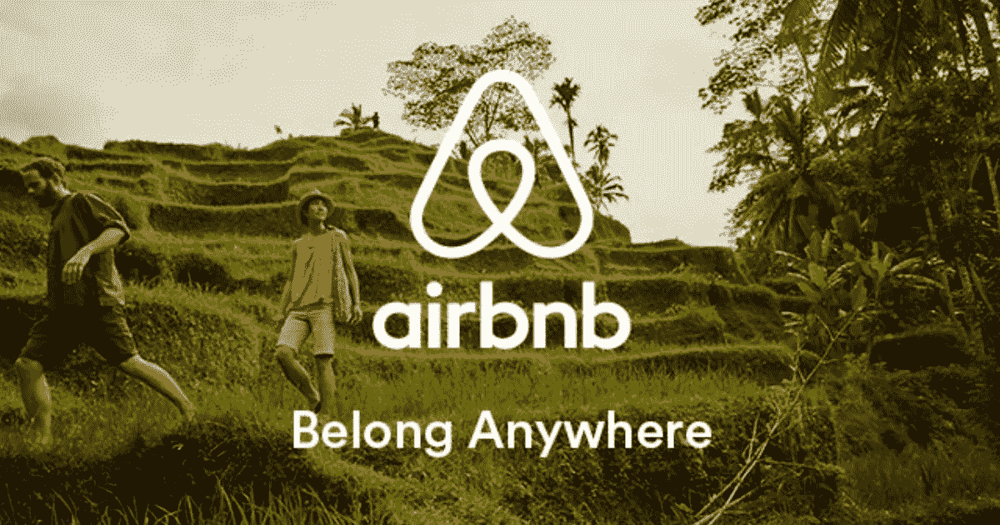
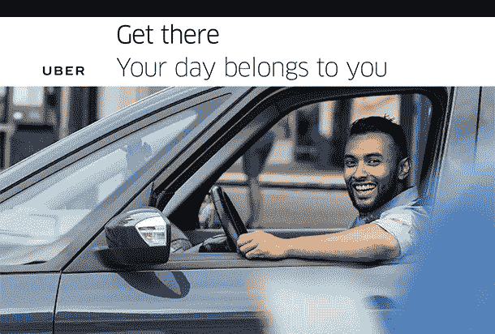
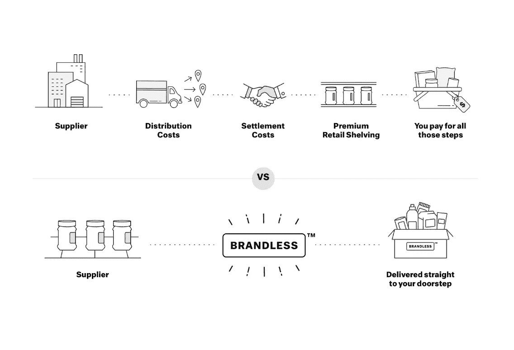
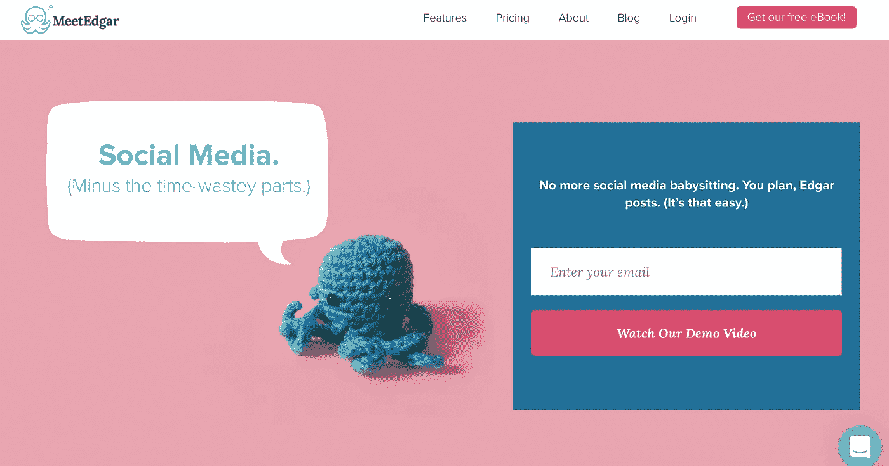
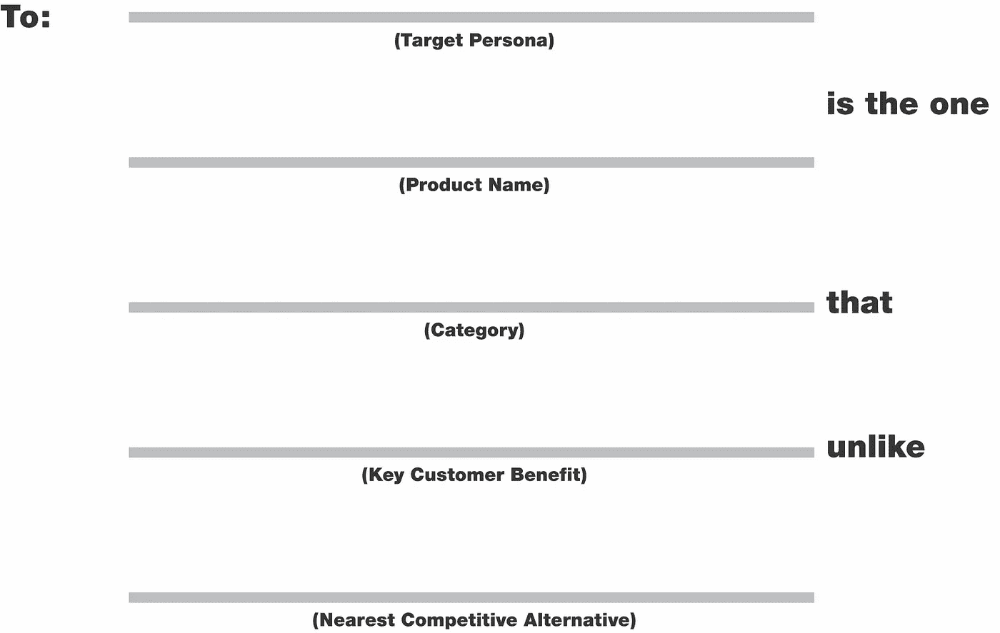
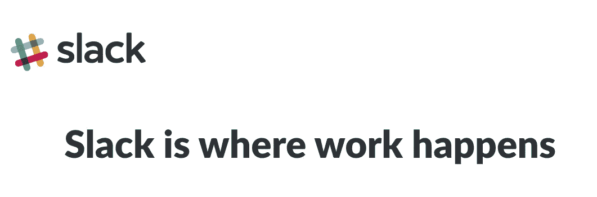

# 阻碍你的品牌故事的良好意图

> 原文：<https://medium.datadriveninvestor.com/the-good-intentions-holding-back-your-brand-story-c83f6c22a0c3?source=collection_archive---------23----------------------->

## 常识并不总是带来令人信服的信息。

“讲故事”可能听起来很简单，但对于初创公司来说，这是一个巧妙的工具。

自从我们的指关节在洞穴地板上移动以来，我们人类就一直在告诉他们。我们的大脑是为它们而生的。

故事帮助我们理解抽象的概念，并将它们应用到我们自己的生活中。他们让我们关心。*如果你能讲一个非常好的故事，你就能推销你从未见过的产品的愿景，不管它有多抽象。*

但是弄清楚你自己的*故事并不容易。我们的本能经常引导我们走向平淡无奇的道路。*

这里有 3 个好的意图，通常会使品牌故事变得沉闷，加上新的角度来强化你的品牌故事。

# **良好意图#1:试图解释你的故事**

我们都希望人们“理解”我们的产品，以及它的与众不同之处。所以你可能认为简单明了地解释你的产品是什么以及它是如何工作的是最好的方式。

不幸的是，直截了当的解释不会让人们对你的产品感兴趣，最终听起来更像是读书报告而不是故事。

你的解释可能充满了智能元素，例如，点对点平台，实现了对内容的无摩擦访问，但就像读书报告一样，如果你没有工程背景，它很抽象，很难理解。读者会感到厌烦。

你的创业公司的故事应该更像一部网飞连续剧，让你即使在周一晚上 11 点也能进入下一集。

这意味着从你的产品中走出来，站在客户的角度考虑问题。告诉他们他们唯一想听的故事:你能为他们做什么。

当故事是关于我们的时候，我们突然感兴趣了。就像你的朋友想告诉你他们昨晚做的梦。太无聊了，除非他们的梦是关于你的。

[英雄之旅](http://www.well-storied.com/blog/heros-journey)是无数著名故事中使用的情节结构。它有几个阶段，但关键是每个英雄都在故事的过程中发生变化。

卢克·天行者从湿气农场男孩变成了邪恶的绝地。比尔博·巴金斯从冷漠的霍比特人变成了屠龙者。布里奇特·琼斯从一个悲伤的老处女变成了科林·费尔斯的女朋友。像他们一样，我们都想变得更好。

把你的顾客想象成你故事中的主要英雄。你的产品如何帮助他们成为更好的自己？

这对你来说似乎是不言而喻的，但对你公司之外的大千世界来说并不明显。

拼出我们更好的一面。

From removed tourist to connected traveler.

Airbnb 邀请人们“属于任何地方”。在 Airbnb 出现之前，你是住在酒店里的游客，与你要去的真实地方没有联系。在 Airbnb 之后，你是一个旅行者，拥有在世界任何地方建立联系的真实体验。

From tied-down to in control of your day (and therefore, your life).

优步承诺给司机新的自由。在优步之前，你被工作时间表束缚住了。在优步之后，你可以控制自己何时想赚钱，如何打发一天的时间。

# **现在你来试试:你的客户是如何改变的？**

制作一个简单的 2 列表格，在顶部显示“之前”和“之后”。思考顾客在使用你的产品前后的所有不同变化。是他们的情绪吗？他们的社会地位？他们的观点？典型的一天工作？

尽量具体一点。比如从不开心到开心，太泛了。选择一个最好的“之后”状态，看看它如何在你的创业公司的标题中发挥作用，比如 Airbnb。

# **良好意图#2:只关注“好东西”**

很自然，我们希望尽可能地展示我们的产品。因此，我们尽可能地增加了许多奇妙的功能和好处。

*   关于健康、全成分的能量棒订阅。
*   一款关于提高工作效率的时间管理应用。

每个人和他们的母亲都滔滔不绝地谈论福利，所以这些陈述听起来不错，但也有点“那又怎样？”

这是因为在这些句子中，客户没有任何风险。没有你能量棒中的健康、完整的成分，我也能活得很快乐，非常感谢你。

如果你想提高人们的赌注，你的故事需要一个反派。反派的存在是为了让故事变得有趣。他们代表了你的客户——也就是英雄——所面临的问题。你的产品是他们打败它的武器。

Brandless 出色地命名了他们的反派 BrandTax。

Brandless is a real misnomer…they rock at brand.

作为一家直接面向消费者的公司，Brandless 消除了我们通常为杂货店商品支付的隐藏加价:BrandTax。它很快让我明白，我被无数其他商品不公平地收取了费用。但是布兰德利斯正在帮助我在食品杂货和家庭用品上战胜它。

You can be lighthearted about your villain too.

MeetEdgar 的反派是创业者社交媒体管理的时间吸。他们通过自动化你的社交媒体管理来对抗时间的消耗。

# **现在你来试试:谁是你的反派？**

头脑风暴至少 5 个可能的坏人。你的产品解决的问题是一个很好的起点；但是，这个反派在你的客户眼里可能是另外一副面孔。听听你的潜在客户和客户如何用他们自己的话谈论问题。

选择你认为最好的反面角色，然后描述它如何对你的顾客产生负面影响。最后，想想你的品牌是如何帮助客户打败这个恶棍的。你能给你的反派一个名字吗，比如布兰德里斯？

# **良好意图#3:从模板开始**

当你不知道从哪里开始时，模板似乎是个好主意。

比如这个人:

才华横溢的 April Dunford 解释了为什么这个 70 年代的模板毫无用处:

> 这种无用的工具从未被如此广泛地使用过。事实上，这个练习的输出是一个滑稽的、笨拙的、无意义的、晦涩难懂的弗兰克陈述，这还不是最糟糕的部分。不，这个“定位练习”最糟糕的部分是它假设你已经知道答案了！

我很抱歉，如果你浪费了生命中的几个小时试图用你可能还没有弄明白的东西来填补空白。

你的故事是出现在不同地方的信息的集合。总之，它们将你的产品和大愿景之间的点连接起来。要找到它们，你必须先拓宽视野，搞清楚:

*   你是什么
*   你为什么这么做
*   你的独特价值

弄清楚这些部分，并让它们一起工作，这就是你如何在市场上建立一个一致的品牌信息。

Slack 就是一个很好的例子——他们在*什么*、*为什么*和*独特价值*之间编织了一根金线。

Slack 是什么:一个协作中心，它将合适的人与所有合适的信息和工具聚集在一起，以完成工作。

Slack 的原因:让工作更简单、更愉快、更有效率。

Slack 的独特价值:工作发生的地方

# **现在你来试试:研究出你的故事元素**

花时间回答以下问题:

*   我们做了什么别人没做过的事？
*   谁是我们的恶棍？
*   我们如何帮助改变我们的客户？
*   10 年后我们将如何改变世界？

作为一个团队集体讨论答案，并把它们挂在墙上。圈出对你重要的陈述，最重要的是对你的客户重要的陈述。记下重复出现的主题，将它们归类到你的为什么、做什么和独特价值中。

# **伟大的故事是伟大的战略**

安德森·霍洛维茨基金的合伙人兼联合创始人本·霍洛维茨用一句完美的话将其分解为:

> 公司故事就是公司战略。

你的故事是你走向市场战略的表达。你的投资者套牌的肉。销售和营销的基础。

这是你让世界第一眼就关注你的想法的入场券。

通过讲述你最大、最大胆的故事，给你的产品最大的成功机会。

**关于艾玛·奥布莱恩:** *我帮助初创公司走出杂草，通过品牌和产品信息来推销他们的愿景。我的客户从种子到成长阶段，从 B2B 到消费者，从 SaaS 到电子商务。如果解释你的创业让你抓狂，来 www.PunchyBrands.com***找我吧。**