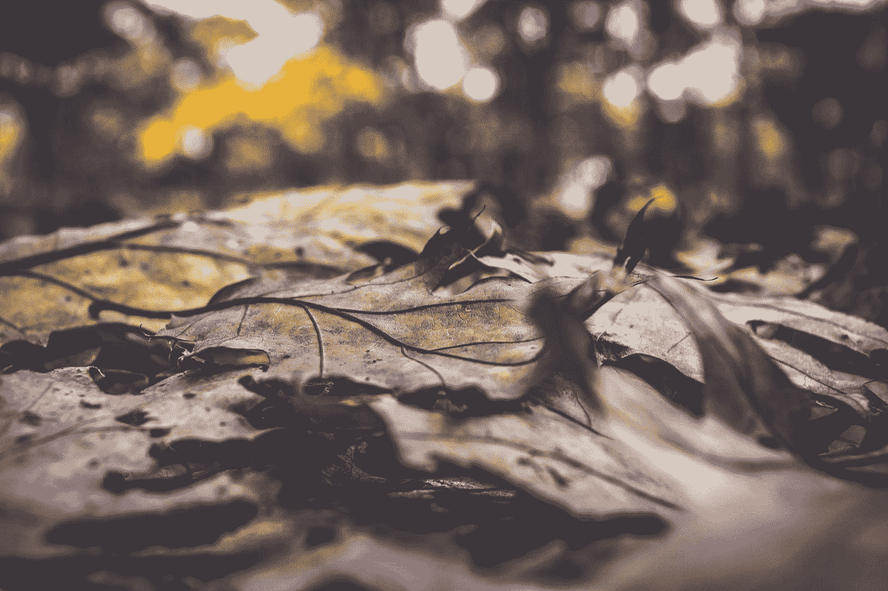

# 美好的时光令人着迷。

> 原文：<https://medium.datadriveninvestor.com/the-good-times-are-fascinating-669bd99c7fa6?source=collection_archive---------37----------------------->

Photo by [Fancycrave](https://unsplash.com/@fancycrave?utm_source=medium&utm_medium=referral) on [Unsplash](https://unsplash.com?utm_source=medium&utm_medium=referral)

它们现在很迷人，因为它们几乎完全符合忧虑的感觉。担心事情会变成不是我现在的感觉，而是我内心深处的另一种感觉。恐惧。害怕失败，害怕痛苦，害怕悲伤，害怕好日子的负面。

我的优步司机在说话，他看起来很好，但我不确定什么是好的。

当我曾经如此渴望相信人们的善良时，我也看到了一些人的善良是多么浅薄。如果我高估了自己的虔诚，以为自己走在神中间，而实际上我们都只是凡人，我会堕落到什么地步。只有像我这样的男人。没什么特别的，然而一个好朋友曾经给我发了一个视频，视频里一个男人讲述了我们每个人都值得爱，因为我们每个人都是特别的，独一无二的。

我要求我的司机轻轻地跳过交通灯，因为我听说这是一个汽车等待的危险地点。他做到了。但当他这样做时，他说我们活着，但我们生活在恐惧中。仿佛在问，我们不断地、始终如一地生活在对我们可能在某个地方听说过或见过的事物的恐惧之中，这是一种什么样的生活。有时。某个地方。任何地方。但在这里，我们希望。

我同意他的观点。我听到自己说，我们必须生活在希望中。是以前的我在说话。我非常想成为的那个我，但我还没想好如何找到。

我今天知道我视力不好。我的感官会补偿它。我的听觉很敏锐，不顾一切地在我周围荒凉的景色中搜寻任何听起来有点不合适的东西。或者说太过到位了。太安静了。太大声了。我的耳朵现在只能做这些了，我的右眼基本上落后了几年。显然，电脑和电话是对我们造成伤害的一部分。不管我们对它们倾注了多少爱，它们还是无情的悲剧之源。所有的爱都倾注在我的草稿文件夹里，还有未读未发的邮件。所有从我内心深处发出的汩汩声，都以文字的形式显现出来，希望——渴望——成为某人的情书。

他们落在自己身上。

他们落在我身上。

一个塞满了玉米的陈旧的未加工的胃发出的嘎嘎声，它非常想消化，但会花一个晚上来消化。在空荡荡的家里不应该有音乐，但就像所有的电器都在以合成的高音在寻找我的鼓。那是我的耳膜。音乐应该去的地方。声音本应藏在专门用来欣赏和贬低它们的回音室里，但这是不应该发生的。

对我来说不是。

对我来说，衰老一直是一种可以接受的命运，但它并不意味着伤害这么多。这是为了让我慢慢地、轻轻地滑过十字路口，投入身体等待的怀抱时感觉更安全。我应该像我父亲从未说过的那样吱吱作响，像我一样大笑。骨头像树枝一样折断会很有趣。为午夜做好充分准备。我会喜欢的。我会喜欢的。尤其是在做爱的时候，当我喘不过气来的时候，我会说我有多喜欢它。

我突然想起，上一个和我做爱的人，对我说了些下流的话。不是像她说的那样肮脏或下流。如果你没有发现它是在半夜为你的一个观众写的，那它是一种悄悄的偶然的污秽，会在你身上爬上几十年。她以一种评判的方式评论我的心跳。她希望它慢一点；和她在一起，不那么紧张，节奏也不那么快。有些人在我们的生活中幸存下来，只是故事中的主题，这是多么的悲剧。如果他们的所作所为不是指向我们的内心并把他们的手指深深插入油腻腻的瑕疵，那就不仅仅是传递我们心中的饲料了。

谁伤了你的心，我的爱人？

这是我经常问自己的问题。是谁把它打碎得如此糟糕，以至于我都不知道自己是上面的生物，还是劣质咖啡中下沉的泡沫，而这种咖啡来自一个号称能做出菜单上所说的东西的地方。谁。谁。谁啊。这是对我名字的一个双关语，也是为了拖延时间，因为我害怕我的名字会让我被关在酒吧斗殴的门外。但是我们不要忘记，我从来没有用化名来化名任何人。我对事情的糟糕结果并不满意。我为自己难过，为我疼痛的心难过。

对于每个人破碎的心，他们的胸膛似乎因一次互动而塌陷，在一个十字路口，交通灯由孤独的枪手和恐惧点亮。

那支枪在晚上发出多么大的响声啊。

如此尖锐的声音会在未来几年响起。

如此尖锐，有时我无法入睡，因为害怕你会离开我。

对于一个拿着枪的人在阴影中不停地玩木偶游戏，没有任何东西连着琴弦，只有更多的手指，而发出的接近哭泣来说是如此尖锐。

纵梁木偶。

脱衣舞女。

我漫画书收藏里的订书钉松了。我不知道还能做什么，除了接受我的优步司机在第一时间就在那里:我们活着。