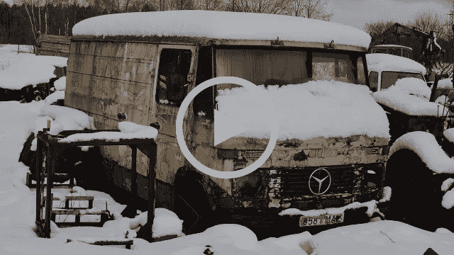

# 伟大的逃避:爱沙尼亚人修理旧货车

> 原文：<https://medium.datadriveninvestor.com/the-great-escapism-estonian-guy-mends-old-van-c6ea68105f7e?source=collection_archive---------29----------------------->

## 你不会想到这样一个缓慢的——有人会说是无聊的——视频会吸引很多观众。但自从 2016 年发布以来，它已经聚集了超过 600 万次观看。

这是一个寒冷的早晨，在爱沙尼亚农村的某个地方，一台相机正朝着你见过的最破旧的垃圾飘去。曾经欢快的黄色油漆已经变得阴郁；褪色，有斑点，剥落。银色奔驰标志是唯一闪亮的东西。

镜头后面的那个人，目前我们只知道他沉重的呼吸声，出现了:一只霜白色的手用力打开了货车生锈的门。里面也是类似的情况。空的燃料容器和机械碎片散落在地板、仪表板和乘客座位上。

这辆货车已经 12 年没有发动过了。剧情很简单:会开始吗？

这名男子和他的朋友继续深情地对这辆老爷车进行心肺复苏，直到它的旧柴油发动机 12 年来第一次开始工作。内部充满了浓烟。

拿着相机的人给了我们所有腐烂的电器和生锈的金属的挥之不去的特写；甚至拍摄燃料从油桶倒入油箱的过程——都是 1080p 高清的。声音很棒。每一个沙沙声，叮当声，砰的一声，刮擦声和雪地上的脚印都被捕捉到了。背景是狗吠声。在远处的某个地方，汽车正沿着一条路疾驰。或者是树上的风？

你不会想到这样一个缓慢的——有人会说是无聊的——视频会吸引很多观众。但自从 2016 年发布以来，它已经聚集了超过 600 万次观看。

# 伟大的逃避主义

除了让我想让我自己的冷战时代的车在无数个周日下午重新启动之外，看着那个人修理货车让我放松。YouTube 的算法似乎知道会这样；他们推荐的。它就在那里，依偎在吉米·法伦的剪辑和愤怒的秃顶男人对英国退出欧盟大喊大叫的视频中。一种解毒剂，可以解除我们正在经历的混乱和困惑。

这是我们这个时代的典型现象，人们使用智能技术来观看陌生人修理旧香肠的视频。也许这是对狂热的现代文化感到厌倦的表现。像梅塞德斯面包车这样愚蠢、耐用的技术不会试图在每一个转折点都质疑你；最接近侵入式通知的是一盏昏暗的红灯，表示你的燃料不足，最接近收集个人数据的是你留在驾驶座上的屁股印。

对许多人来说，逐步修理机器是一种愉快的经历。心理学家[米哈里·契克森米哈](https://positivepsychologyprogram.com/mihaly-csikszentmihalyi-father-of-flow/)说，这种类型的活动引发了一种叫做[心流](https://www.amazon.co.uk/gp/product/0712657592/ref=as_li_tl?ie=UTF8&camp=1634&creative=6738&creativeASIN=0712657592&linkCode=as2&tag=jbcsmyth-21&linkId=6268f5f4e291e3c2d1a63b3de860dece)的状态，在这种状态下，一项活动足够困难，足以扩展你的精神极限，但又足够容易，在你的能力范围内，导致一种纯粹专注的感觉和短暂的自我迷失。也许这就是视频里那个冷冰冰的人的感受——欢乐。

如果做某事有乐趣，那么看它也有乐趣。

主要广播公司抓住了这一点，导致了“慢电视”的诞生，观众可以坐下来看人们做各种从容不迫的活动。

一个[挪威电视频道](https://www.theguardian.com/tv-and-radio/tvandradioblog/2013/oct/04/slow-tv-norwegian-movement-nrk)播出了编织、剪羊毛、制作精致玻璃花瓶的镜头，以及[冬天从奥斯陆到卑尔根的火车](https://www.youtube.com/watch?v=hvHK4yZNXpk)。挪威以外的广播公司也进行了尝试。BBC 四台拍摄了黎明合唱、[沿着英国运河的乘船之旅](https://www.youtube.com/watch?v=8fElraViW08)以及圣诞节期间由萨米族驯鹿牧民带领的迷人雪橇之旅。澳大利亚 SBS 电视台在“甘”号上安装了摄像机(这是一列令人惊叹的火车，世界上最长的火车，理应拥有自己的时事通讯)，拍摄了它从阿德莱德到达尔文的 17 小时旅程。

**这是一份时事通讯，面向那些想更深入地了解他们的第二故乡及其人民的移民，以及世界各地想更多地了解这个神奇的国家正在发生的事情及其原因的西班牙爱好者。* [*在这里订阅可以在你的收件箱里收到这些文章。*](https://weirdspain.substack.com/subscribe)*