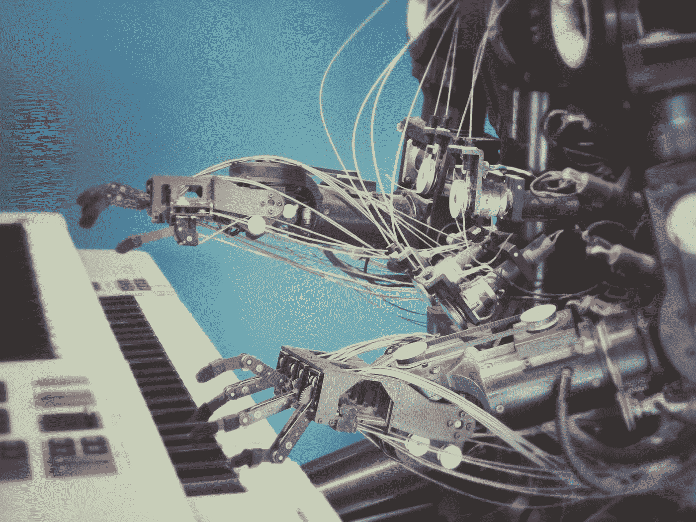

# 伟大的平等主义者

> 原文：<https://medium.datadriveninvestor.com/the-great-leveller-c4adbdc20be0?source=collection_archive---------5----------------------->

> 一旦你有任务要做，那就去做，而不是提心吊胆地活着。——洛根·九指

我们开发了一种称为伟大的 TGL(Great Leveller)的人工智能算法，其潜在用途比 OpenAI 的 GPT-2 等基于转换器的语言模型具有更大的直接影响。

作为一个例子，我们使用谷歌翻译。我们选择翻译路径英语-西班牙语-拉丁语-希腊语-俄语-英语。你可以自己试试这个。

下面是贯穿这个模型的一个示例段落。

> 我一生中大部分时间都是学生，我理解与分数相关的压力。在中学，压力来自于你期望高分的父母。在高中，压力转移到似乎对你的未来更重要的事情上:进入大学。但是当你最终进入大学，不管是哪一所，压力依然存在:被你的专业录取，实习机会，研究生院，等等。随着时间的推移,“成绩”的概念已经不仅仅是衡量学术进步的标准，学生们开始将这个数字与他们在某些科目上的内在技能或能力联系起来。这成为他们身份的一部分。

成为

> 即使当我把大半生都奉献给这些的时候，我也理解我的同胞们从事收视率工作的强烈愿望。在高中，父母被期望获得高分。到了高中，有些压力的改变很可能是大学。但是当他最终进入大学时，不管他坚持的印象如何，他抓住了电影、研究生院等机会。久而久之，“绝对”这个概念就不仅仅是一个学术进步的指标了，学生的数量开始指向某些学科所固有的能力或才能。这是他们自身身份的一部分。

然后可以自由修改结果。当然，完整的算法要复杂得多，包括定制的翻译器网络、基于最小化低级相似性和最大化高级相似性的损失、学习的语言路径以及选择一次翻译多少。

我们相信这种新算法将帮助人类共同努力实现所有人的自由意志。或者只是帮他们抄袭。你认为现在有多少人比你更会用这种翻译技巧来作弊？

**影响:**

*   改变想法
*   修正想法
*   分享想法

请将评论通过电子邮件发送给 albertwujj@gmail.com(艾伯特)或 timerox888@gmail.com(亚伦)[。请随意试验我们的算法。毕竟这些都是想法，不是原创的想法。](mailto:timerox888@gmail.com)

**引用:**

[李春明](https://www.kaggle.com/leecming)和[来训练他们是我的原因](https://www.kaggle.com/rhgrossm)的[翻译为测试时间增加](https://www.kaggle.com/c/jigsaw-toxic-comment-classification-challenge/discussion/52557)