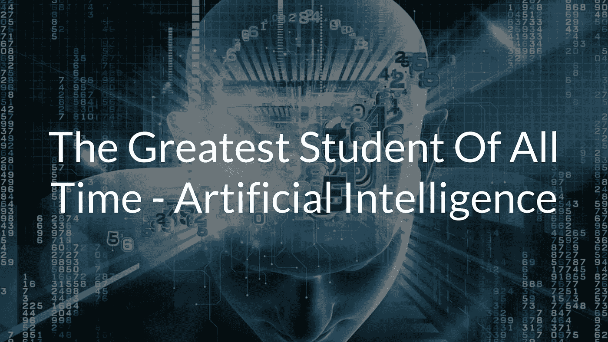
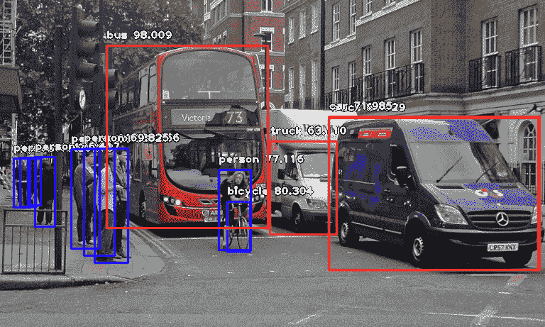
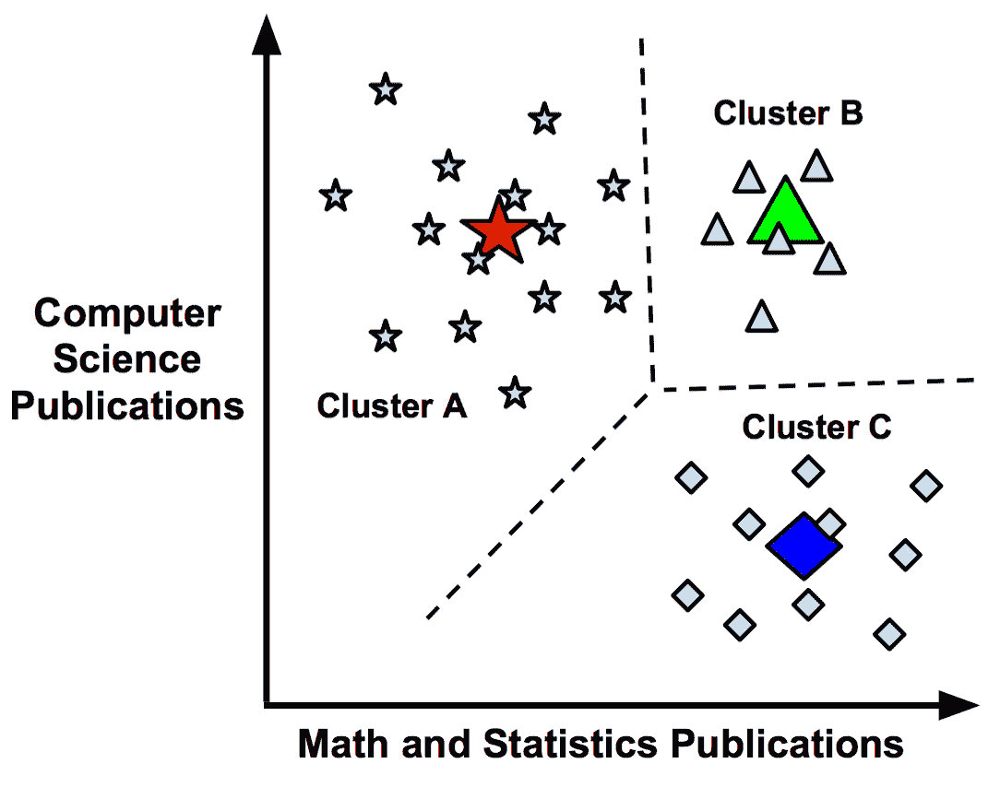
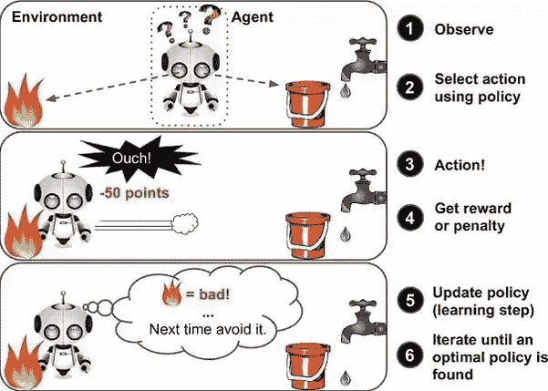

# 有史以来最伟大的学生——人工智能

> 原文：<https://medium.datadriveninvestor.com/the-greatest-student-of-all-time-artificial-intelligence-b77be80dc9a7?source=collection_archive---------19----------------------->

想象一下这样一个世界，在这个世界里，机器可以理解人类的语言并与你交谈，玩石头剪子布，以前所未有的速度完成工作，创作原创艺术和音乐，识别癌症，甚至在几个小时内打败你(在此插入你最喜欢的视频游戏的名称)!

那个世界看起来和我们生活的世界非常相似。

Siri 可以和你说话，告诉你任何事情，简单的计算机程序可以和你玩石头剪子布，人工智能绝对可以做那个列表上的所有事情，甚至更多。

人工智能将真正影响每一个行业，但如何影响呢？坦率地说，人工智能**比人类学得更快**，比我们保留更多的信息。人工智能不受记忆丧失、注意力分散或任何影响人类学习能力的因素的限制。唯一可能影响人工智能学习能力的是数据和计算能力。这意味着，如果有足够的数据和计算能力，人工智能可以学习任何东西。这使得它远远优于人类。人工智能可以造出比我们更好的机器人，比训练了 20 年的专家更准确、更快速地识别癌症，通过更好的灌溉方法、种植等来优化作物生长。，还有更多！

好吧，人工智能确实很酷，但它是如何做到这一点的呢？人工智能的一个主要组成部分是**机器学习**。这正是它听起来的样子，**通过一组复杂的算法(不允许有明确的指令)，赋予机器像人一样学习的能力**(但更好，因为它没有失忆和其他人类的问题)。

# **机器学习的类型**

有四种不同类型的机器学习模型(模型就是机器学习的方式/它使用的算法):

**监督学习**模型、**非监督学习**模型、**半监督学习**模型、**强化学习**模型。

为了理解 ML，让我们以一个学生 Al 为例，他正试图学习数学。对于这些类型中的每一种，Al 都将作为我们的机器学习模型。

# **监督学习模型**

艾尔对数学一窍不通，他懒惰的老师给了他一张工作表。艾尔选择尝试猜答案的方法，然后问老师答案是否正确。老师有一个答案列表，他给了 Al，但是他太懒了，没有告诉 Al 如何独立完成任何问题(例如，二次公式是如何工作的)。通过这种猜测和检查的方法，Al 发展了自己对数学工作原理的理解，甚至想出了自己的窍门。

有监督的机器学习模型以大致相同的方式运作，猜测和检查，直到它理解数据中的模式，并为这些模式为什么存在以及它们如何工作创建自己的逻辑。然而，人类不可能永远照看这个模型。老实说，坐在电脑旁边输入诸如“这是一只狗还是一只猫？”这样的问题的正确答案是愚蠢的**对于 1000 个数据集。还好艾尔的老师有答案，他可以直接给艾尔。在现实生活中，这是一个带标签的数据集。每一条数据都有标签，就像 Al 工作表上的每一个问题都有答案一样。例如，img1.jpg 可以有标签“猫”，而 img512.jpg 可以有标签“鹦鹉”**

如果机器学习模型需要 1000 个数据集来理解猫和长尾小鹦鹉之间的差异，那么当你或一个 5 岁的孩子在没有数据集的情况下能够区分这两种动物的差异又有什么意义呢？一旦机器理解了猫和长尾小鹦鹉的区别，它就能比人更快地识别它们**。**

这甚至会导致这样的事情:

这张图像中的每个物体都在几毫秒内通过机器学习进行了分类。这项技术在像**无人驾驶汽车**这样的事情上非常重要，因为它们需要识别物体，比如人或其他汽车，而不是撞上它们。监督学习是机器学习的一个巨大分支，而且肯定是最准确的分支之一。

# **无监督学习模型**

让我们转移到一个平行维度。第一个例子和这个例子的唯一区别是 Al 的老师。这一次，艾尔的老师忘记了答题卡。现在，艾尔必须完全靠自己学习数学。尽管如此，艾尔还是学会了。

这听起来**可笑**对吧？对学数学来说，是的。对于识别未标记数据中的模式，答案是否定的。例如，你的手机使用无监督学习来对照片进行分类。在不理解数据的情况下找到它的结构是可能的。**无监督学习模型通过寻找相似的数据的特定特征并根据这些特征对该数据进行分类来做到这一点。**

我对这个数据一无所知，我的 ML 模型也是。但是，它仍然能够将这些数据分类为星形、三角形和菱形。正如人们可能想象的那样，无监督学习确实很棘手，但仍然非常有用。

# **半监督学习模型**

现在到了我们的第三维度，艾尔的老师设法把答案钥匙放在他们的咖啡里，擦掉了他们答案钥匙上的一些答案。这意味着 Al 可以猜测并检查一些答案，但不是全部。

这种情况在数据集上经常发生，其中有些数据被标记为**，而有些没有被标记为**。ML 模型仍将学习如何分类和发现数据中的模式。这可能是最常见的机器学习类型。以前，最大似然模型可以分为监督学习模型和非监督学习模型。但是，随着最近数据的增加(所有记录数据的 90%是在最近 2 年内创建的)，新类型的模型被创建，这个桶最终被创建。

# **强化学习模型**

休息时间到了。艾尔，什么都不知道，基本上是走来走去和不同的东西互动。如果他做了坏事，比如向孩子扔石头，他就会失去好孩子的名声。如果他做了好事，他会增加它。

**强化学习模型的工作方式大致相同，通过与随机事物互动，就像在游戏中一样，但它不会失去或增加声誉，而是失去并获得想象中的点数**。该模型的最终目标是最大化点数。这意味着它会竭尽全力做好事。然而，你也可以对这个模型进行编程，让它因做好事而扣分，因做坏事而加分。强化学习基本上是通过游戏化一切来工作的。这个模型需要学习的只是一系列它可以采取的行动，一个奖励信号，以及一个它所处环境的表示，比如一幅图像。强化学习非常适合教导机器最大化奖励和最小化惩罚。

机器学习实际上是让人工智能**学习**的东西，因此，可以做一些惊人的事情，如检测疾病，通过改善作物生长来解决世界饥饿问题，等等！通过了解它是如何工作的，我们可以尝试改进它，或者生闷气，因为它可以比你更好地玩视频游戏。这对理解人工智能本身实际上是如何工作的非常重要。

# **关键要点:**

*   人工智能将影响每一个行业——医疗保健、食品、娱乐等等！
*   人工智能比人类学得更好更快。
*   机器学习使用复杂的算法，让机器在没有明确指令的情况下进行学习。

***如果你喜欢这篇文章:***

*   ***分享给你的人脉***
*   ***关注我的***[***LinkedIn***](https://www.linkedin.com/in/areez-bhanji/)***和*** [***中型***](https://medium.com/@areezbhanji) ***随时更新我在区块链的进展！***

# DDI 特色数据科学课程:

*   [**用于数据科学的 Python**](http://go.datadriveninvestor.com/intro-python/mb)
*   [**深度学习**](http://go.datadriveninvestor.com/deeplearningpython/mb)
*   [**数据可视化**](http://go.datadriveninvestor.com/datavisualization/mb)

**DDI 可能会从这些链接中收取会员佣金。我们感谢你一直以来的支持。*