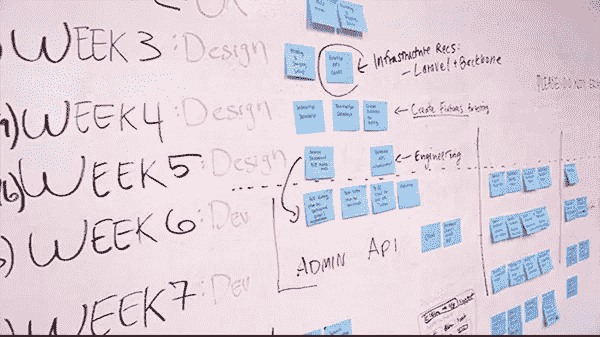

# 最大的悲剧是你不去尝试

> 原文：<https://medium.datadriveninvestor.com/the-greatest-tragedy-is-when-you-dont-try-7cbca4663a4c?source=collection_archive---------15----------------------->

## 在教练博客——世界领先的领导力和教练博客之一，我们经常发布主要作者和权威的文章——今天我们很高兴发布乔恩·韦斯顿伯格在[Medium.com](https://medium.com/life-learning/the-greatest-tragedy-is-when-you-dont-try-61a3fea99ca1#.i9j7pmh29)写的一篇文章。

## “有一天”是最悲伤的词——它也可能意味着永远不会。

我知道失败不是一个肮脏的词。在创业圈子里，我经常有一种几乎被人仰慕的感觉。我们希望看到失败，那些把自己的缺点变成成功的失败。这就是为什么我们崇拜那些真正搞砸了的企业家，却在第三幕中找到了成为赢家的方法。

我认为很明显失败本身并不是悲剧。当你在某件事上失败时，你甚至不需要为此感到太糟糕。有大约一千条关于失败的名言、陈词滥调和陈词滥调，你可以依靠它们来帮助你恢复。看一下这份清单。

我们现在已经到了一个点，我们许多人都知道失败、跌倒、崩溃和燃烧都是实现任何事情的旅程的一部分。那很好。我喜欢它。我很高兴我们已经摆脱了犯错误的耻辱。

因为真正阻止我们前进的障碍与失败无关。大多数企业家、梦想家、创始人、作家、游戏规则改变者、未来的篮球巨星、未来的音乐家、画家、说唱歌手、跑步者、程序员、梦想家和潜在的宇航员面临的真正障碍从来都不是失败。从沙发上起来试一试都不费事。

我遇到了很多人，做着我的工作。大约 20%的人在建立公司，或者自由职业，或者赚钱，或者取得某种程度的成功。这些人给了我难以置信的鼓舞，他们让我的生活变得更加有趣，因为他们积累了一些原始的经验，我可以用来教他们，或者从自己身上学习。

另外大约 80%的人在他们的任务清单上写下了“创业”或者“写书”,但是从来没有做过。它已经列在清单上很久了，他们能抽出时间来做这件事的可能性几乎为零。他们是所有人。他们是所有人，因为他们没有尝试过。他们已经决定要改变他们的生活，他们认为这个决定就足够了。

我希望是这样。我希望我能说意图是战斗的十分之九，但这显然是不真实的。意图只是等待催化剂的原材料。只要你不采取行动，你就不会找到那个催化剂，你就不会获得牵引力，你就不会变得比你自己更强。

我相信，由于惰性或感觉缺乏时间、精力或资源，或任何其他原因，不去尝试已经阻止了这个世界听到比我们想象或梦想的更美妙的音乐。

我相信，在某个地方，有成百上千的远见卓识者和天才，他们只是没有尝试——正因为如此，人类错过了本可以改变我们生活和呼吸方式的公司、产品、想法、创新和理论。我相信，有些艺术家本可以创作出如此深刻的美的作品，以至于让政客们落泪——但他们从未尝试过。

谈到制造商和建筑商，我对 FOMO 有着强烈的兴趣。我不希望他们屈服于现代人类懒惰和嗜睡的本能，因为如果他们这样做，我可能会错过有史以来最伟大的公司和创造。我很自私。我想要好东西。所以起诉我吧。

我们已经接受了失败给我们提供了教训。只要你有意识地生活，而不是毫无自我意识地自动驾驶，那就永远是真的。不活动，从不尝试，这不会教会你任何东西。你不进步，你不进步，你不发展，你肯定赢不了。

如果通过尝试和失败，最坏的情况是你学到了一些艰难的教训，那么你有充分的理由去尝试。当然，总会有其他难以面对的后果——由于创业和倒闭，我损失了金钱，失去了客户，失去了一些自尊，迷失了方向，失去了我的人际关系——但你总能挺过去。你总能从另一边出来。

当我告诉人们我希望每个看我博客的人都比我大的时候，我想人们不会相信我。我希望它们是巨大的。我希望每个人都成为非常成功、有成就感的艺术家、有才华的小说家或百万富翁企业家。我想不出更好的遗产来回顾。但是如果你不拿出游戏的面孔去尝试，这永远不会发生。

点击此处阅读更多内容，不要忘记订阅我的教练博客网站以获得免费的教练报告:[https://www . coaching-blog . com/the-great-tradition-is-when-you-don-t-try/](https://www.coaching-blog.com/the-greatest-tragedy-is-when-you-dont-try/)

请访问我们的网站，订阅免费的教练杂志:【http://www.international-coaching-news.net/ 