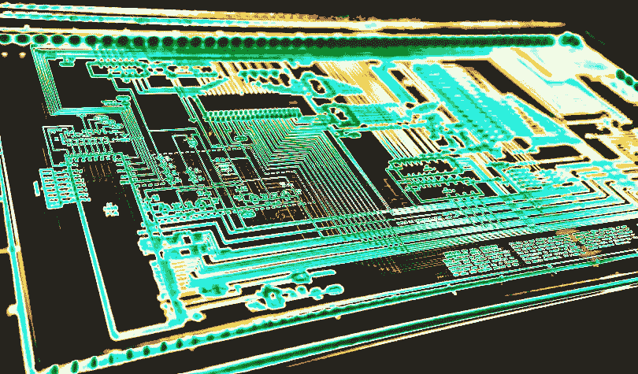

# 加密和区块链网络安全的成长之痛:从 Sybil 攻击到瓶颈

> 原文：<https://medium.datadriveninvestor.com/the-growing-pains-of-crypto-and-blockchain-cybersecurity-from-sybil-attacks-to-bottlenecks-27d9e328138a?source=collection_archive---------12----------------------->

加密用户和投资者担心区块链是可以被黑客攻击的，但是尽管有这些担心，加密行业仍然面临着许多挑战。

区块链脱颖而出，声称为加密货币用户提供无懈可击的安全性和可靠性。然而，最近一连串针对几个不同的区块链的公开攻击提出了网络安全问题，并提醒令人眼花缭乱的加密先驱们，就像常规互联网一样，完美的安全是不可能的。

看起来，用户所能期望的最好结果是明显的风险被减轻——在一定程度上。这一点或门槛可能只是人为错误，因为尽管最巧妙的安全措施与最高效的平台方法相结合，但网络安全的好坏取决于持有密钥的个人。

离线安全措施也是如此。你的住所可能有最先进的运动探测器、加固的门、锁和窗户，更不用说看门狗了。但是，如果房主丢失了钥匙，允许它们被复制，或者一个邪恶的窃贼偷走了它们——抢劫家里的珠宝就变成了从前门走进去，又从后门出去。

 [## 如何创建自己的加密货币，让您的企业为未来做好准备-数据驱动…

### 加密货币是如何工作的？如何制作加密货币？如何推出我的加密货币？所有这些问题必须…

www.datadriveninvestor.com](https://www.datadriveninvestor.com/2019/03/25/how-to-create-your-own-cryptocurrency-and-make-your-business-ready-for-the-future/) 

**搜集证据**

鉴于消费者、供应商、企业和服务提供商之间网络安全基础设施的巨大差异，高调的数据泄露事件经常发生。

现实情况是，一旦一个弱点被利用(通常是被有独创性的黑客利用)，整个系统都会因此变得脆弱。另一个问题是，在任何互联系统中，并非所有代理都具有相同的安全级别，这实际上意味着黑客可以利用安全缺陷感染整个系统。

可以说，目前的互联网基础设施无法应对防止复杂网络攻击的挑战。以 Equifax、WannaCry、Bitfinex 和分散自治组织(DAO)为例。这些攻击中的每一个都不是架构本身的漏洞造成的，而是特定公司或个人实现架构的方式造成的。

好消息是，问题不在于基础设施本身，而在于正在实施的安全方法。坏消息是，无论实施何种网络安全措施，黑客总会有可乘之机。

在 2016 年由 Raphael Nicolle 首先创立的加密货币交易平台 Bitfinex 的案例中，其黑客行为导致价值 6000 万美元的比特币被盗。

**攻击队形**

自从区块链技术和加密货币诞生以来，人们开发了各种攻击方法，试图窃取用户之间数百万美元的交易。可以理解的是，由于区块链技术是一种新现象，它有各种各样的初期问题，开发者试图随着时间的推移逐步消除这些问题(就像所有其他新的金融科技发展一样)。

以下是已经开发的一些漏洞及其运作方式:

**茜玻发作**

这种所谓的西比尔病是为了纪念弗洛拉·施赖伯的《西比尔》一书而命名的，这本书深入研究了多重人格障碍患者的治疗方法。在加密货币的世界中，Sybil 攻击涉及同一方拥有的单个网络上的大量节点(因此连接到图书)，试图中断网络活动。破坏的两种主要方法是用坏事务淹没网络，或者操纵有效事务的中继方式。

计算机科学专家声称，Sybil 攻击是理论上的(到目前为止)，可能永远不会真正实现，因为支撑加密货币的基本设计概念之一是集成防御机制，防止这种特殊形式的破坏。比特币通过所谓的“工作验证算法”来防止 Sybil 攻击，这种算法要求节点花费资源(以能量的形式)来接收硬币，从而使拥有绝大多数节点变得相当昂贵。不同的项目处理 Sybil-resistance 的方式不同，但是几乎所有的项目都处理它。

目前，Sybil 攻击只是雷达上的一个小点，但随着时间的推移，它们可能会击中离家更近的地方——特别是现在许多加密设置正在向市场蔓延，并诱导许多企业家在安全方面走捷径，以鼓励更多人参与他们闪亮的新加密硬币。

**路由攻击**

路由攻击通过拦截在自治系统和构成互联网架构的顶级节点之间发送的互联网流量来工作。这些节点在一个层次结构上工作，这意味着如果黑客可以渗透到顶端的一两个节点，他们可以扩散各种机制来拦截发送到系统其余部分的流量。最终的结果是过多的不法行为，是的，你已经猜到了，许多被盗的硬币。

路由攻击在互联网上随处可见，现在正被定制为破坏区块链和加密货币流量。

根据 ETHZurich 所做的[研究，13 家互联网服务提供商(ISP)托管了比特币网络的 30%,而只有 3 家 ISP 为该网络路由所有交易流量的 60%。如果 ISP 遭到破坏或损坏，这可能会成为黑客攻击的主要目标。](https://btc-hijack.ethz.ch/)

**直接拒绝服务**

直接拒绝服务(DDoS)攻击是邪恶用户试图通过大量请求和互联网流量来有效削弱服务器、网站甚至比特币节点。

在标准网站的情况下，DDoS 攻击阻止合法的请求接收他们需要的资源。在比特币节点的情况下，这需要发送大量小额或无效交易来淹没网络，并阻止合法交易得到处理。

DDoS 攻击在互联网上极为常见，几乎每个大公司或政府部门在过去十年中都不得不应对这种攻击。黑客在寻找漏洞时似乎更喜欢大型实体，大概是因为如果他们的漏洞成功，可能会有更多的掠夺(或更大范围的破坏)。

这种攻击方法已经变得如此广泛，以至于专家们说，现在从任何数量的声名狼藉的“黑客”或公司那里购买 DDoS 攻击是相对容易的。

**瓶颈**

2015 年 6 月，Coinwallet.eu 通过在整个网络发送数千笔交易，对比特币网络进行了压力测试，以强调应该增加块大小的观点。当时，Coinwallet 的开发者坚称，垃圾邮件攻击是堵塞整个网络并有效关闭任何加密货币的直接方法。

大约一个月后，在被称为“洪水攻击”的事件中，比特币网络上同时发送了 8 万笔微交易，造成了沉重的积压，有可能使比特币陷入停顿，并有可能在紧张的用户中造成恐慌。

比特币网络被[有效解救](https://coincentral.com/blockchain-hacks/)，仅仅是在全球最大的矿池之一 F2Pool 的[介入之后。该公司被迫将整个街区用于合并所有未完成的垃圾邮件交易，然后最终清除它们，并将比特币网络恢复正常。](http://www.f2pool.com/)

**51%或“多数攻击”**

考虑到区块链的安全性与创建区块链本身的计算能力直接相关，总是存在有人控制网络大部分散列能力的风险。从理论上讲，这将使攻击者挖掘数据块的速度比网络其他部分的速度加起来还要快，进而为所谓的“双重支出”打开大门。

重复消费是一种欺骗加密货币的方法，包括向区块链提交交易，接收已支付的产品或服务，然后使用多数哈希幂在交易前的某个时间点分叉区块链。本质上，重复消费从连锁历史中删除交易，允许攻击者第二次用相同的硬币进行交易。

简单来说，有点像用一张支票支付多个产品只会兑现一次。这种攻击最有害的方面不是区块链架构的稳定性，而是对其他用户更广泛的信心的影响——有点像在现代经济中伪造法定货币的谣言。

**真正的威胁**

区块链技术已经到来，它带来了加密货币。加密主导的服务可能会改变我们开展业务的方式，同时为社会带来广泛的改善。区块链的目标是将权力放回最终用户手中，而不是可利用的数据共享平台手中。

然而，无论区块链多么强大，他们也不能幸免于攻击。任何技术都有弱点和攻击媒介，区块链也不例外。

网络安全(尤其是加密黑客攻击)中不可避免的问题是，任何加密货币的安全性取决于掌握密钥的人。即使是最好的保护机制也可能被不警惕的用户变得毫无价值，这可能强调了人性的一个基本真理:人们不太注意或警惕，尤其是当他们沉迷于错误的安全感时。

当谈到加密经济的健康时，重复使用密码、成为网络钓鱼骗局的受害者、粗心的网站运营商和疏忽的交易所员工仍然是最危险的失败点。

各种形式的加密黑客攻击正在被一个开发者社区积极缓解，这个社区的人数远远超过了在相反方向工作的旁门左道的黑客。随着网络安全斗争的双方都在开发更大更好的武器，开发者和黑客之间的战争愈演愈烈，短期内不太可能出现明显的赢家。

*原载于 2019 年 3 月 27 日*[*【dailyhodl.com】*](https://dailyhodl.com/2019/03/26/the-growing-pains-of-crypto-and-blockchain-cybersecurity-from-sybil-attacks-to-bottlenecks/)*。*