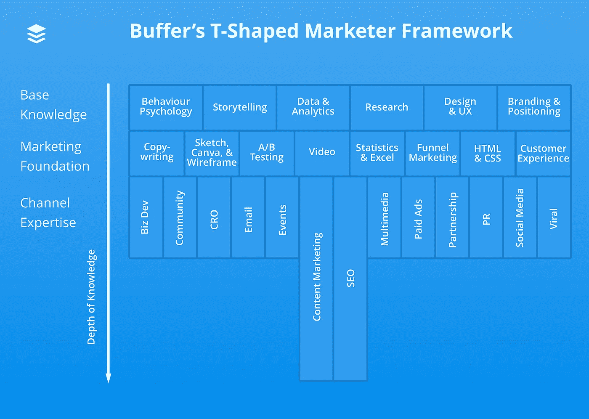
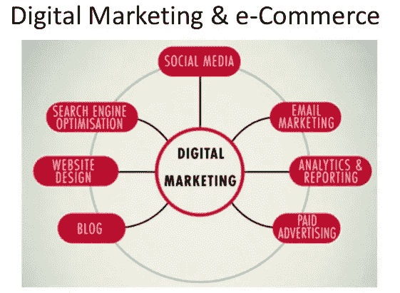

# 增长范式

> 原文：<https://medium.datadriveninvestor.com/the-growth-paradigm-e9b0ae26baac?source=collection_archive---------10----------------------->

如果我说 **lead** 你会想到营销、销售还是设计？

商务语言在不断发展。

 [## 一个企业在它的肚子上移动:如何顾及直觉-数据驱动的投资者

### 事实证明，直觉不仅仅是一种感觉。科学很清楚:你的直觉比你知道的更多…

www.datadriveninvestor.com](https://www.datadriveninvestor.com/2018/11/09/a-business-moves-on-its-stomach-how-to-make-allowances-for-gut-feelings/) 

尤其是今天，某些词在每个行业都会用到，比如会议。

> 人们简化，这是我们的天性。

营销、增长黑客和销售之间的严格界限正在慢慢消失。

所以，如果销售是说服人们购买服务或产品。

那么营销就是告诉世界你的存在。

那么什么是增长黑客呢？

在我们当前的商业范式中，人们倾向于将世界量化为模型。

尝试过创业的人都知道**的**实力**的**弱点 **O** 机会 **T** hreats analysis (SWOT)。

在营销领域，我们使用盗版漏斗模型。

[source](https://growthtribe.fi/growth-hacking-academy/2-day-crash-course)

**A** 意识 **A** 获得 **A** 创造 **R** 能力**R**even UE**R**eferral

如果我们以一家销售定制背心的初创企业为例。

**知名度**意味着通过拥有网站、社交媒体、分发传单或购买杂志广告在世界上拥有**影响力**。

**收购**代表寻找会考虑购买你的产品的人的过程。想想时尚电子邮件列表、独立购物者 facebook 群组等等。

**Activision** 意味着领导者与初创公司的互动，比如注册初创公司的电子邮件列表，喜欢一篇博客文章，在他们的网站上创建一个帐户，以便在首次购买时获得 30%的折扣(**潜在客户**)。

**留存**是指你能把多少潜在客户变成**买家**的过程。报价是如何呈现的，是否有常见问题，是否提供帮助服务等。

**收入**是关于**收入流**是如何构成的。想想利润率，伙伴关系，潜在的多样化。

**推荐**尝试**改善**客户**C**Life**C**周期(CLC)，你的买家多久回来购买一次其他商品。在这里你可以找到交叉销售，网络，品牌定位。

因此，如果你袖手旁观“经典”的商业模式，每个员工只有一个专业。

一个**营销人员**在**认知**阶段工作。

一名**业务开发人员**在**收购**阶段工作。

一个**成长黑客**在**动视**阶段工作。

一名**销售人员**在**留人**阶段工作。

一个**财务分析师**在**收入**阶段工作。

一名**品牌专员**在**推荐**阶段工作。

尽管现在，劳动力在技能和知识方面变得更加灵活。

[source](http://<a href="https://www.freepik.com/free-photos-vectors/background">Background vector created by freepik - www.freepik.com</a>)

一个假设的问题，

杰克是独立短上衣的创始人，并获得了天使投资，以实现向规模化的过渡。他的成功启动激励了其他人加入这个市场，其结果是广告费用和运费都在增加。新的预算只能维持两名新的全职员工。

像所有的企业家一样，杰克要求天使投资者追加预算，以加速他的初创企业的发展。根据他的说法，在接下来的两个季度中，有两个因素至关重要

1.  **定位提高有效性**
2.  **提高效率的营销**

你会推荐杰克雇佣哪个专业人士？

在你妄下结论，建议杰克雇佣一个成长黑客和/或数字营销人员之前，请阅读下一段引言。

> 我从未遇到过精通各方面技术的成长型黑客。-Bart de Lege，[bamboo(阿姆斯特丹](https://bammboo.io)成长型营销机构)的联合创始人

他为什么会这么说？

因为一个人需要好几辈子才能精通增长黑客的所有不同领域。**此外，增长型黑客世界也在不断变化，因此，人们永远无法跟上发展的步伐。**

为了给你一个增长黑客世界有多广阔的例子， [Buffer](https://buffer.com) 做了 [T 形框架](https://buffer.com/resources/t-shaped-marketer)。

数字营销人员是更好的选择吗？

同样的话也同样适用。

图形设计师在用户界面设计方面可能很糟糕，即使他们使用相同的结构元素。同样，数字营销人员也和成长型黑客一样有限。

这是数字营销模式。

[source](http://risingvoices.in/scope-of-digital-media-marketing-in-north-east-india/)

尽管这棵树比较小，但当有人自称为数字营销者时，我会感到怀疑。

他或她可能是伪装的专家或营销团队的领导。

> 因此，我们可以确定，雇佣一个人来负责初创企业的营销部门是非常困难的。

但是等等，

他的增长战略的第一点包括提高他在市场中的地位。

那么，杰克需要一个业务开发人员或品牌专员吗？

因此，尽管一个商业开发商可能会增加他的销售额，他的营销成本仍然会增加。

重塑品牌可以提高他在线和线下的整体形象，但不一定能提高销售额。

这将是效率和效果之间的权衡。

好吧，

那么杰克应该雇用财务分析师，降低成本对每个公司都有好处。

如果我们生活在 2000 年，那就好了。**但不管你喜不喜欢，现在我们生活在数字营销的世界里。**

杰克一开始会增加他的总利润，但随着时间的推移，销售额会下降，从长远来看，他的公司会因为激烈的竞争而失败。

在这种情况下，问题不在于潜在雇员缺乏技能或知识。

**这是我们精益商业模式中讨论较少的副作用之一。**

过去，公司会开发一种新产品，基于他们在一个未被发现的市场的正确领域钻探的猜测。

**今天，我们生活在一个由客户主导的世界，因此我们使用快速实验来测试我们的假设。找出我们在数据之间建立的联系是对还是错。**

增长黑客信条很好地描述了现代商业。

> 数据永远不会说谎，但识别(无用的)模式是人之常情。

因此，如果你的公司想要生存，团队的心态将是至关重要的。

**它不再是关于天赋、专业知识或经验，而是关于利用团队的多学科知识来创造独特的问题，这将有助于解决现代商业的复杂问题。**

所谓的成长心态将帮助团队精通他们所缺乏的领域。

如果你对自己的业务或这篇博文有更多的问题，我可以提供关于定位、品牌和你自己的营销策略(漏斗)的见解。

我是一名自由职业的增长策略师，帮助公司接触他们的客户。

你可以通过 LinkedIn 联系我。