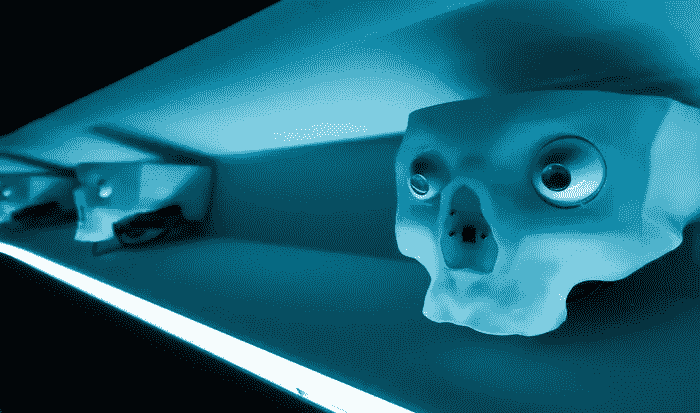
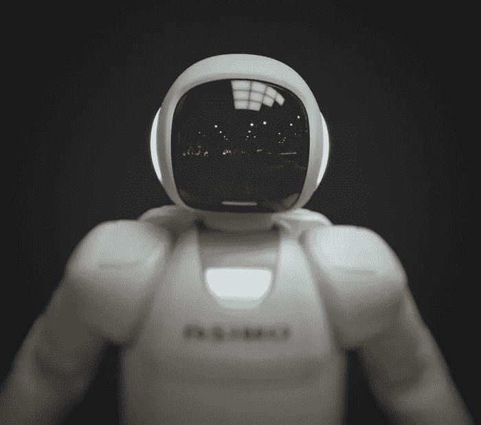
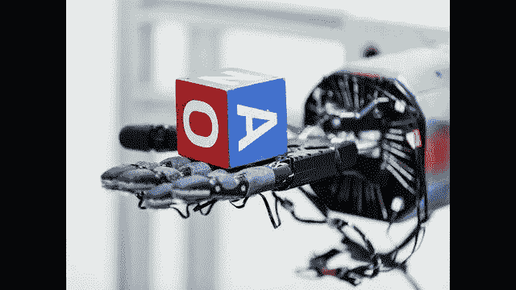

# 人工智能的难题

> 原文：<https://medium.datadriveninvestor.com/the-hard-problem-of-ai-2d8e5aaa7b35?source=collection_archive---------10----------------------->

我们的大脑比任何计算机都要好得多，就像其他器官一样。大脑也是自然选择的产物，它能够从少量数据中理解世界，它非常善于丢弃无用的信息， 它还擅长预测，在不打扰我们的情况下观察我们身体的内部运作，它进化到能够探测危险并提出生存计划这使我们成为群居动物我们发展语言与他人交流这对我们的祖先非常有用，因为他们能够告知他人危险分享想法推动创新留在一起的群体有更大的生存机会装备了这些工具我们赶走了巨大的猛犸象和尼安德特人走向灭绝

将计算机与大脑相提并论是不公平的，虽然两者都是信息处理单元，但它们是不同的，但这是我们在某种程度上能够模拟大脑的最好方法，但我们为什么要这样做呢？建造人工智能不是很愚蠢吗？事实证明，人类从中受益匪浅

即使人工智能很弱，我们也已经做出了令人惊叹的事情，如疾病诊断，开个性化药物，检测身体异常，大多数大公司都依赖机器学习来改善客户体验。人工智能擅长欺诈检测，股票预测和理解巨大的数据，自动驾驶汽车可以减少事故等等

与大脑相比，当前计算机的一些问题是

*   他们的能源消耗很高
*   它们是基于规则的，不能解决它们没有被编程的问题
*   一个晶体管不与许多其他晶体管相连
*   计算机是串行的，不像大脑那样是并行的

*The robot hand has been trained to manipulate objects with unprecedented dexterity*

另一个巨大的问题是，我们对大脑了解不多以视觉为例，我们知道大脑中有各种各样的特征检测器，我们在复制它方面取得了巨大的进展，但与神经网络不同，大脑中没有端点，它是连续的，并与大脑的其他部分相连，它不是一个单一的单元，其唯一目的是检测物体，我们能够感知深度，但我们的眼睛不包含任何关于深度感知的信息。我们的大脑根据从眼睛获得的 2d 输入构建 3d 表示，我们的眼睛也针对效率进行了优化我们只关注很小的区域大脑填充其余的信息即使当我们眨眼时，我们也不会察觉到延迟。有了这些信息，大脑就能控制身体，这不是一件容易的事情。我们的手能够操纵大量的物体，但想出一个基于规则的代码来观察物体，对它们进行分类，理解任务是什么，并想出一个执行任务的计划是不可行的，即使这样做了，也很难设计一个模板来拾取物体和操纵方程。强化学习可以用于在游戏引擎中训练动画机器人，然后将其转移到机器人 OpenAi 演示了这一点，但它也有自己的缺点

我们的腿很灵活，我们用两只脚站立，这使我们能够在不同的地形上行走，我们不局限于平地，我们可以爬山和游泳，我们在其他动物身上没有看到这样的工程。但是这种灵活性是有代价的，它的计算成本很高，我们的腿需要保持平衡，而跑步时我们总是处于平衡状态。一个错误的动作会让你摔倒，但这似乎不会发生。我们的大脑已经掌握了控制身体各部分的艺术

我们知道大量关于这个世界的事实，也称为常识，我们知道猫不会猎杀鬣狗，狮子不会写博客，或者如果你在下午 3 点还活着，你最多在下午 2 点还活着如果我们没有人告诉我们的事实没有数据库可以列出我们知道的所有事实，所以我们不能把所有的事实都塞进计算机，而是我们必须给它配备更小的核心真理和规则集来推断它们的含义

一个思考者必须计算他的行动的效果和副作用，但是我们不能预测每一个结果，然后决定怎么做。我们只是专注于可行的事情，如何做到这一点是一个谜。

> 这些是值得解决的问题

请随意分享你对这个话题的想法，如果你有解决这些问题的方法，请告诉我