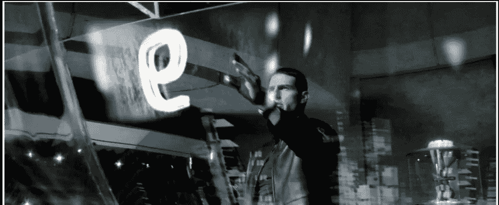

# 面部识别的隐藏面孔

> 原文：<https://medium.datadriveninvestor.com/the-hidden-face-of-facial-recognition-add92d8f1ce2?source=collection_archive---------13----------------------->

Tom Cruise in the movie ‘Minority Report’

许多人认为，看到电影《少数派报告》中的汤姆·克鲁斯穿过商场，屏幕自动提供个性化广告，这是这部电影的另一个科幻元素。然而，想象中的未来已经到来。面部识别系统(非常高的可靠性)不可阻挡的发展，它们的多种应用，以及技术的普及意味着许多公司和公共实体已经在试验它们的效用。目的非常多样:从从收银员那里拿钱到在音乐会上发现可能的跟踪者。然而，这项技术提出了几个必须考虑的法律问题。

人脸是一种“敏感”的个人数据(即受法律特别保护的数据)，可以在我们不知情的情况下被抓取。实施生物识别解决方案的公司必须证明他们遵守隐私法规。《一般数据保护条例》( GDPR)在这方面特别严格，原则上禁止将此类信息用于识别个人身份。也有例外，如警方出于安全目的使用，或当受影响方表示同意，并且追求合法目的时使用。另一方面，必须告知个人目标，在某些情况下，甚至要征得他的同意。

 [## 人们对隐私的不理解是什么？数据驱动的投资者

### 你知道那种感觉。无论是访问应用程序、订阅还是你最喜欢的运动鞋。你按下…

www.datadriveninvestor.com](https://www.datadriveninvestor.com/2019/04/11/privacy-and-convenience/) 

对于许多隐私专家来说，面部识别的广泛使用带来的风险大于好处。律师兼互联网用户协会主席 Ofelia Tejerina 认为，像支付公交车费(马德里 EMT 已经有了一个试点计划)或拿起钥匙这样的普通事情的申请“太过分了”。“你同意并不意味着它是合法的；她警告说:“这可能是一种虐待。在他们看来，监管机构应该告知公民这些解决方案的风险，特别是在发生安全违规时的冒名顶替。“它不是一种无害的技术；她总结道:“风险无法补偿舒适。”。

律师兼网络安全审计员帕洛玛·利亚内萨(Paloma Llaneza)也直言不讳:“最好的生物特征数据是那些没有被收集的数据。”他怀疑该法规能否解决由此产生的问题，因为面部识别的使用不仅会影响人们的隐私，还会影响其他自由，如运动、表达或表现。这并没有评估黑客攻击的后果，因为“与其他密码不同，faces 不支持替换。”

摄像机监视着我们。出于安全考虑，欧盟已经对一个巨大的生物特征数据库开了绿灯。由此引发的政治、意识形态和法律争论十分激烈。然而，公民对此无能为力。正如 EY·阿博加多斯的合伙人布兰卡·埃斯克里巴诺解释的那样，“只要数据严格用于指定的目的，并有足够的安全和保护，原则上来说，提出索赔没有坏处。”

另一方面，欧洲提出在面部识别系统的人工智能中加入更多控制。最大的担忧之一是他们的决策可能会出现偏差。由于这个原因，Escribano 指出，“设计或使用这些程序的组织进行适当的检查以在故障造成损害之前纠正故障是至关重要的。”律师建议，在任何情况下，都要遵守安全标准，进行三重评估判断:措施的必要性、适宜性和相称性。

然而，面部识别的应用正在高速普及。贝克·麦坚时律师事务所合伙人劳尔·卢比奥认为你不必为此担心；“你只要依法办事就行了。”然而，它承认，在遵守规则方面存在一些混乱，监管机构有必要在最具争议的实际案例中消除疑虑。有些项目“不会带来任何隐私风险”，例如特定的访问控制系统，因为生物数据或图像不会被存储，而只是它的一种表示。相反，还有其他更可疑的应用，如私人安全摄像头，以识别人群中的嫌疑人。无论如何，关键是衡量标准与它的用途成正比。

在任何情况下，卢比奥解释说，无论何时处理生物特征数据，都有必要进行隐私影响评估，这是一项关于数据保护影响的研究，反映了其风险和缓解措施。另一方面，各实体必须特别注意数据保护要求的起草，因为如果用户不理解它，它可能导致当局的制裁(GDPR 禁止“黑暗条款”)。

一些公司已经考虑安装人脸识别器，因为这是一种更灵活、更可靠的注册机制。在这种情况下，他们应该记住，虽然并不总是需要得到员工的同意，但他们应该充分告知他们的目的。劳尔·卢比奥说，拒绝遵守这一规则，原则上不会授权公司解雇他，而是必须给他提供一个不那么侵犯性的替代方案。最重要的是，因为劳工法庭遵循保障标准。根据卡斯蒂利亚拉曼查高等法院最近的一项裁决，拒绝签署公司的隐私政策并没有严重到足以成为解雇一名工人的理由。卢比奥批评这一解决方案，因为“它让公司陷入困境。”