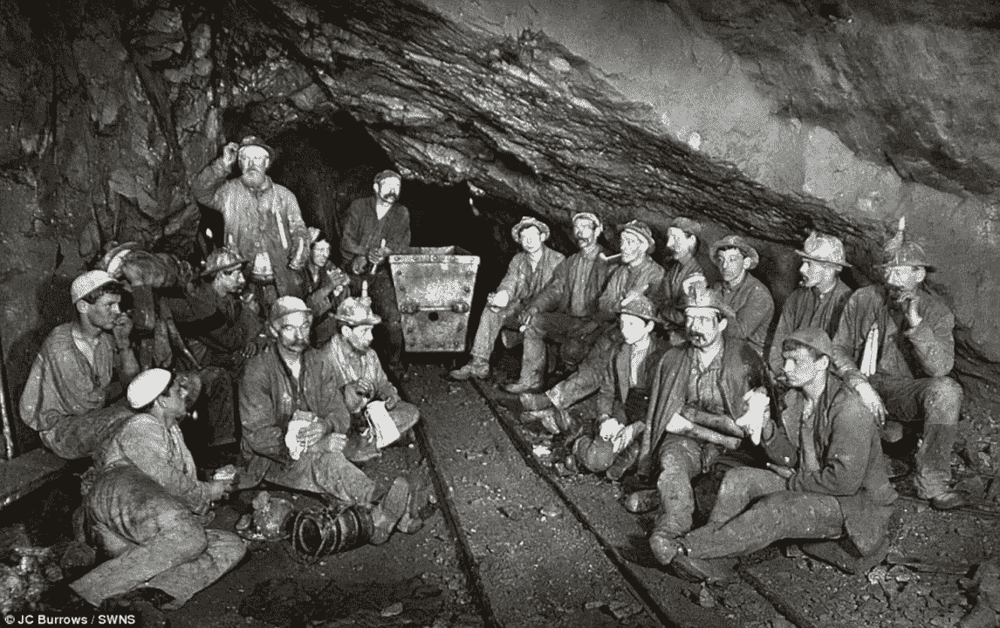
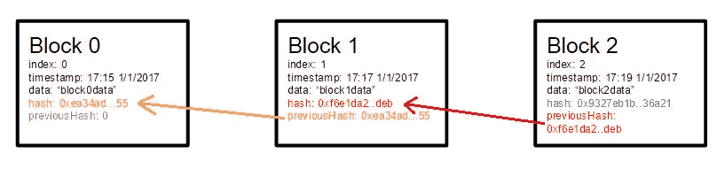
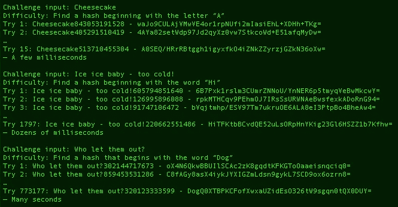
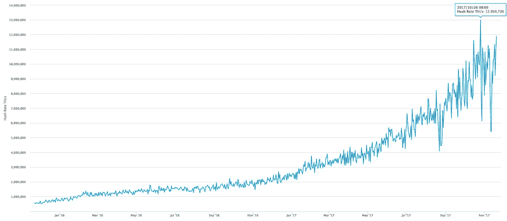
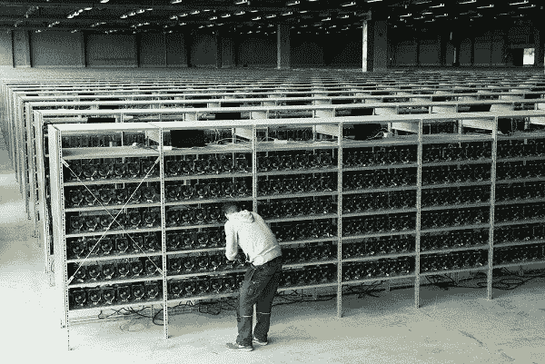

# 比特币挖矿的高额费用和地狱，解释道。

> 原文：<https://medium.datadriveninvestor.com/the-high-fees-and-the-hell-of-bitcoin-mining-explained-f71215d6dfd8?source=collection_archive---------13----------------------->

*   本文于 2017 年 11 月 18 日首次发表于 LinkedIn[https://www . LinkedIn . com/pulse/high-fees-hell-bit coin-mining-explained-Roberto-capodieci/](https://www.linkedin.com/pulse/high-fees-hell-bitcoin-mining-explained-roberto-capodieci/)

我们都知道比特币。我们都知道工作证明(又名“挖矿”)是比特币存在的必要条件。我们都知道采矿需要消耗大量的电力，这主要发生在中国。

采矿是如何工作的？大家都在说的挖掘难度是什么？为什么交易费用如此之高？什么是内存池？为什么像现在这样的采矿会集中比特币？中本聪在设计去中心化的系统时哪里失败了？

用比特币的话来说，“挖矿”是什么意思？

我们都知道，区块链是“一系列数据块，由于加密技术，它们彼此连接(链接在一起)”。众所周知，加密散列是由应用于源数据的散列算法产生的唯一字符串/数字。换句话说，一张照片，一个文本文件，一个视频…每一个都有一个唯一的散列。更改单个位的源数据会更改结果哈希。这对区块链意味着什么？

每个块包含一组在区块链中过账的交易(例如“账户 X 向账户 Y 发送 Z 个比特币”)，包含前一个块的散列。这意味着，当创建一个新的区块时，矿工必须包括交易和他的账户，以及前一个区块的散列。一旦关闭了块并为他刚刚创建的块找到了一个特殊的散列，矿工就向(块)链添加了一个新的块。简而言之，矿工的工作就是为他想要关闭的块创建一个特殊的散列。

为什么哈希需要大量的处理能力，从而消耗大量的电力？

计算一块数据(在比特币区块链的例子中是一块数据)的哈希并不是一个非常困难的过程。然而，比特币使用的工作证明协议给计算哈希的过程增加了“难度”:它要求矿工创建一个以特定文本字符串开头的哈希。如上所述，改变一段数据中的单个位会产生完全不同的散列，因此挖掘者需要进行反复试验来创建散列，每次都使用他们想要关闭的块中的不同 nonce(附加数据段),直到他们找到匹配所请求的初始文本串的散列。随着第一个认领区块的矿工获得一些新比特币的奖励，矿工们使用每一种可能的技巧来尽快找到正确的哈希。

例如:给定包含文本“来自 Roberto Capodieci 的示例事务—测试 0”的块，得到的 SHA256 哈希是:“070 d6c 61755 C3 caf 013 a 176 AE 2 CAC 59087 ACC 01 f1 c 145 fc 8 ddf 7 aefb 2023 dabf”

(试试这里的哈希创建:[https://t.me/joinchat/CJN3VAur_epQLqlZefh2gA](https://t.me/joinchat/CJN3VAur_epQLqlZefh2gA))。

如果当前困难的规则是找到一个以 11 开始的散列，我们需要保持文本“来自 Roberto Capodieci 的 Sample transaction—Test”不变，只改变我们的 nonce，即“Test”之后的数字，并按顺序尝试，直到找到一个以 11 开始的散列

…测试 0 = 070d6c61755c3caf…

…测试 1 = b8602b011b6aeb6d…

…测试 2 = 9f24c69f3bed0946a…

…测试 3 = f546236b4d3048b6…

[49 次尝试]

…测试 53 = 11023daf11ff0454fc…

已经进行了 54 次尝试来寻找以 11 开始的散列，因此有效——通过这个例子的共识规则——来要求该块。如果将难度设置为查找以“1111”开头的散列，则需要进行更多的尝试。

**比特币网络的脉动**

比特币网络的目标是每 10 分钟创建一个新区块。该协议大约每 2 周调整一次难度，使得网络的散列能力平均需要 10 分钟来找到正确的散列以关闭新的块。这意味着难度调整到最快的矿工，在我看来，这就是比特币工作证明协议的问题。

**为什么查找一个散列来关闭一个块会变得很复杂？**

在我们了解挖掘者快速查找哈希值的技巧之前，这可能是第一个问题。使挖掘一个块变得困难——在找到一个好的散列之前平均需要 10 分钟——是为了保护区块链不被重写，因为这将使它很难(如果不是不可能的话)赶上不断增长的真实区块链。

2010 年，我用一个小笔记本开采了 6 个区块(然后我格式化了硬盘)。

今天这是不可能的。为什么？我认为中本聪(设计比特币及其区块链的团队)从来没有想过开采资金池。什么是矿池？在上面的例子中，我们尝试了 54 次才找到正确的散列。这是花费了一定时间的 54 次反复试验。难度调整后，找到解决方案所需的尝试次数平均需要 10 分钟。如果我们有 54 台电脑一起工作会怎么样？我们只需要一个循环，54 台计算机中的一台就会有正确的随机数来生成符合难度规则的散列。在连续几场胜利后，在不到 10 分钟的时间内一个接一个地生成块，难度会有所调整，这样我们就需要 10 分钟——用 54 台计算机——才能找到正确的散列，这使得家里只有一台计算机的人几乎没有机会找到散列。

由于采矿是一项有利可图的活动，矿工们在采矿设备上投入大量资金，这些设备不仅在进行哈希试错时比常规处理器更快，而且有数千个哈希设备协同工作，以找到正确的哈希，如果它们先到达，就可以获得比特币奖励。难度会不断调整，因此平均需要 10 分钟来完成这些采矿作业，数千名矿工一起工作来找到正确的哈希。还有大约 5 个采矿作业正在相互竞争，使其他人没有希望参与游戏。

所有这些与交易费有什么关系？

矿工既能获得关闭区块的奖励，又能获得每个区块中包含的所有交易的交易费。由于比特币区块链中的区块最大大小为 1Mb(目前)，一个区块中可以包含的交易数量是有限的。有一个 mempool，一个等待包含在下一个块中的事务队列，由矿工从 mempool 中选择哪些事务包含在他想要关闭的块中。由于交易费用是由发布比特币交易的人自愿设定的，因此如果有人希望他的交易被列入下一个区块，他或她应该提供有吸引力的费用，让矿工选择他或她的交易。如果不这样做，他们的交易可能会在队列中停留长达一天。

**当我有更性感的东西时会发生什么？**

随着比特币现金(BCH)、已故的比特币经典(BCC)、可能复活的 SegWit2x 和其他产品的出现，再加上莱特币(LiteCoin)等克隆产品，矿工可以选择开采什么。如果一些性感的东西突然出现，看看比特币现金在价值上升后发生了什么，矿工们将他们的一些哈希能力从比特币转移到另一个有利可图的区块链。这导致比特币区块链的哈希能力突然下降，直到难度调整，区块才会变慢，因为找到当前难度的正确哈希需要 10 分钟以上的时间，导致交易队列中的交易量增加，从而导致费用增加。

**这个问题有什么解决办法？**

比特币黄金分叉了比特币，改变了哈希算法，使得所有大型矿商无法用他们当前的硬件开采比特币黄金(他们需要 GPU——一种显卡——来开采比特币黄金)。这使采矿民主化了一段时间，直到少数人发现建立 GPU 采矿钻机有利可图，将普通人排除在游戏之外。

比特币现金制作了更大的块(高达 8Mb，而比特币为 1Mb)，以允许单个块中包含更多的交易。许多其他区块链人使用不同的方法来保护他们的数据块创作，远离了比特币使用的工作证明，许多都是很好的解决方案，然而他们在其他区块链人身上，而不是在比特币上。

到目前为止，还没有人找到并部署一个解决方案来阻止矿业的集中化。

**我们正在考虑一个解决方案**

在 Blockchain Zoo，我们开始集思广益，寻找能让每一个普通用户都能重新使用采矿的解决方案。一旦挖掘在区块链对等网络中的所有参与者之间重新分布，就不需要令人难以置信的散列能力，甚至工作节点的证明也可以在移动电话上运行。我会在另一篇文章中更详细地介绍我们正在研究的解决方案，但是如果您想了解 Blockchain Zoo 并加入我们的对话，请加入我们的电报组:[https://t.me/bczoo](https://t.me/bczoo)

[注意-2019 年 8 月]:我们已经进行了很长一段时间的研究，最终创建了一个将于 2019 年 10 月提交的项目:ZooBC

在此订阅 T4 在线。

在此加入我们的网络:[https://datadriveninvestor.com/collaborate](https://datadriveninvestor.com/collaborate)